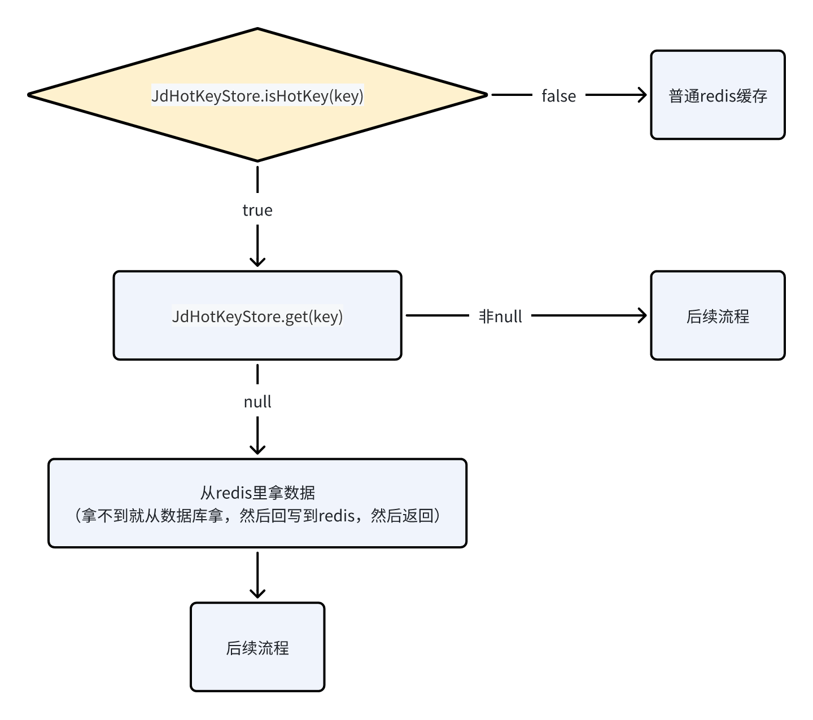
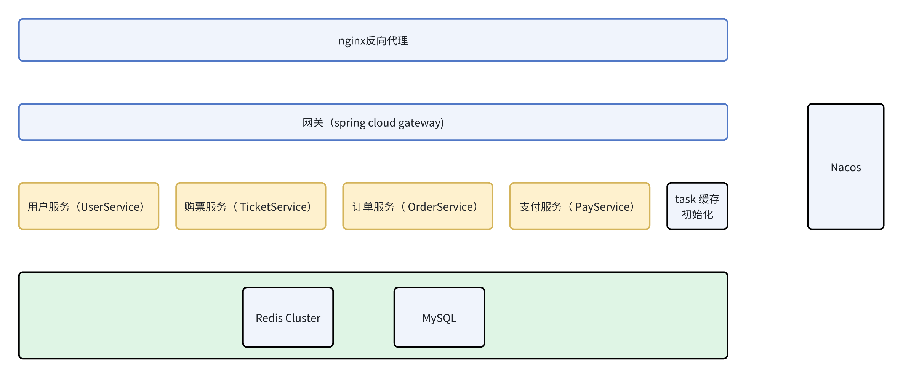
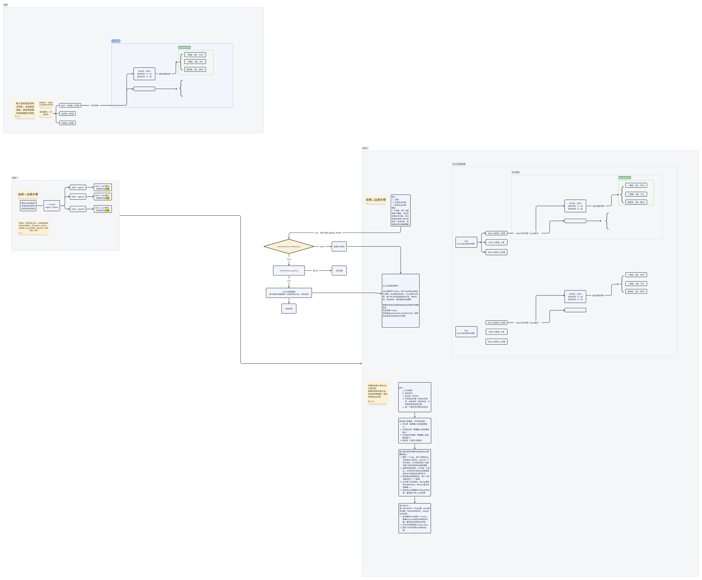
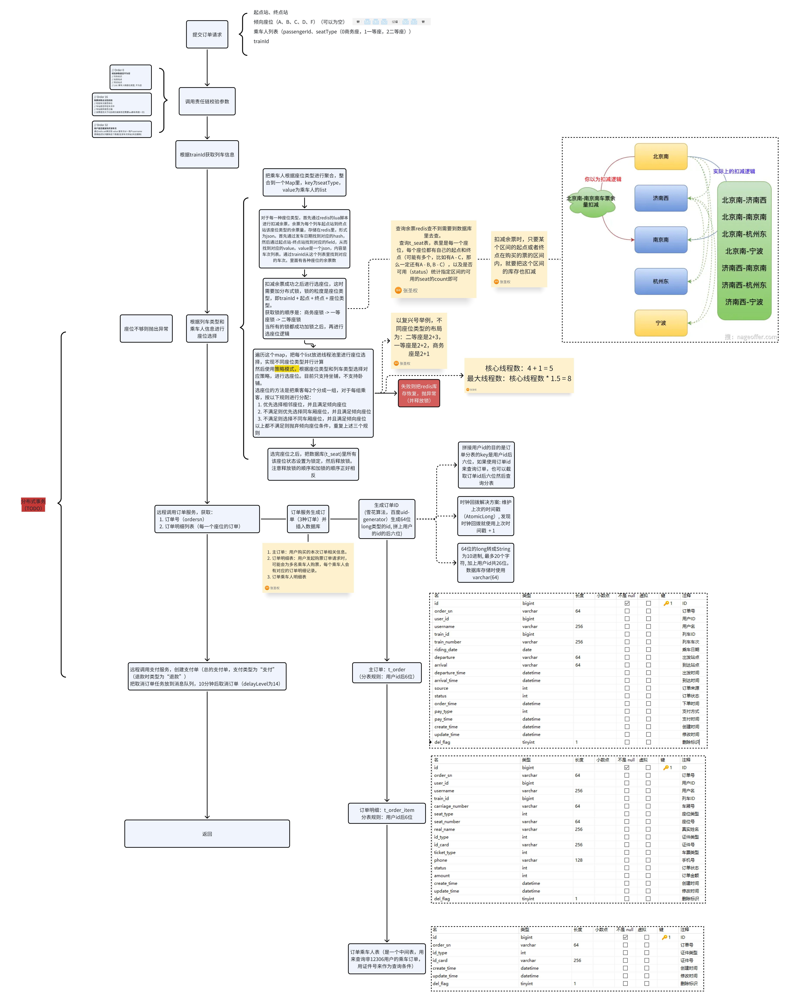
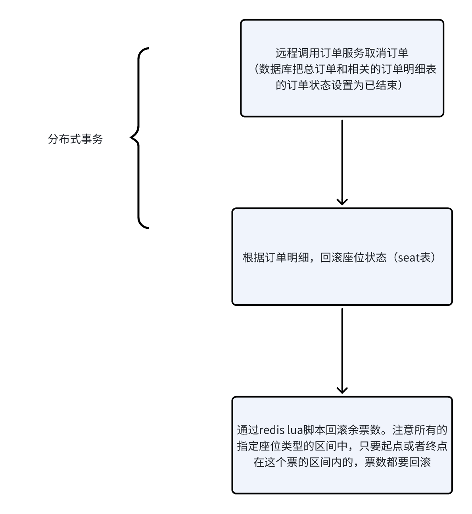
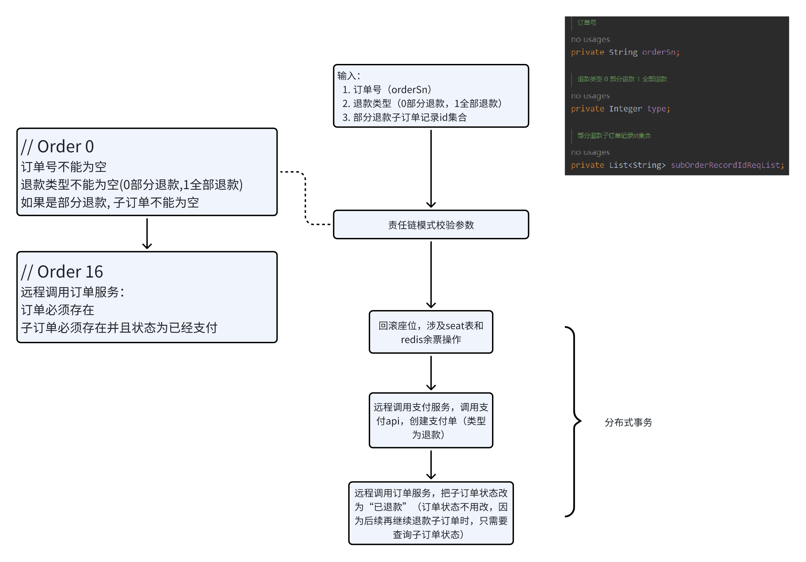
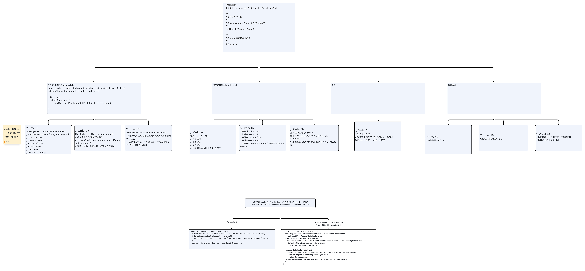
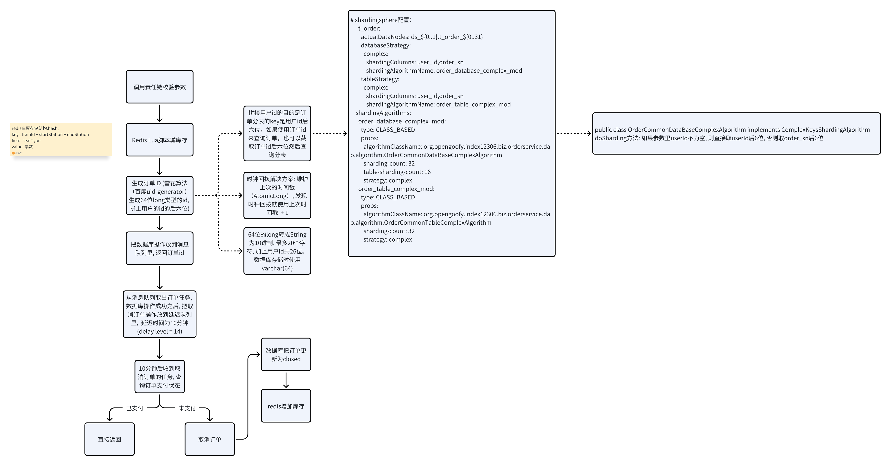
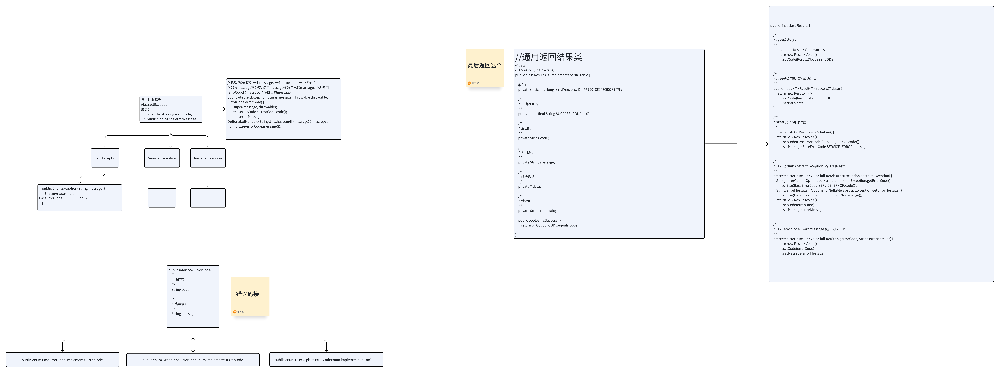

# 12306
# TODO

- sentinel限流

# 介绍

1. ### 介绍
    

- 采⽤多级缓存 + 热key探测解决热key问题 。
    
- 通过Seata解决购票、取消订单、退票功能下的分布式事务问题。
    
- 使⽤责任链模式重构请求数据准确性检验，⽐如：查询购票、购买⻋票下单以及⽀付结果回调等业务。
    
- 使⽤装饰器模式对缓存组件进⾏增强，解决缓存穿透问题。
    
- 使⽤RocketMQ 延时消息实现⽤⼾购票 10 分钟后未⽀付情况下取消订单功能。
    
- 使⽤Redis Lua脚本进⾏购票减库存操作，通过RocketMQ实现异步⽣成订单，满⾜⾼并发场景下的购票需求。
    
- 通过订单号和⽤⼾信息复合分⽚算法完成订单数据分表，实现⽔平分表后使⽤订单号和⽤⼾证件号多条件查询
    
- 功能。
    
- 通过增加中间表实现⾮12306⽤⼾查询本⼈⻋票功能。
    

2. ### 改进
    

- **分布式事务**
    
- **采用多级缓存 + 热key探测解决热key问题**
    
    - 二级缓存：本地缓存 + redis集群缓存
        
        - 本地缓存：caffeine
            
            - 使用京东开源HotKey进行封装
                
        - 热key探测：京东开源HotKey
            
            - 架构：
                
                - etcd：作为一个高性能的配置中心，可以以极小的资源占用，提供高效的监听订阅服务。主要用于存放规则配置，各worker的ip地址，以及探测出的热key、手工添加的热key等。
                    
                - client端：在我们的服务中添加的引用jar，引入后，就可以以便捷的方式去判断某key是否热key。同时，该jar完成了key上报、监听etcd里的rule变化、worker信息变化、热key变化，对热key进行本地caffeine缓存等。
                    
                - worker端是一个独立部署的Java程序，启动后会连接etcd，并定期上报自己的ip信息，供client端获取地址并进行长连接。之后，主要就是对各个client发来的待测key进行累加计算，当达到etcd里设定的rule阈值后，将热key推送到各个client。
                    
                - dashboard控制台：一个带可视化界面的Java程序，也是连接到etcd，之后在控制台设置各个APP的key规则，譬如2秒出现20次算热key。然后当worker探测出来热key后，会将key发往etcd，dashboard也会监听热key信息，进行入库保存记录。同时，dashboard也可以手工添加、删除热key，供各个client端监听。
                    
            - 工作流程：
                
                - client从etcd获取worker的ip地址，通过netty与worker建立长连接
                    
                - client端启动定时任务，每500毫秒向worker端批量发送一次待测的key到对应的worker，发送规则是发送的key进行hash然后对worker数量进行取余
                    
                - 当热key探测出来后，可以选择进行本地存储，该框架采用caffein来存储
                    
            - 注意：
                
                - HotKey只会探测一个key是不是热key，但是不会关心value，我们需要自己主动维护value。当一个key是热key时，要主动设置这个key的value。
                    
                - 为什么不给热key设置过期时间？
                    
                    - 一般来说，设置过期时间的作用有两个：保证数据最终一致性、节省内存
                        
                                    如果不设置过期时间，可以有这样一个例子：A线程读数据，发现缓存不存在，读数据库，然后B线程写数据库，然后删除缓存，然后A线程回写缓存，导致数据不一致。
                        
                    - 但是在热key的场景下，最重要的是热key对于本地内存的命中率即高并发性能，而不是数据的一致性。实际上真实的12306的数据一致性就不是很高，经多次实测发现买票之后5分钟票数才更新
                        
                    - 而节省内存方面，caffeine已经实现了自动内存淘汰，不会出现内存撑爆的情况
                        
                        - caffeine内存淘汰策略：
                            
        - 数据同步：
            
            - 写数据：旁路缓存模式，写完数据库后回写redis和本地缓存
                
            
            ```Java
            /**
            * 删除某key，会通知整个集群删除
            */
            public static void remove(String key) {
              getCache(key).delete(key);
              HotKeyPusher.remove(key);
            }
            ```
            
            - 读数据：
                
            
            
            ```Java
            if (JdHotKeyStore.isHotKey(key)) {
                //注意是get，不是getValue。getValue会获取并上报，get是纯粹的本地获取              
                Object obj = JdHotKeyStore.get(key);              
                if(obj == null) {          
                    // 从redis里获取，旁路缓存策略
                    obj = getFromRedisCacheAside();        
                    JdHotKeyStore.smartSet(key, obj);              
                } else {                  
                    //使用缓存好的value即可              
                }         
            } else {
                JdHotKeyStore.remove(key);
                // 走redis
            }
            ```
            

# 使用JD-HotKey

## QPS提高了多少

几乎没有提升

在4C8G上，原QPS是660左右，加了JD-HotKey之后变成了640左右（关掉限流测试的结果。限流设置为600），基本没有变化。

原因可能是只有一台机器，Redis在内网中，而且购票服务只有一个实例，所以网络IO的成本不是很高，和本地内存的性能差不多。但是如果Redis单独部署并且有多个实例，可能本地内存的作用就发挥出来了

## 热Key的Key的形式是什么

key是发车日期 + 车站区间。在本地缓存里存储的是列车列表。
  

# 缓存击穿问题：不存在

因为缓存没有过期时间，所以一定会命中缓存

但是对于热点数据，即使使用了redis且不过期也会面临redis压力过大以及热点请求挤占一般请求的问题

所以使用本地缓存来搭建多级缓存

# 缓存一致性

首先，在12306的场景下，缓存一致性不是很重要。

购票场景中，使用的方案是旁路缓存模式，但是修改数据库之后不是删除缓存，而是直接修改缓存

另外，在购票场景中不会遇到缓存不存在而数据库里存在的情况。因为车票信息在录入车票时就会插入缓存，并且有效期为15天。15天之后这个车票就不能购买了。

# 遇到什么问题，怎么解决的

## 无法接到远程服务抛出的自定义异常

使用Dubbo对项目进行改造是从12306开始的。遇到的一个问题是当我在一个服务中抛出自定义异常时，最终在全局异常处理器中接到的类型是RuntimeException，于是丢失了这个异常特有的code信息。

后来网上搜索发现，Dubbo会把一些特定类型之外的异常（受检查异常、Dubbo本身的异常如RpcException等）包装成RuntimeException再抛出。因为这些异常可能只在provider里定义了，导致consumer无法成功序列化。而这不是我想要的。

解决方案有：

1. 在接口的方法签名上声明异常。但是抛出的异常必须与声明的异常完全相同，是它的子类都不可以。比较麻烦而且耦合度太高
    
2. 自定义过滤器，把Dubbo的过滤器移除掉。但是这样做会丢掉Dubbo的过滤器的一些有用的功能。
    
3. 把异常类和接口类放在同一个jar包里。
    

我采用的解决方案是3，因为所有的服务都依赖了异常类。所以直接把异常类放在接口模块里就好。

### 短链接项目Dubbo改造

SpringCloudGateway的好处是不需要写代码，只需要配置路由，但是只能使用Http协议去调用下游服务。

短链接项目使用网关通过Dubbo调用短链接服务时，由于Dubbo是没有302响应码这种东西的，所以网关服务只通过配置文件映射路由是不行的。

为了让网关能够直接通过Dubbo进行通信，添加了一个自定义filter。如果是短链接跳转请求，就使用Dubbo去调用短链接服务，然后把结果封装成302响应。否则正常放行。

# 架构



# 业务


## 用户

  

## 查询车票



## 下单

选择车次、座位、乘车人，点击“提交订单”



## 取消订单



## 退票



## 分布式事务

使用seata框架。使用seata的默认事务实现方式AT模式。

### 使用方式

1. 导入依赖
    
2. 启动nacos
    
3. 编写配置，把dubbo和seata注册到nacos上面
    
4. 在需要分布式事务的方法上加上注解`@GloabalTransactional`
    

### 几个使用到seata的地方

1. 下单
    
    1. 车票服务、订单服务
        
2. 取消订单
    
    1. 车票服务、订单服务
        
3. 支付
    
    1. 订单服务、支付服务
        
4. 退票
    
    1. 支付服务、订单服务、车票服务
        

# 表结构

- t_seat 座位表，未分表
    
    - 字段
        
        - train_id
            
        - carriage_number
            
        - seat_number（varchar，比如01A、01D等等）
            
        - seat_type（一等、二等、商务，和carriage表的carriage_type保持一致），硬座、软卧这些没有实现
            
        - start_station
            
        - end_station
            
        - price
            
        - seat_status（0未锁定，1锁定或有人）
            
    - 注意
        
        - 这些都是人工提前录入好的。每一个座位都是有指定车站区间的，假如一个座位的车站区间为A - C，那么表里就有A - B, A - C, B - C三条数据
            
- t_carriage 车厢表, 未分表
    
    - 字段
        
        - train_id（属于哪一个车）
            
        - 车厢号（carriage_number)
            
        - 车厢类型，商务、一等、二等（carriage_type)
            
        - 座位数目（seat_count)
            
- t_region 区域，即城市
    
    - 字段
        
        - name 地区名称
            
        - code 地区编码，人工录入，全局唯一（比如北京就是BJP）
            
        - popular_flag 是否热门（0不热门，1热门，前端选择区域时有个热门城市列表，目前未实现）
            
    - 用于根据区域查询车站，t_station有外键表示这个车站属于哪个region
        
- t_train
    
    - 字段
        
        - train_number (varchar256, 列车车次，比如 G35， T131)
            
        - train_type（0高铁，1智能动车复兴号，2普通列车）
            
        - start_station、end_station 起点站、终点站
            
        - start_region、end_region 起点城市、终点城市
            
        - sale_time 开售时间
            
        - sale_status 是否可售，0可售，1不可售
            
        - departure_time, arrival_time 出发时间，到达时间
            
    - 注意
        
        - 同一个车次在出发前15天可以售票，因此表里会出现车次相同的多条（具体几条不确定，因为车的每趟运行时间长度不一样）数据，它们的sale_time、departure_time、arrival_time不相同，表示是同一车次的不同日期
            
        
- t_station 火车站，未分表
    
    - 字段
        
        - code 车站编号（比如 VNP 表示北京南）
            
        - name 车站名称（比如北京南）
            
        - region 地区编号
            
        - region_name 地区名称（比如北京）
            
    - 注意
        
        - 查询条件里有地区时，根据region可以查询到这个地区有哪些火车站
            
- t_train_station 列车站点表，表示旅途中的每一段路程
    
    - train_id 车次id
        
    - station_id 车站id
        
    - sequence 第几段路程
        
    - departure 出发站， arrival 到达站
        
    - start_region 出发站所在区域， end_region 到达站所在区域
        
    - departure_time 出发时间，arrival_time 到达时间
        
    - stopover_time 在到达站停留时间
        
- t_train_station_price 每一段路程不同车厢类型车票价格
    
    - train_id 车次id
        
    - departure 出发站，arrival 到达站
        
    - seat_type 座位类型
        
    - price 价格
        
- t_order 订单表 分表了，分片键为order_sn
    
    - order_sn 订单号，全局唯一
        
    - user_name 下单的用户名
        
    - status 订单状态（0未支付 1已支付 2已关闭）
        
            如果有退票，订单状态不会改变。因为部分退票的信息存储在t_order_item表的status里
        
- t_order_item 分表了，分片键为order_sn
    
    - order_sn
        
    - id_type
        
    - id_number
        
    - status 订单状态（0未支付 1已支付 2已关闭）
        
    - amount 金额
        
- t_order_item_passenger 分表了，分片键为身份证号
    
      这张表属于中间表。如果乘车人没有12306账号，但是想查询自己的车票和订单，可以通过这张表找到order_sn，然后查询 t_order_item 表和 t_ticket 表
    
    - order_sn
        
    - id_type
        
    - id_number
        
- t_passenger 乘车人表，用于买票时选择乘车人。乘车人可以没有12306账户
    
      分表了，分片键为身份证号
    
    - id_type 证件类型
        
    - id_number 证件号
        
    - phone 手机号
        
    - type 乘车人类型（0成人 1学生）
        
    - varify_status 审核状态
        
- t_ticket 支付成功后生成车票（仅插入到数据库里，并没有展示到前端）
    
    - order_sn 订单编号
        
    - train_id 车次id
        
    - train_number 车次编号 (G123 等)
        
    - carriage_number 车厢号
        
    - seat_number 座位号
        
    - passenger_id_type, passenger_id_number 乘车人表的外键
        
    - departure_time 出发时间，arrival_time 到达时间
        
    - departure 出发站， arrival 到达站
        
    - ticket_status 车票状态（0未使用 1已使用 2已失效）
        
- t_pay 支付单，分表了，分表键为order_sn
    
    - order_sn
        
    - pay_sn 支付流水号（第三方支付服务提供）
        
    - trade_no 三方交易凭证号
        
    - amount 总金额
        
    - type 类型（0支付 1退款）
        
    - pay_time 交易时间
        
    - status 状态（0等待付款 1超时关闭 2成功 3已取消）
        

# 订单id雪花算法部分:

- 采用百度uid-generator中的cacheduid generator，官方提供的TPS数据为800万
    
    - ~~使用两个ringbuffer(用数组实现的循环队列)来存储实现计算好的uid，当uid数目小于容量的50~~%时，计算新的uid并进行填充（每批次uid使用同一个时间戳）
        
        ```Java
              private final long[] slots;  //slots用于缓存已经生成的id
              private final PaddedAtomicLong[] flags; //flags用于存储id的状态(是否可填充、是否可消费)
        ```
        
    - flags用于判断当前位置是可填充还是可消费
        
    - 对CacheLine补齐，避免了由RingBuffer带来的硬件级「伪共享」问题
        
    - put方法使用synchronized修饰，写写冲突
        
    - get方法没有使用synchronized修饰，而是使用两个PaddedAtomicLong类型的指针：cursor和tail
        
- 为什么使用两个ringbuffer？不使用flagbuffer，只使用两个cursor来判断当前位置的uid是否可用不行吗？
    
    - TODO
        
- 时钟回拨解决方案：思想是借用未来的时间。维护一个private final PaddedAtomicLong lastSecond表示上次计算使用的时间戳，首先获取当前系统时间，与上次的时间戳进行比较，如果大于上次的时间戳则正常计算，否则使用把上次的时间戳increment，然后使用这个时间戳。
    

# 责任链模式进行请求校验



- 购票流程
    

    
- 车票余票缓存方案、缓存一致性
    
    - 普通的旁路缓存就行。为了最终一致性，对缓存加一个很小的过期时间（1分钟）
        
- 一些设计模式
    
    - 责任链模式：实现参数校验，避免了参数校验与后续逻辑的耦合
        
    - 策略模式：进行不同优惠券扣减策略，避免了大量的if else，实现松耦合
        
    - 策略模式：不同座位类型进行不同的
        
- 异常处理



# 用户信息脱敏

- 针对需要脱敏和不需要脱敏的接口, 使用不同的responseDTO
    
- 其中需要脱敏的responseDTO的需要脱敏的字段使用自定义的序列化器来进行脱敏
    
    - SpringMVC默认采用jsackson作为序列化器
        
    - 在需要自定义序列化方法的字段上面加上注解
        
    
        `@JsonSerialize(using = PhoneDesensitizationSerializer.class)`
    
    - 编写序列化方法, 使用hutool工具的脱敏方法进行脱敏
        
    
    ```Java
        @Override
        public void serialize(String phone, JsonGenerator jsonGenerator, SerializerProvider serializerProvider) throws IOException {
            String phoneDesensitization = DesensitizedUtil.mobilePhone(phone);
            jsonGenerator.writeString(phoneDesensitization);
        }
    ```
    

# 幂等

- 在redis存储唯一key（setIfAbsent，底层使用setnx），如果已经存储过了，就直接返回
    
- 成功之后删除key
    
- 对于消息队列异步任务，在catch异常后也要把key删除，并重新抛出异常，便于后续消息重新投递以及重新消费
    

# 分库分表

- 分库原因：解决并发量大的问题，分表原因：解决数据量大的问题
    
- 水平分表分多少
    
    - 经验值：单表2000万条数据（3层B+数能存储2190w 条记录数）
        

# 问题

1. 购买列车中间站点余票如何更新？
    
2. 数据库的日志是什么？Binlog 在项目中怎么用的？
    
3. 如何保证数据库和缓存的一致性？
    
4. 项目的数据库表如何设计？
    
5. 12306 是否有抢票流程？
    
6. 用户购票时是否一定有余票？
    
7. 如何防止恶意提单和刷票行为？
    
8. 是否有设计防刷系统？如何进行风控和用户管理？
    
9. 如何处理同一个 IP 持续请求服务的情况？
    
10. 是否提供检索功能，如何处理不同出发站和到达站的组合？
    
11. Redis 的数据结构是什么？如何处理不同出发站和到达站的组合？
    
12. 购票抢票时如何使用分布式锁？setnx 的缺点是什么？
    
13. 延迟关闭订单是否可以通过定时任务来实现？存在哪些问题？
    
14. 如何保证数据库与缓存的一致性？缓存双删和 BinLog 更新有何区别？
    
15. 如何防止注册用户时的缓存击穿问题？如何解决布隆过滤器的误判？
    
16. 除了布隆过滤器，还有其他解决方案吗？
    
17. 为什么没有选择 Kafka 或 RabbitMQ？
    
18. 如何防止 RocketMQ 消息丢失？如何解决消息积压的问题？
    
19. 如何防止 RocketMQ 消息重复消费？
    
20. 为什么要进行限流？限流解决了什么问题？为什么不使用 Hystrix？
    
21. 限流的原理是什么？
    
22. 用户数据是根据什么进行分库分表的？
    
23. 订单如何进行分库分表？为什么要分库分表？
    
24. 如何让乘车人查询自己的订单？
    
25. 为什么使用复合分片算法？其原理是什么？
    
26. 对分布式数据库了解吗？
    
27. 如何保证订单号的全局唯一性？
    
28. 12306 的订单分库分表是如何拆分的？如何处理热点表问题？
    
29. 12306 的数据是如何存储的？
    
30. 介绍一下 ShardingSphere。
    
31. 读写分离能否解决海量数据的问题？
    
32. 为什么要使用设计模式？不使用会有什么问题？责任链模式有哪些优点？
    
33. 12306 的列车数据搜索使用 ElasticSearch 吗？
    
34. 为什么列车数据搜索使用 Redis 而不是 ElasticSearch？
    
35. 如何保证列车站点余票的实时性？
    
36. 除了 RocketMQ，如何处理延期关闭订单的问题？它们各自的优缺点是什么？
    
37. 如何解决用户注册缓存穿透问题？
    
38. 为什么不使用缓存双删来解决数据库和缓存的一致性问题？
    
39. 多人购票选座算法是如何实现的？
    
40. 如何确保购票时系统能承受高并发而不出问题？
    
41. 为什么要进行分库分表？分库分表会带来哪些问题？如何评估订单数据分库分表的容量？
    
42. 如果订单按照用户 ID 分片，那么乘车人如何查询自己的车票？