# 八股

[K哥2024 互联网中大厂JAVA面试真题汇总](https://yq0pkza686.feishu.cn/docx/Yb6bd5lBioNGwbx8nUKc7hrTnlc)

# [当我们在浏览器中输入一个 URL 后发生了什么？](https://wx.zsxq.com/dweb2/index/columns/48418884588288)

## 1. URL解析为IP地址

1.  在多层缓存中查找 IP 地址

    1.  浏览器缓存

    2.  操作系统缓存(hosts文件)

2.  找不到的话，向本地DNS服务器发请求（属于迭代查询）。本地DNS服务同样会先查询缓存，如果缓存中有此条记录，就可以直接返回结果

3.  找不到的话，本地DNS服务器会进行迭代查询

4.  本地域名服务器向根域名服务器的查询属于迭代查询。

5.  迭代查询的特点：当根域名服务器收到本地域名服务器发出的迭代查询请求报文时，要么给出所要查询的IP地址，要么告诉本地服务器：“你下一步应当向哪一个域名服务器进行查询”。

6.  然后让本地服务器进行后续的查询。根域名服务器通常是把自己知道的顶级域名服务器的IP地址告诉本地域名服务器，让本地域名服务器再向顶级域名服务器查询。

7.  顶级域名服务器在收到本地域名服务器的查询请求后，要么给出所要查询的IP地址，要么告诉本地服务器下一步应当向哪一个权限域名服务器进行查询。

8.  最后，知道了所要解析的IP地址或报错，然后把这个结果返回给发起查询的主机

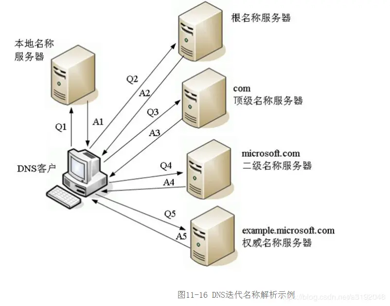

### （补充）DNS服务器类型

1.  根域名服务器

      根域名服务器是最高层次的域名服务器，主要用于管理互联网的主目录。目前全球共有13台根域名服务器，其中1台为主根服务器，位于美国，其他为12个辅根服务器，9台位于美国，英国、瑞典和日本各有一台。

      所有的根域名服务器都知道所有的顶级域名服务器的域名和IP地址。根域名服务器采用传播技术，因此当DNS客户向某个根域名服务器的IP地址发出查询报文时，互联网上的路由器就能找到离这个DNS客户最近的一个根域名服务器。

2.  顶级域名服务器(TLD服务器)

      顶级域名服务器负责管理在该顶级域名服务器注册的所有二级域名。当收到DNS查询请求时，它们负责给出相应的回答，回答可能是最终的结果，也可能是下一台域名服务器的IP地址。

3.  权威性域名服务器

权威性域名服务器通常是解析器查找 IP 地址过程中的最后一步。

## 2. 浏览器向 web 服务器发送一个 HTTP 请求

1.  建立TCP连接

2.  发送http请求

## 3. 服务器响应请求

1.  服务器发送html文档

2.  浏览器解析html文件

3.  首先会解析HTML文件构建DOM树，然后解析CSS文件构建渲染树，等到渲染树构建完成后，浏览器开始布局渲染树并将其绘制到屏幕上

4.  在解析过程中，如果遇到请求外部资源时，如图片、外链的CSS、iconfont等，请求过程是异步的，并不会影响html文档进行加载。

# 三次握手与四次挥手

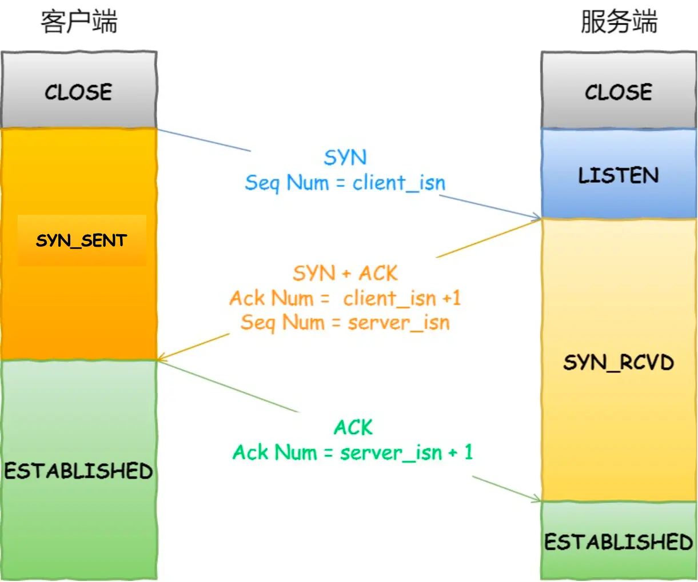

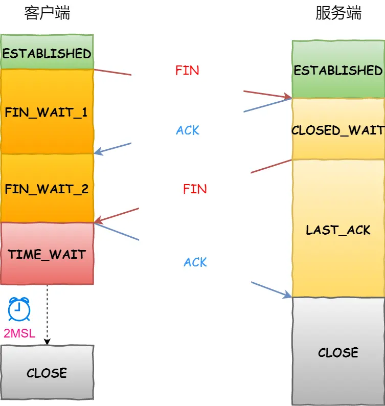

# 成员变量和局部变量

*   如果成员变量是使用 `static` 修饰的，那么这个成员变量是属于类的，如果没有使用 `static` 修饰，这个成员变量是属于实例的。而对象存在于堆内存，局部变量则存在于栈内存

*   基本数据类型存放在栈中是一个常见的误区！ 基本数据类型的存储位置取决于它们的作用域和声明方式。如果它们是局部变量，那么它们会存放在栈中；如果它们是成员变量，那么它们会存放在堆中。static变量属于这个类，也存在堆中

```Java
public class Test {
    // 成员变量，存放在堆中
    int a = 10;
    // 被 static 修饰，也存放在堆中，但属于类，不属于对象
    // JDK1.7 静态变量从永久代(Permanent Generation，使用永久代实现的方法区)移动了 Java 堆中
    static int b = 20;

    public void method() {
        // 局部变量，存放在栈中
        int c = 30;
        static int d = 40; // 编译错误，不能在方法中使用 static 修饰局部变量
    }
}
```

```Java
public class VariableExample {

    // 成员变量
    private String name;
    private int age;

    // 方法中的局部变量
    public void method() {
        int num1 = 10; // 栈中分配的局部变量
        String str = "Hello, world!"; // 栈中分配的局部变量
        System.out.println(num1);
        System.out.println(str);
    }

    // 带参数的方法中的局部变量
    public void method2(int num2) {
        int sum = num2 + 10; // 栈中分配的局部变量
        System.out.println(sum);
    }

    // 构造方法中的局部变量
    public VariableExample(String name, int age) {
        this.name = name; // 对成员变量进行赋值
        this.age = age; // 对成员变量进行赋值
        int num3 = 20; // 栈中分配的局部变量
        String str2 = "Hello, " + this.name + "!"; // 栈中分配的局部变量
        System.out.println(num3);
        System.out.println(str2);
    }
}
```

*   对于编译器（javac）来说，局部变量没赋值很好判断，可以**直接报错**。而成员变量可能是运行时赋值，无法判断，误报“没默认值”又会影响用户体验，所以采用**自动赋默认值**。

# 注意`char` 在 `Java` 中占两个字节。

# 关于内部类

enclosing class可以访问inner class的private/protected成员，inner class也可以访问enclosing class的private/protected成员

# 字符串常量池

为了提高性能并减少内存的开销，JVM在实例化字符串常量时进行了一系列的优化操作：

在JVM层面为字符串提供字符串常量池，可以理解为是一个缓存区；

创建字符串常量时，JVM会检查字符串常量池中是否存在这个字符串；

若字符串常量池中存在该字符串，则直接返回引用实例；若不存在，先实例化该字符串，并且，将该字符串放入字符串常量池中，以便于下次使用时，直接取用，达到缓存快速使用的效果。

```Java
String str1 = "abc";
String str2 = "abc";
System.out.println("str1 == str2: " + (str1 == str2)); //结果：str1 == str2: true
```

# 多态

多态，顾名思义，表示一个对象具有多种的状态，具体表现为父类的引用指向子类的实例。

**多态的特点:**

*   对象类型和引用类型之间具有继承（类）/实现（接口）的关系；

*   引用类型变量发出的方法调用的到底是哪个类中的方法，必须在程序运行期间才能确定；

*   多态不能调用“只在子类存在但在父类不存在”的方法；

*   如果子类重写了父类的方法，真正执行的是子类覆盖的方法，如果子类没有覆盖父类的方法，执行的是父类的方法。

# final 和 static final

*   final 变量在声明时可以不初始化，后面(构造函数或构造代码块)再初始化

*   static final 变量必须在声明时初始化，或者声明后在static代码块里初始化

# hashCode() 默认实现方式

在 Oracle OpenJDK8 中默认是 "使用线程局部状态来实现 Marsaglia's xor-shift 随机数生成", 并不是 "地址" 或者 "地址转换而来"

不同 JDK/VM 可能不同

在 Oracle OpenJDK8 中有六种生成方式 (其中第五种是返回地址), 通过添加 VM 参数: -XX:hashCode=4 启用第五种。

参考源码:

*   <https://hg.openjdk.org/jdk8u/jdk8u/hotspot/file/87ee5ee27509/src/share/vm/runtime/globals.hpp> （1127 行）

*   <https://hg.openjdk.org/jdk8u/jdk8u/hotspot/file/87ee5ee27509/src/share/vm/runtime/synchronizer.cpp> （537 行开始）

# StringBuffer StringBuilder

StringBuffer 对方法加了同步锁或者对调用的方法加了同步锁，所以是线程安全的。StringBuilder 并没有对方法进行加同步锁，所以是非线程安全的。

相同情况下使用 StringBuilder 相比使用 StringBuffer 仅能获得 10%\~15% 左右的性能提升，但却要冒多线程不安全的风险。

*   操作少量的数据: 适用 String

*   单线程操作字符串缓冲区下操作大量数据: 适用 StringBuilder

*   多线程操作字符串缓冲区下操作大量数据: 适用 StringBuffer

# String 为什么是不可变的?

```Java
public final class String implements java.io.Serializable, Comparable<String>, CharSequence {
    private final char value[];
  //...
}
```

1.  保存字符串的数组被 final 修饰且为私有的，并且String 类没有提供/暴露修改这个字符串的方法。

2.  String 类被 final 修饰导致其不能被继承，进而避免了子类破坏 String 不可变。

## 补充：

在 Java 9 之后，String、StringBuilder 与 StringBuffer 的实现改用 byte 数组存储字符串。

Java 9 为何要将 String 的底层实现由 char\[] 改成了 byte\[] ?

新版的 String 其实支持两个编码方案：Latin-1 和 UTF-16。如果字符串中包含的汉字没有超过 Latin-1 可表示范围内的字符，那就会使用 Latin-1 作为编码方案。Latin-1 编码方案下，byte 占一个字节(8 位)，char 占用 2 个字节（16），byte 相较 char 节省一半的内存空间。

# 使用 + 号拼接string

字符串对象通过“+”的字符串拼接方式，实际上是通过 StringBuilder 调用 append() 方法实现的，拼接完成之后调用 toString() 得到一个 String 对象 。

不过，在循环内使用“+”进行字符串的拼接的话，存在比较明显的缺陷：编译器不会创建单个 StringBuilder 以复用，会导致创建过多的 StringBuilder 对象。

不过，使用 “+” 进行字符串拼接会产生大量的临时对象的问题在 JDK9 中得到了解决。在 JDK9 当中，字符串相加 “+” 改为了用动态方法 makeConcatWithConstants() 来实现，而不是大量的 StringBuilder 了。这个改进是 JDK9 的 JEP 280open in new window 提出的，这也意味着 JDK 9 之后，你可以放心使用“+” 进行字符串拼接了。

# String s1 = new String("abc");这句话创建了几个字符串对象？

会创建 1 或 2 个字符串对象。

编译时期可能创建一个，如果字符串常量池还没有这个字符串的话

运行时期会在堆上面创建一个

# 不要在 finally 语句块中使用 return

当 try 语句和 finally 语句中都有 return 语句时，try 语句块中的 return 语句会被忽略。这是因为 try 语句中的 return 返回值会先被暂存在一个本地变量中，当执行到 finally 语句中的 return 之后，这个本地变量的值就变为了 finally 语句中的 return 返回值。

# 如果有些字段不想进行序列化怎么办？

对于不想进行序列化的变量，使用 transient 关键字修饰。

transient 关键字的作用是：阻止实例中那些用此关键字修饰的的变量序列化；当对象被反序列化时，被 transient 修饰的变量值不会被持久化和恢复。

关于 transient 还有几点注意：

*   transient 只能修饰变量，不能修饰类和方法。

*   transient 修饰的变量，在反序列化后变量值将会被置成类型的默认值。例如，如果是修饰 int 类型，那么反序列后结果就是 0。

*   static 变量因为不属于任何对象(Object)，所以无论有没有 transient 关键字修饰，均不会被序列化。

# 语法糖

JVM 其实并不能识别语法糖，Java 语法糖要想被正确执行，需要先通过编译器进行解糖，也就是在程序编译阶段将其转换成 JVM 认识的基本语法。这也侧面说明，Java 中真正支持语法糖的是 Java 编译器而不是 JVM。

# PECS

    producer extends consumer super

    producer : 只能get不能set。<? extends xxx>

    consumer : 只能set不能get。<? super xxx>

# 动态代理

```Java
import java.lang.reflect.InvocationHandler;
import java.lang.reflect.Method;
import java.util.Date;

public class LogHandler implements InvocationHandler {
    Object target;  // 被代理的对象，实际的方法执行者

    public LogHandler(Object target) {
        this.target = target;
    }
    @Override
    public Object invoke(Object proxy, Method method, Object[] args) throws Throwable {
        before();
        Object result = method.invoke(target, args);  // 调用 target 的 method 方法
        after();
        return result;  // 返回方法的执行结果
    }
    // 调用invoke方法之前执行
    private void before() {
        System.out.println(String.format("log start time [%s] ", new Date()));
    }
    // 调用invoke方法之后执行
    private void after() {
        System.out.println(String.format("log end time [%s] ", new Date()));
    }
}
```

```Java
import proxy.UserService;
import proxy.UserServiceImpl;
import java.lang.reflect.InvocationHandler;
import java.lang.reflect.Proxy;

public class Client2 {
    public static void main(String[] args) throws IllegalAccessException, InstantiationException {
        // 设置变量可以保存动态代理类，默认名称以 $Proxy0 格式命名
        // System.getProperties().setProperty("sun.misc.ProxyGenerator.saveGeneratedFiles", "true");
        // 1. 创建被代理的对象，UserService接口的实现类
        UserServiceImpl userServiceImpl = new UserServiceImpl();
        // 2. 获取对应的 ClassLoader
        ClassLoader classLoader = userServiceImpl.getClass().getClassLoader();
        // 3. 获取所有接口的Class，这里的UserServiceImpl只实现了一个接口UserService，
        Class[] interfaces = userServiceImpl.getClass().getInterfaces();
        // 4. 创建一个将传给代理类的调用请求处理器，处理所有的代理对象上的方法调用
        //     这里创建的是一个自定义的日志处理器，须传入实际的执行对象 userServiceImpl
        InvocationHandler logHandler = new LogHandler(userServiceImpl);
        /*
                   5.根据上面提供的信息，创建代理对象 在这个过程中，
               a.JDK会通过根据传入的参数信息动态地在内存中创建和.class 文件等同的字节码
               b.然后根据相应的字节码转换成对应的class，
               c.然后调用newInstance()创建代理实例
                 */
        UserService proxy = (UserService) Proxy.newProxyInstance(classLoader, interfaces, logHandler);
        // 调用代理的方法
        proxy.select();
        proxy.update();
        
        // 保存JDK动态代理生成的代理类，类名保存为 UserServiceProxy
        // ProxyUtils.generateClassFile(userServiceImpl.getClass(), "UserServiceProxy");
    }
}
```

## JDK动态代理和CGLib动态代理的区别

*   JDK代理只能对实现接口的类生成代理；CGLib是针对类实现代理，对指定的类生成一个子类，并覆盖其中的方法，这种通过继承类的实现方式，不能代理final修饰的类。

*   JDK代理使用的是反射机制实现aop的动态代理，CGLib代理使用字节码处理框架ASM(开源的Java字节码编辑库，操作字节码)，通过修改字节码生成子类。所以jdk动态代理的方式创建代理对象效率较高，执行效率较低，CGLib创建效率较低，执行效率高。

*   JDK动态代理机制是委托机制，具体说动态实现接口类，在动态生成的实现类里面委托handler去调用原始实现类方法，CGLib则使用的继承机制，具体说被代理类和代理类是继承关系，所以代理类是可以赋值给被代理类的，如果被代理类有接口，那么代理类也可以赋值给接口。

# Java SPI 机制

Java 中的 SPI 机制就是在每次类加载的时候会先去找到 class 相对目录下的 META-INF 文件夹下的 services 文件夹下的文件，将这个文件夹下面的所有文件先加载到内存中，然后根据这些文件的文件名和里面的文件内容找到相应接口的具体实现类，找到实现类后就可以通过反射去生成对应的对象，保存在一个 list 列表里面，所以可以通过迭代或者遍历的方式拿到对应的实例对象，生成不同的实现。

# Java 条件编译

```Java
public class ConditionalCompilation {
    public static void main(String[] args) {
        final boolean DEBUG = true;
        if(DEBUG) {
            System.out.println("Hello, DEBUG!");
        }

        final boolean ONLINE = false;

        if(ONLINE){
            System.out.println("Hello, ONLINE!");
        }
    }
}
```

反编译后代码如下：

```Java
public class ConditionalCompilation
{

    public ConditionalCompilation()
    {
    }

    public static void main(String args[])
    {
        boolean DEBUG = true;
        System.out.println("Hello, DEBUG!");
        boolean ONLINE = false;
    }
}
```

首先，我们发现，在反编译后的代码中没有System.out.println("Hello, ONLINE!");，这其实就是条件编译。当if(ONLINE)为 false 的时候，编译器就没有对其内的代码进行编译。

所以，Java 语法的条件编译，是通过判断条件为常量的 if 语句实现的。其原理也是 Java 语言的语法糖。根据 if 判断条件的真假，编译器直接把分支为 false 的代码块消除。通过该方式实现的条件编译，必须在方法体内实现，而无法在正整个 Java 类的结构或者类的属性上进行条件编译，这与 C/C++的条件编译相比，确实更有局限性。在 Java 语言设计之初并没有引入条件编译的功能，虽有局限，但是总比没有更强。

# 当泛型内包含静态变量

```Java
public class StaticTest{
    public static void main(String[] args){
        GT<Integer> gti = new GT<Integer>();
        gti.var=1;
        GT<String> gts = new GT<String>();
        gts.var=2;
        System.out.println(gti.var);
    }
}
class GT<T>{
    public static int var=0;
    public void nothing(T x){}
}
```

以上代码输出结果为：2！

有些同学可能会误认为泛型类是不同的类，对应不同的字节码，其实 由于经过类型擦除，所有的泛型类实例都关联到同一份字节码上，泛型类的静态变量是共享的。上面例子里的GT.var和GT.var其实是一个变量。

# HashMap和Hashtable的区别

## 线程是否安全:

HashMap是非线程安全的, Hashtable 是线程安全的,因为Hashtable内部的方法基本 都经过synchronized修饰。

## 效率:

因为线程安全的问题, HashMap 要比 Hashtable 效率高一点。另外,Hashtable基本被淘汰, 不要在代码中使用它; (如果你要保证线程安全的话就使用ConcurrentHashMap吧!);

## 对Nullkey和Nullvalue的支持:

HashMap 可以存储null的key和value,但null作为键只能有一个, null作为值可以有多个;

Hashtable不允许有 null 键和null值,否则会抛出NullPointerException

原因：

1.  null键：null作为键，无法使用hashcode和equals方法，所以不好

2.  null值：会出现二义性：首先通过contains(key)返回true，在get之前，另一个线程删除了value，于是get到了null，这时就无法判断是原本就是null还是因为不存在而返回的null

## 初始容量大小和每次扩充容量大小的不同:

创建时如果不指定容量初始值,Hashtable默认的初始大 小为11,之后每次扩充,容量变为原来的2n+1。HashMap默认的初始化大小为16。之后每次扩充,容 量变为原来的2倍。

创建时如果给定了容量初始值,那么Hasshtable会直接使用你给定的大小,而 HashMap 会将其扩充为2的幂次方大小(HashMap中的tablesizeFor()方法保证,下面给出了源代 码)。也就是说HashMap总是使用2的幂作为哈希表的大小,后面会介绍到为什么是2的幂次方。

## 底层数据结构:

JDK1.8以后的HashMap在解决哈希冲突时有了较大的变化,当链表长度大于阈值(默认为8)时,将链表转化为红黑树(将链表转换成红黑树前会判断,如果果当前数组的长度小于64,那么会选择先进行数组扩容,而不是转换为红黑树),以减少搜索时间(后文中我会结合源码对这一过程进行 分析)。Hashtable没有这样的机制。

# HashMap的长度为什么是2的幂次方

为了能让HashMap存取高效,尽量较少碰撞,也就是要尽量把数据分配均匀。我们上面也讲到了过了, Hash值的范围值-2147483648到2147483647,前后加起来大概40亿的映射空间,只要哈希函数映射得比较均匀松散, 一般应用是很难出现碰撞的。但问题是一个400亿长度的数组,内存是放不下的。所以这个散 列值是不能直接拿来用的。用之前还要先做对数组的长度取模运算, 得到的余数才能用来要存放的位置也就是对应的数组下标。这个数组下标的计算方法是"(n-1)\&hash"。(n代表数组长度)。这也就解释了 HashMap的长度为什么是2的幂次方。

这个算法应该如何设计呢?

我们首先可能会想到采用%取余的操作来实现。但是,重点来了:"取余(%)操作中如果除数是2的幂次则等价于与其除数减一的与(&)操作(也就是说hash%length==hash&(length-1)的前提是length是2的n次方;)。"并且采用二进制位操作&,相对于%能够提高运算效率,这就解释了HashMap的长度为什么是2的幂次方。

# HashMap 多线程操作导致死循环问题

[链接](https://javaguide.cn/java/collection/java-collection-questions-02.html#hashmap-%E5%A4%9A%E7%BA%BF%E7%A8%8B%E6%93%8D%E4%BD%9C%E5%AF%BC%E8%87%B4%E6%AD%BB%E5%BE%AA%E7%8E%AF%E9%97%AE%E9%A2%98)

# ConcurrentHashMap 为什么 key 和 value 不能为 null？

ConcurrentHashMap 的 key 和 value 不能为 null 主要是为了避免二义性。null 是一个特殊的值，表示 没 有 对 象 或 没 有 引 用 。 如 果 你 用 null 作 为 键 ， 那 么 你 就 无 法 区 分 这 个 键 是 否 存 在 于 ConcurrentHashMap 中，还是根本没有这个键。同样，如果你用 null 作为值，那么你就无法区分 这个值是否是真正存储在 ConcurrentHashMap 中的，还是因为找不到对应的键而返回的。

拿 get 方法取值来说，返回的结果为 null 存在两种情况：

*   值没有在集合中 ；

*   值本身就是 null。

这也就是二义性的由来。

多 线 程 环 境 下 ， 存 在 一 个 线 程 操 作 该 ConcurrentHashMap 时 ， 其 他 的 线 程 将 该 ConcurrentHashMap 修改的情况，所以无法通过 containsKey(key) 来判断否存在这个键值对，也就 没办法解决二义性问题了。

与此形成对比的是， HashMap 可以存储 null 的 key 和 value，但 null 作为键只能有一个，null 作为 值可以有多个。如果传入 null 作为参数，就会返回 hash 值为 0 的位置的值。单线程环境下，不存在 一个线程操作该 HashMap 时，其他的线程将该 HashMap 修改的情况，所以可以通过 contains(key) 来做判断是否存在这个键值对，从而做相应的处理，也就不存在二义性问题。

也就是说，多线程下无法正确判定键值对是否存在（存在其他线程修改的情况），单线程是可以的 （不存在其他线程修改的情况）。 如果你确实需要在 ConcurrentHashMap 中使用 null 的话，可以使用一个特殊的静态空对象来代替 null。

```Java
public static final Object NULL = new Object();
```

# Java 线程和操作系统的线程有啥区别？

**现在的 Java 线程的本质其实就是操作系统**的线程。

JDK 1.2 之前，Java 线程是基于绿色线程（Green Threads）实现的，这是一种用户级线程（用户线程）

JDK 1.2 及以后，Java 线程改为基于原生线程（Native Threads）实现，也就是说 JVM 直接使用操作系统原生的内核级线程（内核线程）来实现 Java 线程，由操作系统内核进行线程的调度和管理。

*   用户线程：由用户空间程序管理和调度的线程，运行在用户空间（专门给应用程序使用）。

*   内核线程：由操作系统内核管理和调度的线程，运行在内核空间（只有内核程序可以访问）。

区别和特点：用户线程创建和切换成本低，但不可以利用多核。内核态线程创建和切换成本高，可以利用多核。

# 单核 CPU 上运行多个线程效率一定会高吗？

对于CPU密集型线程，多个线程同时运行会导致频繁的线程切换，增加了系统的开销，降低了效率。

对于IO密集型线程，多个线程同时运行可以利用 CPU 在等待 IO 时的空闲时间，提高了效率。

因此，对于单核 CPU 来说，如果任务是 CPU 密集型的，那么开很多线程会影响效率；如果任务是 IO 密集型的，那么开很多线程会提高效率。当然，这里的“很多”也要适度，不能超过系统能够承受的上限。

# 线程死锁

死锁是指两个或两个以上的进程（线程）在执行过程中，由于竞争资源或者由于彼此通信而造成的一种阻塞的现象，若无外力作用，它们都将无法推进下去。

## 形成死锁的四个必要条件

1.  互斥条件：线程(进程)对于所分配到的资源具有排它性，即一个资源只能被一个线程(进程)占用，直到被该线程(进程)释放

2.  请求与保持条件：一个线程(进程)因请求被占用资源而发生阻塞时，对已获得的资源保持不放。

3.  不剥夺条件：线程(进程)已获得的资源在末使用完之前不能被其他线程强行剥夺，只有自己使用完毕后才释放资源。

4.  循环等待条件：当发生死锁时，所等待的线程(进程)必定会形成一个环路（类似于死循环），造成永久阻塞

### 如何避免线程死锁

我们只要破坏产生死锁的四个条件中的其中一个就可以了。

**破坏互斥**条件

这个条件我们没有办法破坏，因为我们用锁本来就是想让他们互斥的（临界资源需要互斥访问）。

**破坏请求与保持条件**

一次性申请所有的资源。

**破坏不剥夺条件**

占用部分资源的线程进一步申请其他资源时，如果申请不到，可以主动释放它占有的资源。

**破坏循环等待条件**

靠按序申请资源来预防。按某一顺序申请资源，释放资源则反序释放。破坏循环等待条件。

## 银行家算法

当资源比较有限时，可以通过银行家算法来分配资源。

银行家算法 通过先 试探 分配给该进程资源，然后通过 安全性算法 判断分配后系统是否处于安全状态，若不安全则试探分配作废，让该进程继续等待，若能够进入到安全的状态，则就 真的分配资源给该进程。

# sleep() 方法和 wait() 方法对比

共同点：两者都可以暂停线程的执行。

区别：

*   sleep() 方法没有释放锁，而 wait() 方法释放了锁 。

*   wait() 通常被用于线程间交互/通信，sleep()通常被用于暂停执行。

*   wait() 方法被调用后，线程不会自动苏醒，需要别的线程调用同一个对象上的 notify()或者 notifyAll() 方法。

*   sleep()方法执行完成后，线程会自动苏醒，或者也可以使用 wait(long timeout) 超时后线程会自动苏醒。sleep() 是 Thread 类的静态本地方法，wait() 则是 Object 类的本地方法。为什么这样设计呢？下一个问题就会聊到。

# 为什么 wait() 方法不定义在 Thread 中？

wait() 是让获得对象锁的线程实现等待，会自动释放当前线程占有的对象锁。每个对象（Object）都拥有对象锁，既然要释放当前线程占有的对象锁并让其进入 WAITING 状态，自然是要操作对应的对象（Object）而非当前的线程（Thread）。

类似的问题：为什么 sleep() 方法定义在 Thread 中？因为 sleep() 是让当前线程暂停执行，不涉及到对象类，也不需要获得对象锁。

# 可以直接调用 Thread 类的 run 方法吗？

**调用 start() 方法方可启动线程并使线程进入就绪状态，直接执行 run() 方法的话不会以多线程**的方式执行。

new 一个 Thread，线程进入了新建状态。调用 start()方法，会启动一个线程并使线程进入了就绪状态，当分配到时间片后就可以开始运行了。 start() 会执行线程的相应准备工作，然后自动执行 run() 方法的内容，这是真正的多线程工作。 但是，直接执行 run() 方法，会把 run() 方法当成一个 main 线程下的普通方法去执行，并不会在某个线程中执行它，所以这并不是多线程工作。

# Happens-before 原则

## 目的：解决程序员要求的内存可见性和放宽对编译器的束缚的矛盾

*   一方面，对于程序员来说，我们希望内存模型易于理解、易于编程，为此 JMM 的设计者要为程序员提供足够强的内存可见性保证，专业术语称之为 “强内存模型”。

*   而另一方面，编译器和处理器则希望内存模型对它们的束缚越少越好，这样它们就可以做尽可能多的优化（比如重排序）来提高性能，因此 JMM 的设计者对编译器和处理器的限制要尽可能地放松，专业术语称之为 “弱内存模型”。

## 具体内容

如果两个操作不满足以下任意一个 happens-before 规则，那么这两个操作就没有顺序的保障，JVM 可以对这两个操作进行重排序。

1.  程序次序规则（Program Order Rule）：在一个线程内，按照控制流顺序，书写在前面的操作先行发生（Happens-before）于书写在后面的操作。注意，这里说的是控制流顺序而不是程序代码顺序，因为要考虑分支、循环等结构。

2.  解锁规则（Monitor Lock Rule）：一个 unlock 操作先行发生于后面对同一个锁的 lock 操作。这里必须强调的是 “同一个锁”，而 “后面” 是指时间上的先后。

3.  volatile 变量规则：对一个 volatile 变量的写操作 happens-before 于后面对这个 volatile 变量的读操作。说白了就是对 volatile 变量的写操作的结果对于发生于其后的任何操作都是可见的。

4.  传递规则：如果 A happens-before B，且 B happens-before C，那么 A happens-before C；

5.  线程启动规则：Thread 对象的 start()方法 happens-before 于此线程的每一个动作。

6.  线程终止规则（Thread Termination Rule）：线程中的所有操作都先行发生于对此线程的终止检测，我们可以通过 Thread 对象的 join() 方法是否结束、Thread 对象的 isAlive() 的返回值等手段检测线程是否已经终止执行。

7.  线程中断规则（Thread Interruption Rule）：对线程 interrupt() 方法的调用先行发生于被中断线程的代码检测到中断事件的发生，可以通过 Thread 对象的 interrupted() 方法检测到是否有中断发生。

8.  对象终结规则（Finalizer Rule）：一个对象的初始化完成（构造函数执行结束）先行发生于它的 finalize() 方法的开始。

# 并发编程三个重要特性

## 原子性

一次操作或者多次操作，要么所有的操作全部都得到执行并且不会受到任何因素的干扰而中断，要么都不执行。在 Java 中，可以借助synchronized、各种 Lock 以及各种原子类实现原子性。synchronized 和各种 Lock 可以保证任一时刻只有一个线程访问该代码块，因此可以保障原子性。各种原子类是利用 CAS (compare and swap) 操作（可能也会用到 volatile或者final关键字）来保证原子操作。

## 可见性

当一个线程对共享变量进行了修改，那么另外的线程都是立即可以看到修改后的最新值。在 Java 中，可以借助synchronized、volatile 以及各种 Lock 实现可见性。如果我们将变量声明为 volatile ，这就指示 JVM，这个变量是共享且不稳定的，每次使用它都到主存中进行读取。

## 有序性

由于指令重排序问题，代码的执行顺序未必就是编写代码时候的顺序。我们上面讲重排序的时候也提到过：指令重排序可以保证串行语义一致，但是没有义务保证多线程间的语义也一致 ，所以在多线程下，指令重排序可能会导致一些问题。在 Java 中，volatile 关键字可以禁止指令进行重排序优化。

# wait 和 blocked 状态是否消耗CPU

1.  处于waittig和blocked状态的线程都不会消耗CPU

2.  线程频繁地挂起和唤醒需要消耗CPU, 而且代价颇大

# 乐观锁和悲观锁举例

*   悲观锁：synchronized和ReentrantLock等独占锁就是悲观锁思想的实现。

*   java.util.concurrent.atomic包下面的原子变量类（比如AtomicInteger、LongAdder）就是使用了乐观锁的一种实现方式 CAS 实现的。

# 如何实现乐观锁？

乐观锁一般会使用版本号机制或 CAS 算法实现，CAS 算法相对来说更多一些

# 乐观锁悲观锁优缺点

## 乐观锁

### 优点

*   写比较少的情况下（多读场景），可以省去锁的开销，加大了系统的整个吞吐量。

*   不会有死锁

### 缺点

*   ABA问题

*   解决方法：J.U.C 包提供了一个带有标记的原子引用类 AtomicStampedReference 来解决这个问题， 它可以通过控制变量值的版本来保证 CAS 的正确性。 大部分情况下 ABA 问题不会影响程序并发的正确性， 如果需要解决 ABA 问题，改用传统的互斥同步可能会比原子类更高效。

*   自旋时间长开销大

如果 JVM 能支持处理器提供的 pause 指令那么效率会有一定的提升，pause 指令作用：

抢锁失败时让线程短暂休眠（4几十个时钟周期），相对于上下文切换几千个时钟周期，速度快很多。

本来通过CPU 高速自旋抢锁，换成了抢锁失败后 delay一下（Pause）但是不释放CPU，delay 时间到后继续抢锁，也就是把连续的自旋抢锁转换成了更稀疏的点状的抢锁（间隔的 delay是个随机数），这样避免了上下文切换

*   只能保证一个共享变量的原子操作

CAS 只对单个共享变量有效，当操作涉及跨多个共享变量时 CAS 无效。但是从 JDK 1.5 开始，提供了AtomicReference类来保证引用对象之间的原子性，你可以把多个变量放在一个对象里来进行 CAS 操作.所以我们可以使用锁或者利用[AtomicReference](https://blog.csdn.net/small_love/article/details/111058977)类把多个共享变量合并成一个共享变量来操作。

## 悲观锁

## 版本号机制

一般是在数据表中加上一个数据版本号 version 字段，表示数据被修改的次数。当数据被修改时，version 值会加一。当线程 A 要更新数据值时，在读取数据的同时也会读取 version 值，在提交更新时，若刚才读取到的 version 值为当前数据库中的 version 值相等时才更新，否则重试更新操作，直到更新成功。

## CAS 算法

CAS 是一个原子操作，底层依赖于一条 CPU 的原子指令。

CAS 涉及到三个操作数：

*   V：要更新的变量值(Var)

*   E：预期值(Expected)

*   N：拟写入的新值(New)

当且仅当 V 的值等于 E 时，CAS 通过原子方式用新值 N 来更新 V 的值。如果不等，说明已经有其它线程更新了 V，则当前线程放弃更新。

# 算法

**c++**

1.  unordered\_map不能用pair作为key

2.  new出来的数组内元素没有初始化(比如int\* arr = new int\[n], arr是没有初始化的)，推荐使用vector

3.  auto&& 相比 auto&，前者可以接受左右值，后者只能接受左值

**java**

1.  将数组转为List如果直接使用Arrays.asList，转出来的List是不可进行增删操作的（因为本质上还是原来的数组，只是接口变了）

```Java
String[] arr = new String[] {"abc", "aaa", "bbb"}
List<String> ls = Arrays.asList(arr);
```

```Plaintext
想要转成List之后还可以add、remove，有两种方法：

1. 使用构造方法（不能装箱，不支持基本类型）
```

```Java
Integer[] arr = new Integer[] {1, 23, 55};
List<Integer> ls = new ArrayList<>(Arrays.asList(arr));
```

```Plaintext
2. 使用stream流 （可以装箱，推荐使用）
```

```Java
int[] arr = new int[] {1, 23, 55};
List<Integer> ls = Arrays.stream(arr).boxed().collect(Collectors.toList());
```

# synchronized 用法

1.  修饰实例方法 （锁当前对象实例 this）

给当前对象实例加锁，进入同步代码前要获得 当前对象实例的锁 。

```Java
synchronized void method() {
    //业务代码
}
```

1.  修饰静态方法 （锁当前类 class）

给当前类加锁，会作用于类的所有对象实例 ，进入同步代码前要获得 当前 class 的锁。这是因为静态成员不属于任何一个实例对象，归整个类所有，不依赖于类的特定实例，被类的所有实例共享。

```Java
synchronized static void method() {
    //业务代码
}
```

静态 synchronized 方法和非静态 synchronized 方法之间的调用互斥么？不互斥！如果一个线程 A 调用一个实例对象的非静态 synchronized 方法，而线程 B 需要调用这个实例对象所属类的静态 synchronized 方法，是允许的，不会发生互斥现象，因为访问静态 synchronized 方法占用的锁是当前类的锁，而访问非静态 synchronized 方法占用的锁是当前实例对象锁。

1.  修饰代码块 （锁指定对象/类）

对括号里指定的对象/类加锁：synchronized(object) 表示进入同步代码库前要获得 给定对象的锁。synchronized(类.class) 表示进入同步代码前要获得 给定 Class 的锁

```Java
synchronized(this) {
    //业务代码
}
```

**尽量不要使用 synchronized(String a) 因为** **JVM** **中，字符串常量池**具有缓存功能。

# 构造方法可以用 synchronized 修饰么？

先说结论：构造方法不能使用 synchronized 关键字修饰。

构造方法本身就属于线程安全的，不存在同步的构造方法一说。

# synchronized 底层原理

1.  synchronized语句块

synchronized 同步语句块的实现使用的是 monitorenter 和 monitorexit 指令，其中 monitorenter 指令指向同步代码块的开始位置，monitorexit 指令则指明同步代码块的结束位置。

在 Java 虚拟机(HotSpot)中，Monitor 是基于 C++实现的，由ObjectMonitoropen in new window实现的。每个对象中都内置了一个 ObjectMonitor对象。

另外，wait/notify等方法也依赖于monitor对象，这就是为什么只有在同步的块或者方法中才能调用wait/notify等方法，否则会抛出java.lang.IllegalMonitorStateException的异常的原因。

在执行monitorenter时，会尝试获取对象的锁，如果锁的计数器为 0 则表示锁可以被获取，获取后将锁计数器设为 1 也就是加 1。

1.  synchronized 修饰方法的的情况

synchronized 修饰的方法并没有 monitorenter 指令和 monitorexit 指令，取得代之的确实是 ACC\_SYNCHRONIZED 标识

JVM 通过该 ACC\_SYNCHRONIZED 访问标志来辨别一个方法是否声明为同步方法，从而执行相应的同步调用。如果是实例方法，JVM 会尝试获取实例对象的锁。如果是静态方法，JVM 会尝试获取当前 class 的锁

# 公平锁和非公平锁有什么区别？

1.  公平锁 :

锁被释放之后，先申请的线程先得到锁。性能较差一些，因为公平锁为了保证时间上的绝对顺序，上下文切换更频繁。

1.  非公平锁：

锁被释放之后，后申请的线程可能会先获取到锁，这是为了性能考虑，但可能会导致某些线程永远无法获取到锁。

# sychronized 和 ReentrantLock 比较

*   二者默认都是非公平锁，RentrantLock可以通过构造函数指定为公平锁，而 synchronized 不可以

*   两者都是可重入锁

*   synchronized 依赖于 JVM 而 ReentrantLock 依赖于 API (AQS)

# ReentrantLock 比 synchronized 增加的一些高级功能

*   等待可中断

ReentrantLock提供了一种能够中断等待锁的线程的机制，通过 lock.lockInterruptibly() 来实现这个机制。也就是说正在等待的线程可以选择放弃等待，改为处理其他事情。

*   可实现公平锁

ReentrantLock可以指定是公平锁还是非公平锁。而synchronized只能是非公平锁。所谓的公平锁就是先等待的线程先获得锁。ReentrantLock默认情况是非公平的，可以通过 ReentrantLock类的ReentrantLock(boolean fair)构造方法来指定是否是公平的。

*   可实现选择性通知（锁可以绑定多个条件）

synchronized关键字与wait()和notify()/notifyAll()方法相结合可以实现等待/通知机制。ReentrantLock类当然也可以实现，但是需要借助于Condition接口与newCondition()方法。

***

1.  等待可中断

以下代码是使用不可中断的lock()方法，即使检测到Thread.isInterrupted,一样会继续尝试获取锁，失败则继续休眠。只是在最后获取锁成功后再把当前线程置为interrupted状态,然后再中断线程。

```Java
        public static void main(String[] args) throws InterruptedException {
            final Lock lock = new ReentrantLock();
            lock.lock();
            Thread.sleep(1000);
            Thread t1 = new Thread(new Runnable(){
                @Override
                public void run() {
                    lock.lock();
//                        try {
//                                        lock.lockInterruptibly();
//                                } catch (InterruptedException e) {
//                                        // TODO Auto-generated catch block
//                                        e.printStackTrace();
//                                }
                    System.out.println(Thread.currentThread().getName()+" interrupted.");
                }
            });
            t1.start();
            Thread.sleep(1000);
            t1.interrupt();
            Thread.sleep(3000);
            System.out.println("unlock");
            lock.unlock();
        }
```

输出：

```Plaintext
unlock
Thread-0 interrupted.
```

以下是使用lockInterruptibly()方法，在interrupt之后立即抛出异常

```Java
        public static void main(String[] args) throws InterruptedException {
            final Lock lock = new ReentrantLock();
            lock.lock();
            Thread.sleep(1000);
            Thread t1 = new Thread(new Runnable(){
                @Override
                public void run() {
//                    lock.lock();
                        try {
                                        lock.lockInterruptibly();
                                } catch (InterruptedException e) {
                                        // TODO Auto-generated catch block
                                        e.printStackTrace();
                                }
                    System.out.println(Thread.currentThread().getName()+" interrupted.");
                }
            });
            t1.start();
            Thread.sleep(1000);
            t1.interrupt();
            Thread.sleep(3000);
            System.out.println("unlock");
            lock.unlock();
        }
```

输出：

```Plain
java.lang.InterruptedException
        at java.util.concurrent.locks.AbstractQueuedSynchronizer.doAcquireInterruptibly(AbstractQueuedSynchronizer.java:898)
        at java.util.concurrent.locks.AbstractQueuedSynchronizer.acquireInterruptibly(AbstractQueuedSynchronizer.java:1222)
        at java.util.concurrent.locks.ReentrantLock.lockInterruptibly(ReentrantLock.java:335)
        at org.example.App$1.run(App.java:22)
        at java.lang.Thread.run(Thread.java:750)
Thread-0 interrupted.
unlock
```

1.  可实现公平锁

```Java
 // 有参构造函数，true表示公平锁，false表示非公平锁
    ReentrantLock reentrantLock = new ReentrantLock(true);
```

1.  待写

# StampedLock 是什么？

StampedLock 是 JDK 1.8 引入的性能更好的读写锁，不可重入且不支持条件变量 Condition。

不同于一般的 Lock 类，StampedLock 并不是直接实现 Lock或 ReadWriteLock接口，而是基于 CLH 锁 独立实现的（AQS 也是基于这玩意）。

# 不需要synchronized的操作

JVM规范定义了几种原子操作：

*   基本类型（long和double除外）赋值，例如：int n = m；

*   引用类型赋值，例如：List list = anotherList。

long和double是64位数据，JVM没有明确规定64位赋值操作是不是一个原子操作，不过在x64平台的JVM是把long和double的赋值作为原子操作实现的。

# 创建线程池

1.  使用预定义的

    ```Java
    ExecutorService executor = Executors.newFixedThreadPool(10);
    ExecutorService executorService = Executors.newCachedThreadPool();
    ScheduledExecutorService executorService = Executors.newScheduledThreadPool(3);
    ExecutorService executorService = Executors.newSingleThreadExecutor();        
    ```

2.  使用new ThreadPoolExecutor构造函数

    ```Java
    ExecutorService executorService = new ThreadPoolExecutor(2, 10,
     3                 1, TimeUnit.MINUTES, new ArrayBlockingQueue<>(5, true),
     4                 Executors.defaultThreadFactory(), new ThreadPoolExecutor.AbortPolicy());
    ```

# ThreadPoolExecutor

构造方法：

```Java
ThreadPoolExecutor(
        int corePoolSize, 
        int maximumPoolSize,
        long keepAliveTime,
        TimeUnit unit,
        BlockingQueue<Runnable> workQueue,
        ThreadFactory threadFactory,
        RejectExecutionHandler handler
        )
```

参数解释：

1.  corePoolSize 核心线程池大小。

当在execute(Runnable)方法中提交新任务并且正在运行的线程数少于 corePoolSize 时，即使其他工作线程处于空闲状态，也会创建一个新线程来处理该请求。

1.  maximumPoolSize 最大线程数量。当线程池已满（正在运行的线程等于maxmumPoolSize）时，再加入任务会执行**拒绝策略**（后面会提到）

2.  keepAliveTime

线程最大空闲时间，如果在空闲时间内，任务队列没有饱和的话就会销毁除基本线程之外的线程。

1.  unit

keepAliveTime的时间单位。可选的单位有Days、HOURS、MINUTES、MILLISECONDS、MICROSECONDS、NANOSECONDS。

1.  workQueue

用于保存等待执行的任务的阻塞队列。可以选择以下几个阻塞队列：

*   容量为 Integer.MAX\_VALUE 的 LinkedBlockingQueue（无界队列）：FixedThreadPool 和 SingleThreadExector 。FixedThreadPool最多只能创建核心线程数的线程（核心线程数和最大线程数相等），SingleThreadExector只能创建一个线程（核心线程数和最大线程数都是 1），二者的任务队列永远不会被放满。

*   SynchronousQueue（同步队列）：CachedThreadPool 。SynchronousQueue 没有容量，不存储元素，目的是保证对于提交的任务，如果有空闲线程，则使用空闲线程来处理；否则新建一个线程来处理任务。也就是说，CachedThreadPool 的最大线程数是 Integer.MAX\_VALUE ，可以理解为线程数是可以无限扩展的，可能会创建大量线程，从而导致 OOM。

*   DelayedWorkQueue（延迟阻塞队列）：ScheduledThreadPool 和 SingleThreadScheduledExecutor 。DelayedWorkQueue 的内部元素并不是按照放入的时间排序，而是会按照延迟的时间长短对任务进行排序，内部采用的是“堆”的数据结构，可以保证每次出队的任务都是当前队列中执行时间最靠前的。DelayedWorkQueue 添加元素满了之后会自动扩容原来容量的 1/2，即永远不会阻塞，最大扩容可达 Integer.MAX\_VALUE，所以最多只能创建核心线程数的线程。

1.  handler

拒绝策略。当队列中的元素放满并且线程池中的线程达到最大数量时，此时线程池处于饱和状态。此时就需要做出相应的策略应对，有如下四个选项：

AbortPolicy：默认策略，抛出异常

CallerRunsPolicy：使用调用者所在线程来运行该任务，不抛出异常

DiscardOldestPolicy：丢弃队列里最旧的一个任务（等待最久的），然后再添加到队列中，不抛出异常

DiscardPolicy：直接忽略提交的任务

# ThreadLocal 和 InheritableThreadLocal 区别

ThreadLocal 每个线程独立拥有，而InheritableThreadLocal的内容可以父线程传递给子线程

在Thread的init方法中将父线程InheritableThreadLocal的值赋给了子线程

```Java
// Thread.java
private void init(ThreadGroup g, Runnable target, String name,long stackSize, AccessControlContext acc) {
                // 前面省略

        //1. 这边先判断了父线程中inheritableThreadLocals属性是否为空，不为空的话就复制给子线程
        if (parent.inheritableThreadLocals != null)
            this.inheritableThreadLocals = ThreadLocal.createInheritedMap(parent.inheritableThreadLocals);
        /* Stash the specified stack size in case the VM cares */
        this.stackSize = stackSize;

        /* Set thread ID */
        tid = nextThreadID();
    }

// ThreadLocal.java
static ThreadLocalMap createInheritedMap(ThreadLocalMap parentMap) {
        return new ThreadLocalMap(parentMap);
}

// ThreadLocal.java
        private ThreadLocalMap(ThreadLocalMap parentMap) {
            Entry[] parentTable = parentMap.table;
            int len = parentTable.length;
            setThreshold(len);
            table = new Entry[len];

            for (int j = 0; j < len; j++) {
                Entry e = parentTable[j];
                if (e != null) {
                    @SuppressWarnings("unchecked")
                    ThreadLocal<Object> key = (ThreadLocal<Object>) e.get();
                    if (key != null) {
                        Object value = key.childValue(e.value);
                        Entry c = new Entry(key, value);
                        int h = key.threadLocalHashCode & (len - 1);
                        while (table[h] != null)
                            h = nextIndex(h, len);
                        table[h] = c;
                        size++;
                    }
                }
            }
        }
```

需要注意的是一旦子线程被创建以后，再操作父线程中的ThreadLocal变量，那么子线程是不能感知的。因为父线程和子线程还是拥有各自的ThreadLocalMap,只是在创建子线程的“一刹那”将父线程的ThreadLocalMap复制给子线程，后续两者就没啥关系了。

# 双亲委派机制

## 概念

1.  每个class loader都有一个classloader类型的parent

2.  首先通过findLoadedClass方法查看该对象是否已经加载

3.  然后调用parent的loadClass方法，如果返回null，自己再通过自定义的findClass方法加载对象

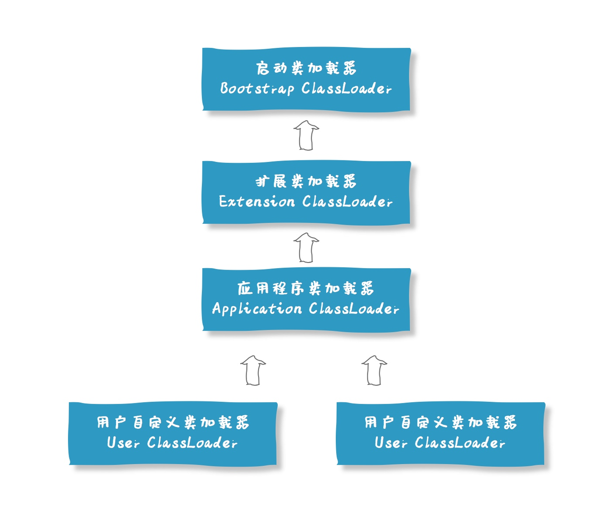

其实，Java中提供的这四种类型的加载器，是有各自的职责的：

*   Bootstrap ClassLoader ，主要负责加载Java核心类库，%JRE\_HOME%\lib下的rt.jar、resources.jar、charsets.jar和class等。

*   Extention ClassLoader，主要负责加载目录%JRE\_HOME%\lib\ext目录下的jar包和class文件。

*   Application ClassLoader ，主要负责加载当前应用的classpath下的所有类

*   User ClassLoader ， 用户自定义的类加载器,可加载指定路径的class文件

那么也就是说，一个用户自定义的类，如com.hollis.ClassHollis 是无论如何也不会被Bootstrap和Extention加载器加载的。

## 双亲委派机制好处

**避免重复加载 + 避免核心类篡改**

*   采用双亲委派模式的是好处是Java类随着它的类加载器一起具备了一种带有优先级的层次关系，通过这种层级关可以避免类的重复加载，当父亲已经加载了该类时，就没有必要子ClassLoader再加载一次。

*   其次是考虑到安全因素，java核心api中定义类型不会被随意替换，假设通过网络传递一个名为java.lang.Integer的类，通过双亲委托模式传递到启动类加载器，而启动类加载器在核心Java API发现这个名字的类，发现该类已被加载，并不会重新加载网络传递的过来的java.lang.Integer，而直接返回已加载过的Integer.class，这样便可以防止核心API库被随意篡改。

# 最重要的JVM参数

## 初始化堆内存 -Xms\[unit] 和 -Xmx\[unit]

如果我们要为 JVM 分配最小 2 GB 和最大 5 GB 的堆内存大小，我们的参数应该这样来写：

```Bash
-Xms2G -Xmx5G
```

格式：

```Bash
-Xms<heap size>[unit]
-Xmx<heap size>[unit]
```

unit 表示要初始化内存的单位。单位为 “ g” (GB)、“ m”（MB）、“ k”（KB）。

## 显式新生代内存 -XX:NewSize=\[unit] -XX:MaxNewSize=\[unit]

1.  如果我们要为 新生代分配 最小 256m 的内存，最大 1024m 的内存我们的参数应该这样来写：

```Bash
-XX:NewSize=256m
-XX:MaxNewSize=1024m
```

1.  如果我们要为 新生代分配 256m 的内存（NewSize 与 MaxNewSize 设为一致），我们的参数应该这样来写：

```Bash
-Xmn256m
```

1.  还可以通过 -XX:NewRatio= 来设置老年代与新生代内存的比值。比如下面的参数就是设置老年代与新生代内存的比值为 1。也就是说老年代和新生代所占比值为 1：1，新生代占整个堆栈的 1/2。

```Bash
-XX:NewRatio=1
```

## 设置元空间初始大小

```Bash
-XX:MetaspaceSize=N #设置 Metaspace 的初始大小（是一个常见的误区，后面会解释）
-XX:MaxMetaspaceSize=N #设置 Metaspace 的最大大小
```

Metaspace 的初始容量并不是 -XX:MetaspaceSize 设置，无论 -XX:MetaspaceSize 配置什么值，对于 64 位 JVM 来说，Metaspace 的初始容量都是 21807104（约 20.8m）。

\-XX:MetaspaceSize 的作用是控制Metespace第一次Full GC，Metaspace 由于使用不断扩容到-XX:MetaspaceSize参数指定的量，就会发生 FGC，且之后每次 Metaspace 扩容都会发生 Full GC。

由于调整元空间的大小需要Full GC，这是非常昂贵的操作，如果应用在启动的时候发生大量Full GC，通常都是由于永久代或元空间发生了大小调整，基于这种情况，一般建议在JVM参数中将MetaspaceSize和MaxMetaspaceSize设置成一样的值，并设置得比初始值要大。

# http 101 状态码

功能：协议切换

应用：http/2、WebSocket

# 根服务器全球只有13台？

截至2023年6月，全球共有1719台根域名服务器在运行。

由于DNS和UDP（数据包在IPv4内的最大有效大小为512字节）的共同限制，根域名服务器地址的数量被限制为13个。

幸运的是，采用任播技术架设镜像服务器可解决该问题，并使得实际运行的根域名服务器数量大大增加。截至2023年6月，全球共有1719台根域名服务器在运行。

任播：位于不同网络下的服务器拥有相同的IP地址

# TCP 流量控制

通过滑动窗口协议实现

滑动窗口协议既保证了分组无差错、有序接收，也实现了流量控制。主要的方式就是接收方返回的 ACK 中会包含自己的接收窗口的大小，并且利用大小来控制发送方的数据发送。

**流量控制引发的死锁？怎么避免死锁的发生？**

当发送者收到了一个窗口为0的应答，发送者便停止发送，等待接收者的下一个应答。

但是如果这个窗口不为0的应答在传输过程丢失，发送者一直等待下去，而接收者以为发送者已经收到该应答，等待接收新数据，这样双方就相互等待，从而产生死锁。

为了避免流量控制引发的死锁，TCP使用了持续计时器。每当发送者收到一个零窗口的应答后就启动该计时器。若接收者仍然返回零窗口，则重置该计时器继续等待；若窗口不为0，则重置发送窗口后开始发送，这样就避免了死锁的产生。

# MySQL

## 共享锁(in share mode) 和 排他锁(for update)

*   共享锁：

    *   允许不同事务使用共享锁读

    *   但不允许其它事务修改或者加入排他锁

    *   如果有修改必须等待一个事务提交完成，才可以执行，容易出现死锁

## 如何查看 MySQL 服务被多少个客户端连接了？

可以执行 `show processlist` 命令进行查看。

## 空闲连接会一直占用着吗？

当然不是了，MySQL 定义了空闲连接的最大空闲时长，由 wait\_timeout 参数控制的，默认值是 8 小时（28880秒），如果空闲连接超过了这个时间，连接器就会自动将它断开。

使用`show variables like 'wait_timeout';`查看

```Bash
mysql> show variables like 'wait_timeout';
+---------------+-------+
| Variable_name | Value |
+---------------+-------+
| wait_timeout  | 28800 |
+---------------+-------+
1 row in set (0.00 sec)
```

当然，我们自己也可以手动断开空闲的连接，使用的是 `kill connection + id` 的命令。

```Bash
mysql> kill connection +6;
Query OK, 0 rows affected (0.00 sec)
```

## MySQL 的连接数有限制吗？

MySQL 服务支持的最大连接数由 max\_connections 参数控制，比如我的 MySQL 服务默认是 151 个,超过这个值，系统就会拒绝接下来的连接请求，并报错提示“Too many connections”。

```Bash
mysql> show variables like 'max_connections';
+-----------------+-------+
| Variable_name   | Value |
+-----------------+-------+
| max_connections | 151   |
+-----------------+-------+
1 row in set (0.00 sec)
```

## 怎么解决长连接占用内存的问题？

两种方式。

第一种，定期断开长连接。既然断开连接后就会释放连接占用的内存资源，那么我们可以定期断开长连接。

第二种，客户端主动重置连接。MySQL 5.7 版本实现了 mysql\_reset\_connection() 函数的接口，注意这是接口函数不是命令，那么当客户端执行了一个很大的操作后，在代码里调用 mysql\_reset\_connection 函数来重置连接，达到释放内存的效果。这个过程不需要重连和重新做权限验证，但是会将连接恢复到刚刚创建完时的状态。

# MySQL 索引

## 索引失效的场景

*   使用左模糊或左右模糊

*   对索引计算或使用函数

*   索引为字符串, 比较值为数字(会将索引转为数字,即使用CAST函数)

*   联合索引非最左匹配

*   WHERE 子句中的 OR 条件中有非索引字段

**例外**

如果发生覆盖索引, 即使索引本应用不上, 也会走索引而不是全表扫描(只不过是全索引扫描index而不是范围扫描range)。

原因是二级索引树的记录东西很少，就只有「索引列+主键值」，而聚簇索引记录的东西会更多，比如聚簇索引中的叶子节点则记录了主键值、事务 id、用于事务和 MVCC 的回滚指针以及所有的剩余列。

所以，MySQL 优化器认为直接遍历二级索引树要比遍历聚簇索引树的成本要小的多，因此 MySQL 选择了「全扫描二级索引树」的方式查询数据。

## MDL

[为了能安全的对表结构进行变更，在对表结构变更前，先要看看数据库中的长事务，是否有事务已经对表加上了 MDL 读锁，如果可以考虑 kill 掉这个长事务，然后再做表结构的变更。](https://xiaolincoding.com/mysql/lock/mysql_lock.html#%E5%85%83%E6%95%B0%E6%8D%AE%E9%94%81)

## 锁

|                                  |       |
| -------------------------------- | ----- |
| 语句                               | 锁类型   |
| `select ... lock in share mode;` | 行级共享锁 |
| `select ... for update;`         | 行级独占锁 |
| update语句                         | 行级独占锁 |
| delete语句                         | 行级独占锁 |

## 有什么命令可以分析加了什么锁？

我们可以通过 `select * from performance_schema.data_locks\G;` 这条语句，查看事务执行 SQL 过程中加了什么锁。

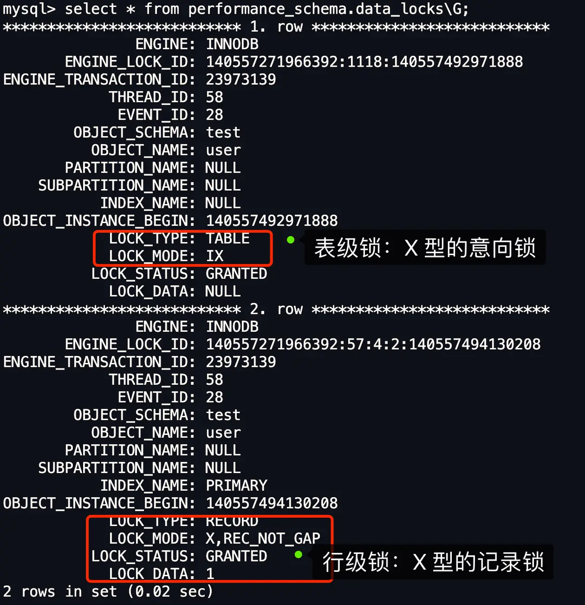

# 单例

1.
    #### 饿汉模式

```Java
/**
 * 饥饿模式: 类加载时就初始化
 */
final class HungrySingleton {
    /** 实例对象 */
    private static HungrySingleton instance = new HungrySingleton();

    /** 禁用构造方法 */
    private HungrySingleton() { }

    /**
     * 获取单例对象, 直接返回已创建的实例
     * @return instance 本类的实例
     */
    public static HungrySingleton getInstance() {
        return instance;
    }
}
```

优点: 线程安全

缺点:

1.  可能存在创建而不用的情况, 造成空间浪费

2.  如果类比较大, 加载会很耗时(对比懒汉模式)

3.
    #### 懒汉模式

4.  线程不安全, 单线程使用

```Java
public class Singleton {
    private static Singleton uniqueSingleton;

    private Singleton() {
    }

    public Singleton getInstance() {
        if (null == uniqueSingleton) {
            uniqueSingleton = new Singleton();
        }
        return uniqueSingleton;
    }
```

1.  双重检查锁 + `volatile`

```Java
/**
 * 双重检查锁模式: 对线程安全的懒惰模式的改进: 方法上的synchronized在每次调用时都要加锁, 性能太低.
 */
final class DoubleCheckedLockingSingleton {
    /** 实例对象, 添加volatile关键字, 防止指令重排序导致对象未初始化完成就被访问 */
    private static volatile DoubleCheckedLockingSingleton instance = null;

    /** 禁用构造方法 */
    private DoubleCheckedLockingSingleton() { }

    /**
     * 获取对象: 将方法上的synchronized移至内部
     * @return instance 本类的实例
     */
    public static DoubleCheckedLockingSingleton getInstance() {
        // 先判断实例是否存在
        if (instance == null) {
            // 加锁创建实例
            synchronized (DoubleCheckedLockingSingleton.class) {
                // 再次判断, 因为可能出现某个线程拿了锁之后, 还没来得及执行初始化就释放了锁,
                // 而此时其他的线程拿到了锁又执行到此处 ==> 这些线程都会创建一个实例, 从而创建多个实例对象
                if (instance == null) {
                    instance = new DoubleCheckedLockingSingleton();
                }
            }
        }
        return instance;
    }
}
```

为什么要再次判断？因为一个线程判断为null之后，另外一个线程可能已经创建了对象，所以在锁定之后，需要再次核实一下，真的为null，则进行对象创建。

1.
    #### 静态内部类

```Java
/**
 * 静态内部类模式, 也称作Singleton Holder(单持有者)模式: 线程安全, 懒惰模式的一种, 用到时再加载
 */
final class StaticInnerSingleton {
    /** 禁用构造方法 */
    private StaticInnerSingleton() { }

    /**
     * 通过静态内部类获取单例对象, 没有加锁, 线程安全, 并发性能高
     * @return SingletonHolder.instance 内部类的实例
     */
    public static StaticInnerSingleton getInstance() {
        return SingletonHolder.instance;
    }

    /** 静态内部类创建单例对象 */
    private static class SingletonHolder {
        private static StaticInnerSingleton instance = new StaticInnerSingleton();
    }
}
```

1.
    #### 枚举类单例

```Java
/**
 * 枚举类单例模式
 */
enum EnumSingleton {
    /** 此枚举类的一个实例, 可以直接通过EnumSingleton.INSTANCE来使用 */
    INSTANCE
}
```

## **破坏单例模式的方法**

> (1) 除枚举方式外, 其他方法都会通过反射的方式破坏单例, 解决方法:
>
> 反射是通过调用构造方法生成新的对象, 可以在构造方法中进行判断 —— 若已有实例, 则阻止生成新的实例, 如:
>
> ```Java
> private Singleton() throws Exception {
> if (instance != null) {
> throw new Exception("Singleton already initialized, 此类是单例类, 不允许生成新对象, 请通过getInstance()获取本类对象");
>     }
> }
> ```

(2) 如果单例类实现了序列化接口Serializable, 就可以通过反序列化破坏单例, 解决方法:

> 不实现序列化接口, 或者重写反序列化方法`readResolve()`, 反序列化时直接返回相关单例对象:
>
> ```Java
> // 反序列化时直接返回当前实例
> public Object readResolve() {return instance;
> }
> ```
>
> (3) Object#clone()方法也会破坏单例, 即使你没有实现Cloneable接口 —— 因为clone()方法是Object类中的. 解决方法是:
>
> 重写clone()方法, 并在其中抛出异常信息“Can not create clone of Singleton class”

# Bean的生命周期

1.  通过xml配置或注解方式得到BeanDefiniition，通过BeanDefinition使用反射实例化Bean

2.  通过依赖注入设置Bean的属性

3.  各种Aware（BeanNameAware的setBeanName方法等）

4.  调用BeanPostProcessor接口的postProcessBeforeInitializition方法

5.  初始化

6.  调用BeanPostProcessor接口的postProcessAfterInitializition方法

7.  创建的Bean放入一个Map里，业务中使用Bean

8.  销毁Bean

其中，

1.  初始化阶段自定义初始化有3种方式

    1.  PostConstruct注解

    2.  Bean注解或xml配置的initMethod属性，指定自定义的初始化方法

    3.  实现InitianiliziingBean的afterPropertiesSet方法
2.  销毁方法有两种方式

    1.  实现disposableBean的destory方法

    2.  Bean注解或xml配置的destoryMethod属性，指定自定义的销毁方法

# `@SpringBootApplication`注解

看作是`@Configuration`、`@EnableAutoConfiguration`、`@ComponentScan`注解的集合

*   `@EnableAutoConfiguration`：启用SpringBoot的自动配置机制

*   `@ComponentScan`：扫描被`@Component`(`@Service`、`@Controller`)注解的Bean，注解默认会扫描该类所在的包下的所有的类。

*   `@Configuration`：允许在上下文中额外注册的Bean或导入其他配置类

## `@EnableAutoConfiguration`注解[原理](https://www.jianshu.com/p/464d04c36fb1)

`@EnableAutoConfiguration`注解会引入一个EnableAutoConfigurationImportSelector类

EnableAutoConfigurationImportSelector会扫描加入的依赖中的META-INF/spring.factories文件

META-INF/spring.factories的内容类似如下

```Properties
org.springframework.boot.autoconfigure.EnableAutoConfiguration=core.bean.MyConfig,core.bean.Myconfig2,core.bean.People
```

# Spring配置文件优先级

1.  第一，在jar包的同一个目录下建config文件夹，然后把配置文件放进去。

2.  第二，直接把配置文件放到jar包的同级目录

3.  第三，classpath下建一个config文件夹，然后把配置文件放进去。

4.  第四，在classpath下直接放配置文件。

# Linux netstat命令

netstat 命令用来打印 Linux 中网络系统的状态信息，可让你得知整个 Linux 系统的网络情况。

参考：<http://man.linuxde.net/netstat>

示例：

```Bash
# 列出所有端口 (包括监听和未监听的)
netstat -a     #列出所有端口
netstat -at    #列出所有tcp端口
netstat -au    #列出所有udp端口

# 列出所有处于监听状态的 
Socketsnetstat -l        #只显示监听端口
netstat -lt       #只列出所有监听 tcp 端口
netstat -lu       #只列出所有监听 udp 端口
netstat -lx       #只列出所有监听 UNIX 端口

# 显示每个协议的统计信息
netstat -s   #显示所有端口的统计信息
netstat -st   #显示TCP端口的统计信息
netstat -su   #显示UDP端口的统计信息
```

# select、poll、epoll （[链接](https://www.xiaolincoding.com/os/8_network_system/selete_poll_epoll.html#select-poll)）

# fd\_set有多大？

fd\_set结构中成员fd\_bits数组大小为16， 而每一个元素可以表示64位，每一位将代表一个描述符， 所以16个元素可以表示1024个描述符。

# select和poll的区别？

1.  poll使用链表来管理文件描述符，解决了select中1024大小的限制

2.  新定义了 pollfd 数据结构，使用两个不同的变量来表示监听的事件和就绪的事件，这样就不需要像 select 那样每次重置 fd\_set 了。(select返回就绪socket的原理是仍然使用fd\_set，只是fd\_set中标记为1的位表示就绪的socket而不是入参时要监听的）

```C
/**
 * 获取就绪事件
 *
 * @param pollfd  要监听的文件描述符集合
 * @param nfds    文件描述符数量
 * @param timeout 本次调用的超时时间
 * @return 大于0：已就绪的文件描述符数；等于0：超时；小于：出错
 */int poll(struct pollfd *fds,unsigned int nfds,int timeout);struct pollfd {int fd;         // 监听的文件描述符
    short events;   // 监听的事件
    short revents;  // 就绪的事件
}
```

## EPOLL

### 核心流程

1）应用程序调用 epoll\_create，内核会分配一块内存空间，创建一个 epoll，最后将 epoll 的 fd 返回，我们后续可以通过这个 fd 来操作 epoll 对象

2）应用程序不断调用 epoll\_ctl 将我们要监听的 fd 维护到 epoll，内核通过红黑树的结构来高效的维护我们传入的 fd 集合

3）应用程序调用 epoll\_wait 来获取就绪事件， epoll 使用事件驱动的机制，内核里维护了一个链表来记录就绪事件，当某个 socket 有事件发生时，通过回调函数内核会将其加入到这个就绪事件列表中，当用户调用 `epoll_wait()` 函数时，只会返回有事件发生的文件描述符的个数，不需要像 select/poll 那样轮询扫描整个 socket 集合，大大提高了检测的效率。

4）应用程序根据内核返回的就绪事件，进行相应的事件处理

### 边缘触发

当被监控的 Socket 描述符上有可读事件发生时，服务器端只会从 epoll\_wait 中苏醒一次，所以要保证一次性将内核缓冲区的数据读取完

### 水平触发

当被监控的 Socket 描述符上有可读事件发生时，服务器端都会从 epoll\_wait 中苏醒

**select/poll 只有水平触发模式，epoll 默认的触发模式是水平触发，但是可以根据应用场景设置为边缘触发模式。**

# MySQL在Linux下数据库名、表名、列名、别名大小写规则

1、数据库名与表名在Windows中不区分大小写，在Linux中是严格区分大小写的；

3、列名与列的别名在所有的情况下均是忽略大小写的；

**4、字段内容默认情况下是大小写不敏感的。**

  因为默认情况下字段内容是不区分大小写的，也即大小写不敏感。所以解决方案就是要新增字段内容的校验规则。

1.  使用mysql 的`BINARY` 关键字使搜索区分大小写。

  **在查询的sql中加入**\*\*`BINARY`\*\* **关键字**

```SQL

mysql> select * from tb_user where BINARY username ='user';
+----+----------+
| id | username |
+----+----------+
|  1 | user     |
+----+----------+
1 row in set
```

1.  **在创建表的时候进行限制**

  对某一列使用BINARY

```SQL
CREATE TABLE tb_user1 (        
 id BIGINT (20) UNSIGNED NOT NULL AUTO_INCREMENT COMMENT '用户id',        
 username VARCHAR (50) BINARY NOT NULL COMMENT '用户名',        
 PRIMARY KEY (id)
) ENGINE = INNODB DEFAULT CHARSET = utf8 COMMENT = '用户表';

mysql> show create table tb_user1;
tb_user1 | CREATE TABLE tb_user1 (
  id bigint(20) unsigned NOT NULL AUTO_INCREMENT COMMENT '用户id',
  username varchar(50) CHARACTER SET utf8 COLLATE utf8_bin NOT NULL COMMENT '用户名',
  PRIMARY KEY (id)
)
ENGINE=InnoDB DEFAULT CHARSET=utf8 COMMENT='用户表'
1 row in set
```

  或者 使用 `ENGINE=InnoDB DEFAULT CHARSET=utf8 COLLATE=utf8_bin`会将字段中varchar类型的全部设置区分大小写。

```SQL
CREATE TABLE tb_user2 (       
     id BIGINT (20) UNSIGNED NOT NULL AUTO_INCREMENT COMMENT '用户id',       
     username VARCHAR (50) NOT NULL COMMENT '用户名',       
     info VARCHAR (100) NOT NULL COMMENT '详情描述',        
     PRIMARY KEY (id)
 ) ENGINE = INNODB DEFAULT CHARSET = utf8 COLLATE=utf8_bin COMMENT = '用户表';
 
 mysql> show create table tb_user2;
 tb_user2 | CREATE TABLE tb_user2 (  
     id bigint(20) unsigned NOT NULL AUTO_INCREMENT COMMENT '用户id',  
     username varchar(50) COLLATE utf8_bin NOT NULL COMMENT '用户名',  
     info varchar(100) COLLATE utf8_bin NOT NULL COMMENT '详情描述',  
     PRIMARY KEY (id)
 ) ENGINE=InnoDB DEFAULT CHARSET=utf8 COLLATE=utf8_bin COMMENT='用户表'
```

  这两种查看表的详情，本质上都是 在字段上 加上了 `COLLATE utf8_bin`。

# CORS

只要同时满足以下两大条件，就属于简单请求。

（1) 请求方法是以下三种方法之一：

*   HEAD

*   GET

*   POST

（2）HTTP的头信息不超出以下几种字段：

*   Accept

*   Accept-Language

*   Content-Language

*   Last-Event-ID

*   Content-Type：只限于三个值`application/x-www-form-urlencoded`、`multipart/form-data`、`text/plain`

1.  如果是简单请求，浏览器直接发出CORS请求，在头信息之中，添加一个`Origin`字段。

      如果`Origin`指定的源，不在许可范围内，服务器会返回一个正常的HTTP回应。浏览器发现，这个回应的头信息没有包含`Access-Control-Allow-Origin`字段，就知道出错了，从而抛出一个错误。

      CORS请求默认不发送Cookie和HTTP认证信息。如果要把Cookie发到服务器，一方面要服务器同意，指定`Access-Control-Allow-Credentials`字段。

    > ```HTTP
    > Access-Control-Allow-Credentials: true
    > ```

      另一方面，开发者必须在AJAX请求中打开`withCredentials`属性。

2.  如果是非简单请求（非简单请求是那种对服务器有特殊要求的请求，比如请求方法是`PUT`或`DELETE`，或者`Content-Type`字段的类型是`application/json`），会在正式通信之前，增加一次HTTP查询请求，称为"预检"请求。

如果服务器否定了"预检"请求，会返回一个正常的HTTP回应，但是没有任何CORS相关的头信息字段。

# [常见的SQL优化手段](https://www.yuque.com/snailclimb/mf2z3k/abc2sv)

1.  避免使用SELECT \*

2.  深度分页优化

    1.  改为子查询(只适用于ID 是正序的)

    ```SQL
    SELECT `score`, `name` FROM `cus_order` LIMIT 100000, 10

    # 改为

    SELECT `score`, `name` FROM `cus_order`
    WHERE id >= (SELECT id FROM `cus_order` LIMIT 100000, 1)
    LIMIT 10;
    ```

    1.  延迟关联

    ```SQL
    SELECT `score`,`name` FROM `cus_order` a, (SELECT id from `cus_order` LIMIT 1000000, 10) b
    WHERE a.id = b.id;

    # 或者

    SELECT `score`,`name` FROM `cus_order` a
    INNER JOIN(SELECT id from `cus_order` LIMIT 1000000, 10) b 
    ON a.id = b.id
    LIMIT 10;
    ```

    1.  覆盖索引

3.  **尽量避免多表做 join**

# ConcurrentHashMap为什么线程安全?

把整个表分成了多个segment, 锁的是每个segment而不是整张表

segement继承自reentrantlock，是一个 Segment 里包含一个 HashEntry 数组，类似于子哈希表

Jdk 1.8 之后不用segment，采用 CAS + synchronized 锁住每一个node，粒度更细了

Node实现了entry接口，是一个链表,当链表长度大于8时,会转换成红黑树(当前数组的长度小于 64，那么会选择先进行数组扩容，而不是转换为红黑树)

# 红黑树的具体应用

1.  HashMap

2.  Linux io多路复用中的epoll

# 缓存一致性

如果不太关心缓存一致性，可以给缓存设置过期时间，这样缓存只在过期时间内有一致性问题。

这也是保证最终一致性的一种解决方案

1.
    ### 只读缓存(旁路缓存)

**两种方案:**

1.  先写数据库,再删缓存(**推荐**)

2.  先删缓存,再写数据库,再删缓存(延迟双删)

**两种方案都存在一致性问题:**

\*\*共性问题:\*\*原子性问题

即缓存和数据库一个成功，一个失败。

**解决方案**是重试一定次数，一直失败则报错

**个性问题：并发问题**

1.  先写数据库,再删缓存(**推荐**)：会造成短暂的缓存不一致问题，且概率较小：写完数据库还没删除缓存的这一段时间里读到的是旧数据。但是这个时间很短，因为写缓存是写入内存，速度很快。

2.  先删缓存,再写数据库,再删缓存(延迟双删)：先删缓存之后，有另一个读操作读了旧值然后写入缓存中，这时通过再删缓存可以最终解决问题，但是如果业务应用中读取数据库和写缓存的时间不好估算，那么延迟时间就不好设置。

对于两个个性问题，都会造成短暂的一致性问题。但是可以保证最终一致性。

*   在更新缓存前先加个分布式锁，保证同一时间只运行一个请求更新缓存，就会不会产生并发问题了，当然引入了锁后，对于写入的性能就会带来影响。

*   在更新完缓存时，给缓存加上较短的过期时间，这样即使出现缓存不一致的情况，缓存的数据也会很快过期，对业务还是能接受的。

1.
    ### 读写缓存

**两种方案**：写的时候先更新缓存，再更新数据库或异步更新（等缓存淘汰时或批量异步更新）

首先都存在原子性问题，解决方法同上，通过重试来解决

对于异步更新，会出现缓存宕机且未写入数据库，导致数据丢失的问题。

**两种方法比较**：异步更新性能更好，但是有数据丢失隐患。非常适合一些数据经常变化又对数据一致性要求没那么高的场景，比如浏览量、点赞量。

1.
    ### 比较

一般来说只读缓存优于读写缓存。原因是只读缓存没有写缓存的逻辑，减少服务器负担，且数据一致性也比较好（先写数据库,再删缓存优于缓存双删）

但是数据经常变化的话，只读缓存删除频繁且操作数据太多，不如直接读写缓存

数据经常变化且不太关心数据丢失风险，使用异步读写缓存，否则使用同步读写缓存

# Redis事务

开启：MULTI

取消：DISCARD

可以通过`[WATCH](https://redis.io/commands/watch)`命令监听指定的 Key，当调用 `EXEC` 命令执行事务时，如果一个被 `WATCH` 命令监视的 Key 被 **其他客户端/Session** 修改的话，整个事务都不会被执行。

不过，如果 WATCH 与 事务 在同一个 Session 里，并且被 WATCH 监视的 Key 被修改的操作发生在事务内部，这个事务是可以被执行成功的

# 缓存雪崩

大量缓存在同一时间过期或Redis故障宕机，此时如果有大量请求，造成数据库压力过大而崩溃，就是缓存雪崩。

对于两种原因，有不同解决方法。

1.  大量数据同时过期

*   均匀设置过期时间：给数据过期时间加一个随机数

*   互斥锁：当缓存不在数据库里，对缓存加互斥锁，保证同一时间内只有一个请求来构建缓存（从数据库读取数据，再将数据更新到 Redis 里），当缓存构建完成后，再释放锁。实现互斥锁的时候，最好设置超时时间。

    *   缺点是其他线程会等待，并且有死锁的风险

        *   锁未能正确释放：如果在持有锁的过程中代码出现异常，导致锁没有被正确释放，其他所有等待锁的线程将会永远等待下去，形成死锁。

        *   锁顺序死锁：如果代码在获取了一个锁之后，又去获取另一个锁，而其他线程恰好以相反的顺序获取这两个锁，可能会导致循环等待，产生死锁。

        *   重入死锁：如果锁不是可重入的，那么同一个线程在未释放锁的情况下再次请求锁，会导致该线程永远等待自己释放锁，形成死锁。

*   业务线程不再负责更新缓存，缓存也不设置有效期，而是让缓存“永久有效”，并将更新缓存的工作交由后台线程定时更新。

1.  Redis故障宕机

*   服务熔断或请求限流

    *   服务熔断：暂停redis和数据库的使用，等到 Redis 恢复正常后，再允许业务应用访问缓存服务

    *   请求限流：只将少部分请求发送到数据库进行处理，再多的请求就在入口直接拒绝服务，等到 Redis 恢复正常并把缓存预热完后，再解除请求限流的机制。
*   通过主从节点的方式构建 Redis 缓存高可靠集群。

如果 Redis 缓存的主节点故障宕机，从节点可以切换成为主节点，继续提供缓存服务

# 缓存击穿

如果缓存中的某个热点数据过期了，此时大量的请求访问了该热点数据，就无法从缓存中读取，直接访问数据库，数据库很容易就被高并发的请求冲垮，这就是缓存击穿的问题。

解决方案：

1.  同上，互斥锁

2.  不给热点数据设置过期时间，由后台异步更新缓存（加了一个逻辑过期字段，发现过期则开启异步线程来更新，但不会删除缓存，此时请求到来得到的数据是过期的数据），或者在热点数据准备要过期前，提前通知后台线程更新缓存以及重新设置过期时间；

# 缓存穿透

当用户访问的数据，既不在缓存中，也不在数据库中，导致请求在访问缓存时，发现缓存缺失，再去访问数据库时，发现数据库中也没有要访问的数据，没办法构建缓存数据，来服务后续的请求。那么当有大量这样的请求到来时，数据库的压力骤增，这就是缓存穿透的问题。

**原因有两种：**

*   业务误操作，缓存中的数据和数据库中的数据都被误删除了，所以导致缓存和数据库中都没有数据；

*   黑客恶意攻击，故意大量访问某些读取不存在数据的业务；

**应对缓存穿透的方案，常见的方案有三种。**

1.  检验请求是否合法，如果不合法，直接拒绝

2.  缓存空值或默认值

    1.  缺点：

        1.  额外的内存消耗（可以通过设置较短的ttl来缓解，但是用户恶意攻击会导致大量空值被缓存，这时可以通过风控，禁用这个用户的账号）

        2.  短期的缓存不一致（假如插入新的数据后，写入缓存之前有请求来查缓存，查到空值直接返回，造成了不一致

3.  使用布隆过滤器

    1.  优点

        1.  内存小
    2.  缺点

        1.  无法删除元素

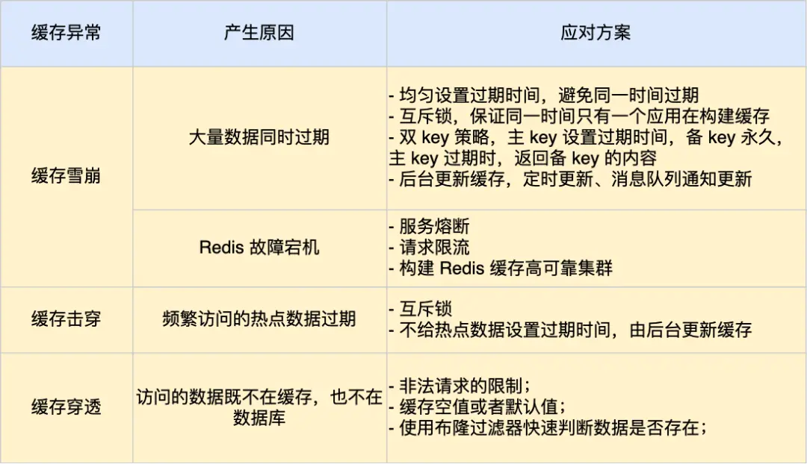

# Redis 过期时间

## 命令

    expire <key> <n> 设置key在n秒后过期

    pexpire <key> <n> 设置key在n毫秒后过期
        
    expireat <key> <n> 设置 key 在某个时间戳（精确到秒）之后过期
        
    pexpireat <key> <n>：设置 key 在某个时间戳（精确到毫秒）之后过期

当然，在设置字符串时，也可以同时对 key 设置过期时间，共有 3 种命令：

    set <key> ex <n>
        
    set <key> px <n>
        
    setex <key> <n> <value>

查看某个 key 剩余的存活时间，可以使用 `TTL <key>` 命令

如果突然反悔，取消 key 的过期时间，则可以使用 `PERSIST <key>` 命令。

## 过期删除原理

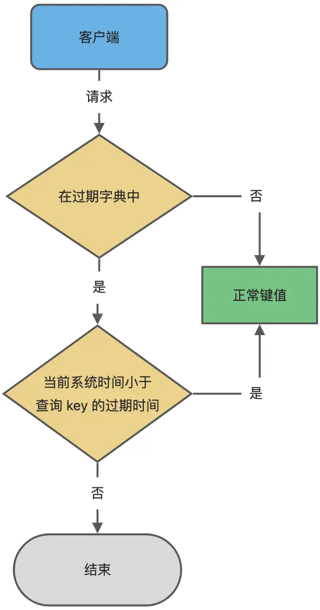

## 过期删除策略

*   定时删除

    *   原理:定时事件

    *   优点:尽快删除,内存友好

    *   缺点:对CPU不友好
*   惰性删除

    *   原理:每次访问时如果过期再删除

    *   优点:对CPU友好

    *   缺点:过期key占用内存,内存不友好
*   定期删除

    *   每隔一段时间「随机」从数据库中取出一定数量的 key 进行检查，并删除其中的过期key。

    *   优点:既能减少过期key的内存占用,又避免频繁删除对CPU的影响

    *   缺点:

        *   内存方面不如定时删除,CPU方面不如惰性删除

        *   难以确定删除的频率，和随机抽查的数量

## Redis 采用什么过期删除策略

Redis 选择「惰性删除+定期删除」这两种策略配合使用，以求在合理使用 CPU 时间和避免内存浪费之间取得平衡。

Redis定期删除的频率是：默认10秒一次，随机抽查的数量是20

# Redis 内存淘汰策略

## 如何设置Redis最大运行内存

redis.conf 中，通过参数 maxmemory `<bytes>` 来设置

### maxmemory 默认值？

64位操作系统中是0，代表无限制

32位操作系统中是3G

## Redis内存淘汰策略有哪些？

1.  无淘汰策略（noeviction）

如果达到内存限制，写入会报错。但是读和删是正常的

1.  进行数据淘汰的策略

    1.  在设置了过期时间的数据中进行淘汰

        1.  volatile-radom：随机淘汰设置了过期时间的任意键值

        2.  volatile-ttl：优先淘汰更早过期的键值

        3.  volatile-lru：最久未使用（redis3.0之前默认）

        4.  volatile-lfu：最少使用（redis4.0之后默认）
    2.  在所有数据范围内进行淘汰

        1.  allkeys-random：随机淘汰

        2.  allkeys-lru：最久未使用

        3.  allkeys-lfu：最少使用

## 如何查看当前 Redis 使用的内存淘汰策略？

*   config get maxmemory-policy

# AOF、RDB

## AOF（append only file）

### 为什么先执行命令，再把数据写入日志呢？（和mysql的WAL相反）

1.  如果语法错误就不会写入日志，避免了语法检查

2.  不会阻塞当前的写操作的线程

但是有弊端：

1.  数据可能丢失

2.  写日志时会阻塞其他操作

### AOF具体执行流程

1.  命令追加到server.aof\_buf缓冲区

2.  I/O系统调用，存入内核缓冲区

3.  内核刷盘

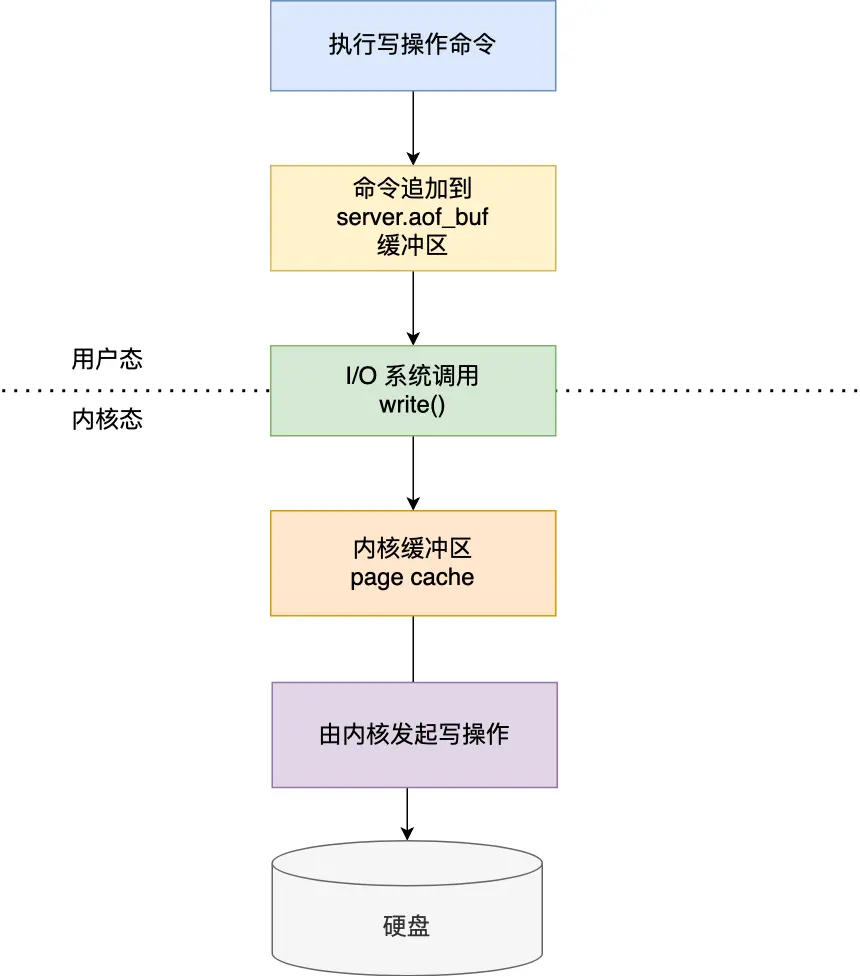

可配置的地方是何时内核刷盘

1.  Always：每次写操作都刷盘

2.  Everysec：每秒一次

3.  No：redis不控制刷盘，由操作系统决定(30秒）

三种策略都无法能完美解决「主进程阻塞」和「减少数据丢失」的问题，因为两个问题是对立的，刷盘会阻塞，不刷盘数据可能丢失。

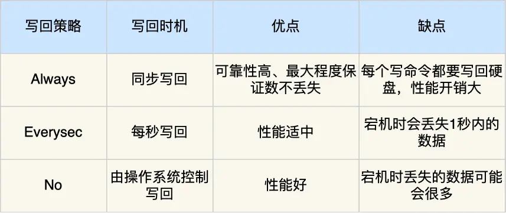

*   如果要高性能，就选择 No 策略；

*   如果要高可靠，就选择 Always 策略；

*   如果允许数据丢失一点，但又想性能高，就选择 Everysec 策略。

实现机制：fsync调用时机

1.  Always：每次写操作都fsync

2.  Everysec：创建异步任务

3.  No：永不fsync

### AOF重写机制

*   **描述**：当 AOF 文件的大小超过所设定的阈值后，Redis 就会启用 AOF 重写机制，来压缩 AOF 文件。

*   **过程**：读取当前数据库中的所有键值对，然后将每一个键值对用一条命令记录到「新的 AOF 文件」，等到全部记录完后，就将新的 AOF 文件替换掉现有的 AOF 文件。

*   为什么重写 AOF 的时候，不直接复用现有的 AOF 文件，而是先写到新的 AOF 文件再覆盖过去？

因为如果 AOF 重写过程中失败了，现有的 AOF 文件就会造成污染，可能无法用于恢复使用。

*   重写 AOF 过程是由后台子进程 *bgrewriteaof* 来完成的。这样做有两个好处：

    *   避免主进程阻塞

    *   子进程带有主进程的数据副本，不用加锁来保证数据安全。
*   有个问题，重写 AOF 日志过程中，如果主进程修改了已经存在 key-value，此时这个 key-value 数据在子进程的内存数据就跟主进程的内存数据不一致了，这时要怎么办呢？

      通过AOF重写缓冲区来实现。

      在AOF重写过程中，父进程新增的AOF日志会同时追加到「AOF 缓冲区」和 「AOF 重写缓冲区」。

      当子进程完成 AOF 重写工作后，会向主进程发送一条信号，信号是进程间通讯的一种方式，且是异步的。

      主进程收到该信号后，会调用一个信号处理函数，该函数主要做以下工作：

    *   将 AOF 重写缓冲区中的所有内容追加到新的 AOF 的文件中，使得新旧两个 AOF 文件所保存的数据库状态一致；

    *   新的 AOF 的文件进行改名，覆盖现有的 AOF 文件。
*   在整个 AOF 后台重写过程中，除了发生写时复制会对主进程造成阻塞，还有信号处理函数执行时也会对主进程造成阻塞，在其他时候，AOF 后台重写都不会阻塞主进程。

## RDB

描述：RDB 快照就是记录某一个瞬间的内存二进制数据，记录的是实际数据，而 AOF 文件记录的是命令操作的日志，而不是实际的数据。

好处：比AOF恢复数据的速度快

坏处：由于是全量数据，每次生成快照比较耗费性能

**原理：**

1.  save命令：在主进程生成RDB文件，会阻塞主线程

2.  bgsave命令：fork子进程（相关知识点：写时复制）

bgsave的执行还可以通过配置文件来定制策略：

```Plain
save 900 1
save 300 10
save 60 10000
```

  别看选项名叫 save，实际上执行的是 bgsave 命令，也就是会创建子进程来生成 RDB 快照文件。

  只要满足上面条件的任意一个，就会执行 bgsave，它们的意思分别是：

*   900 秒之内，对数据库进行了至少 1 次修改；

*   300 秒之内，对数据库进行了至少 10 次修改；

*   60 秒之内，对数据库进行了至少 10000 次修改。

**RDB和AOF的合体**

在redis4.0提出。

该方法叫混合使用 AOF 日志和内存快照，也叫混合持久化。

如果想要开启混合持久化功能，可以在 Redis 配置文件将下面这个配置项设置成 yes：

```Plain
aof-use-rdb-preamble yes
```

**原理：**

在AOF重写的过程中，AOF 文件的前半部分是 RDB 格式的全量数据，后半部分是 AOF 格式的增量数据（重写缓冲区的数据）。

# mall：如何使用Redis + AOP优化动态权限控制？

通过Redis来缓存用户的权限信息。但是使用Spring的@Cacheable注解无法处理Redis宕机问题。于是自己通过RedisTemplate来实现缓存逻辑。当Redis宕机了就需要try catch处理异常。于是所有的CacheService的相关方法都需要try catch，这部分逻辑属于重复工作。

通过AOP切面来捕获Redis的异常，然后返回null，当使用CacheService的方法获得null时，就会从数据库来获取数据。

如果又多了几个缓存业务类，**只要配置下切面即可**。

**不过并不是所有的方法都需要处理异常的**，比如我们的验证码存储（验证码属于临时数据，不用数据库），如果我们的Redis宕机了，我们的验证码存储接口需要的是报错，而不是返回执行成功。

对于上面这种需求我们可以通过自定义注解来完成，首先我们自定义一个CacheException注解，如果方法上面有这个注解，发生异常则直接抛出。

# mall: 线程安全的类有使用吗？

使用SpringSecurity认证时，找出查询到的userdetailsService拥有的权限，存入ConcurrentHashMap中（为什么？）

# GC

## 内存分配

对象首先在Eden区分配

如果Eden区空间不够某个对象使用，则进行一次minorGC（新生代GC），如果内存还不够，就把这个对象放到老年代中。

[大对象直接进入老年代](https://javaguide.cn/java/jvm/jvm-garbage-collection.html#%E5%A4%A7%E5%AF%B9%E8%B1%A1%E7%9B%B4%E6%8E%A5%E8%BF%9B%E5%85%A5%E8%80%81%E5%B9%B4%E4%BB%A3)

### 晋升机制

Eden区 -> Survivor空间(s0、s1）-> 老年代

如果对象在 Eden 出生并经过第一次 Minor GC 后仍然能够存活，并且能被 Survivor 容纳的话，将被移动到 Survivor 空间（s0 或者 s1）中，并将对象年龄设为 1

对象在 Survivor 中每熬过一次 MinorGC,年龄就增加 1 岁。

Hotspot 遍历所有对象时，按照年龄从小到大对其所占用的大小进行累积，当累积的某个年龄大小超过了 survivor 区的 50% 时（默认值是 50%，可以通过 `-XX:TargetSurvivorRatio=percent` 来设置），取这个年龄和 MaxTenuringThreshold 中更小的一个值，作为新的晋升年龄阈值”。

## HotSpot VM 有几种GC


## young GC 和 full GC 的触发条件

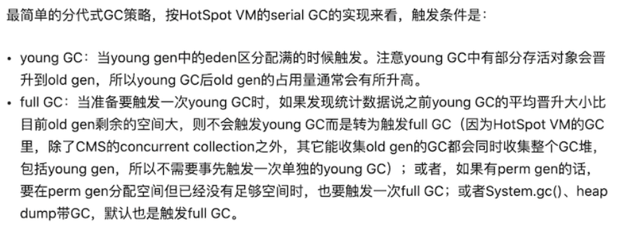

## [空间分配担保](https://javaguide.cn/java/jvm/jvm-garbage-collection.html#%E7%A9%BA%E9%97%B4%E5%88%86%E9%85%8D%E6%8B%85%E4%BF%9D)

空间分配担保是为了确保在 Minor GC 之前老年代本身还有容纳新生代所有对象的剩余空间。

当准备进行young GC时，如果发现晋升到老年代的对象平均大小大于老年代剩余空间（即有爆空间风险），就会进行full GC而不是young GC

### GC算法之死亡对象判断方法

1.  引用计数法：未被采用，因为无法解决循环引用问题

2.  可达性分析：以GC Roots为起点，寻找它们直接或间接引用的对象，如果不可达，就回收掉

#### **哪些对象作为GC Roots？**

*   虚拟机栈(栈帧中的局部变量表)中引用的对象（**局部变量**）

*   本地方法栈(Native 方法)中引用的对象（**局部变量**）

*   方法区中类静态属性引用的对象（**静态变量）**

*   方法区中常量引用的对象（**常量）**

*   所有被同步锁持有的对象

*   JNI（Java Native Interface）引用的对象

## GC算法

1.  标记-清除算法

是最基础的算法，未被采用。

缺点：

1.  \*\*效率问题：\*\*标记和清除两个过程效率都不高。

2.  \*\*空间问题：\*\*产生大量不连续的内存碎片。

3.  复制算法

      优点：没有内存碎片

      缺点：

    1.  可用内存减半

    2.  不适合老年代，因为数量多，复制很吃性能

4.  标记-整理算法

      是根据老年代的特点提出的，标记之后先整理对象，使其对其，然后清理。

      好处：相对于标记清除法，碎片少。相对于复制算法，可用空间大。

      缺点：多了整理这一步，吃性能。

## 几个垃圾回收器

### 新生代收集器

1.  Serial（串行）收集器

采用复制算法。适用于新生代。（老年代使用Serial Old收集器，标记-整理算法）

1.  ParNew

Serial收集器的多线程版本。也是新生代收集器。（老年代使用Serial Old收集器，标记-整理算法）

  在单CPU中，不比Serial性能高。

1.  Parallel Scavenge 收集器

相比于其他收集器关注STW时间，Parallel Scavenge关注点是吞吐量（高效率的利用 CPU）

（吞吐量就是 CPU 中用于运行用户代码的时间与 CPU 总消耗时间的比值。）

有自适应调节策略：-XX:+UseAdaptiveSizePolicy，打开参数后，就不需要手工指定新生代的大小（-Xmn）、Eden和Survivor区的比例（-XX:SurvivorRatio）、晋升老年代对象年龄（-XX:PretenureSizeThreshold）等细节参数了。

### 老年代收集器

1.  **Serial Old收集器**，Serial收集器的老年代版本，单线程，标记-整理算法

2.  \*\*Parallel Old收集器，\*\*Parallel Scavenge收集器的老年代版本，使用多线程和“标记-整理”算法

3.  \*\*CMS收集器，\*\*标记-清除算法。

      运作过程：（三色标记法）

    1.  初始标记。会STW，标记 GCRoots 直接引用的节点，将它们标记为灰色，速度很快

    2.  并发标记。和用户线程并发执行。从灰色节点开始，去扫描整个引用链，然后将它们标记为黑色。时间较长。

    3.  重新标记。会STW。修正并发标记期间改动的引用。

    4.  并发清除。和用户线程并发执行。

      缺点：

    1.  CPU核数较少时，占用过多CPU资源，影响吞吐量

    2.  并发清除阶段产生的浮动垃圾只能下一次再清除

    3.  产生空间碎片

4.  **G1收集器**

      也是使用三色标记法。

      使用分区思路，将堆空间分成若干个大小相等的内存区域（region），在后台维护了一个优先列表，每次根据允许的收集时间，优先选择回收价值最大的 Region

      特点：

    1.  并发

    2.  与 CMS 的“标记-清除”算法不同，G1 从整体来看是基于“标记-整理”算法实现的收集器；从局部上来看是基于复制算法实现的。

    3.  可预测的停顿

**三色标记法**

多标与漏标问题：

1.  多标问题：原本该回收的对象被标记为黑色，原因是并发标记时，用户线程删除了某些对象的引用。问题不大，只是产生浮动垃圾。

2.  漏标问题：

原因：被灰色对象引用的白色对象引用断开，后续不会标记它。但是它后来又被黑色对象引用了。

解决方法：增量更新和原始快照

1.  增量更新（CMS采用）：如果有黑色对象重新引用了白色对象，就在重新标记阶段再以这些黑色对象为根扫描

2.  原始快照（G1）：如果有灰色对象断开了白色对象的引用，就在重新标记阶段再以这些白色对象为根扫描

## 方法区主要回收的是无用的类，那么如何判断一个类是无用的类的呢？

*   所有实例被回收

*   calssloader被回收

*   class本身不被引用（不可达）

# 引用类型

1.  强引用

平常使用的引用是强引用

1.  软引用

空间不够会被回收

1.  弱引用

      只要被垃圾回收器扫描到，就会被回收，不管内存是否足够

2.  虚引用

      **虚引用主要用来跟踪对象被垃圾回收的活动**。

      **虚引用与软引用和弱引用的一个区别在于：** 虚引用必须和引用队列（ReferenceQueue）联合使用。当垃圾回收器准备回收一个对象时，如果发现它还有虚引用，就会在回收对象的内存之前，把这个虚引用加入到与之关联的引用队列中。程序可以通过判断引用队列中是否已经加入了虚引用，来了解被引用的对象是否将要被垃圾回收。

# 设计模式

1.  单例。Spring中的Bean

2.  建造者模式。SpringSecurity中SecurityFilterChain是通过构造器链来实现的

3.  工厂模式。BeanFactory等

4.  适配器模式。接口不兼容的类的协调工作。`InputStreamReader` 和 `OutputStreamWriter` 就是两个适配器(Adapter)， 同时，它们两个也是字节流和字符流之间的桥梁。

5.  观察者模式（发布订阅模式）。

# client模式和server模式

32位JDK才有两种模式。64位JDK只有server模式。

client模式与C1编译器共同运行，更注重编译的速度，启动速度快，更适合用在客户端的版本下

# Redis数据结构

## 数据结构的实现

1.
    ## String

使用sds实现

1.
    ## List

3.2之前，采用ziplist和inkedlist实现（当元素个数比较少，使用ziplist，当元素个数超过某个值时，链表键中会把 ziplist 转化为 linkedlist）

3.2之后，采用quicklist

1.
    ## Hash

采用ZipList或HashTable

当hash对象可以同时满足以下两个条件时，哈希对象使用ziplist编码。否则hashtable

*   hash的所有键值对的键和值长度在64字节内

*   键值对数量在512个以内

hashtable就是经典的hashtable，采用拉链法解决冲突

1.
    ## set

使用intset存储必须满足下面两个条件（否则使用hashtable）：

1.  set对象保存的所有元素都是整数值

2.  set对象的元素数量不超过512个

3.
    ## zset

ziplist或者skiplist

在同时满足以下两个条件的时候使用ziplist，（其他时候使用skiplist）：

*   有序集合保存的元素数量小于128个

*   有序集合保存的所有元素的长度小于64字节

***

## 底层原理

1.
    ## SDS

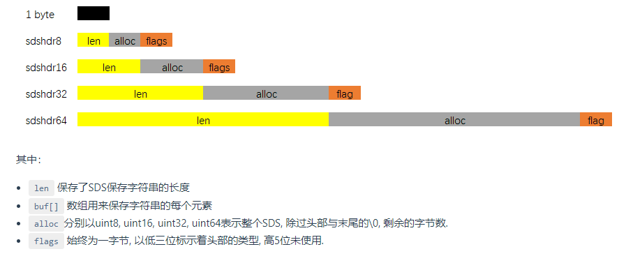

**优点：**

*   杜绝缓冲区溢出：通过len属性判断空间是否足够，不够就进行空间扩展

*   减少内存分配次数。每次字符串扩展都会分配额外的空间

*   二进制安全：不以空字符表示字符串结束，而是通过len属性，不会受到二进制中空字符的影响。

**为什么buf以空字符为结尾？**

为了能够复用string.h里的一些函数

**空间预分配：**

对字符串进行空间扩展（比如APEEND命令: APPEND KEY\_NAME NEW\_VALUE）时，如果新字符串小于1M，则扩容后的总容量为新字符串的两倍。如果新字符串大于等于1M，则扩容后的总容量为新字符串长度再加1MB。

1.
    ## ZipList

好处：不需额外的指针来存储前后节点，省空间

*   连续内存，

```Plain
area        |<---- ziplist header ---->|<----------- entries ------------->|<-end->|
size          4 bytes  4 bytes  2 bytes    ?        ?        ?        ?     1 byte
            +---------+--------+-------+--------+--------+--------+--------+-------+
component   | zlbytes | zltail | zllen | entry1 | entry2 |  ...   | entryN | zlend |
            +---------+--------+-------+--------+--------+--------+--------+-------+
                                       ^                          ^        ^
address                                |                          |        |
                                ZIPLIST_ENTRY_HEAD                |   ZIPLIST_ENTRY_END
                                                                  |
                                                         ZIPLIST_ENTRY_TAIL
```

*   zlbytes：整个ziplist占用的字节数

*   zltail：到达ziplist尾部的偏移量。用于快速找到尾部

*   zllen：ziplist中节点的数量。当这个值小于UINT16\_MAX (65535)时,这个值就是ziplist中节点的数量;当这个值等于UINT106\_MAX时,节点的数量需要遍历整个ziplist才能计算得出。

*   entry：节点，为节省空间，entry长度都不相同。每个entry存储前一个entry的长度、当前entry的长度。（以及content）

*   zlend：0xff

## quicklist

是一个ziplist组成的双向链表。每个节点使用ziplist来保存数据。

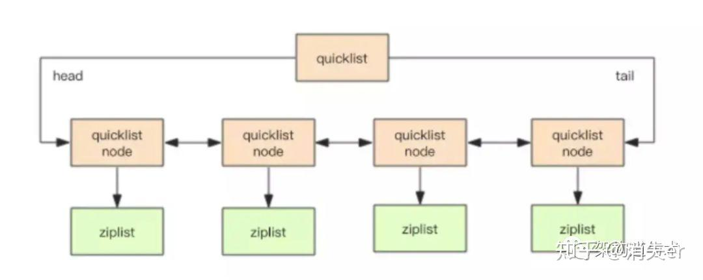

## intset

内部是一个有序数组，通过二分查找来找元素

## skiplist

原理：多级索引，每级索引都是一个链表，且步长不一样

时间复杂度是logn

# Redis为什么快？

采用io多路复用机制，提高io速度

运行在内存中，速度自然快

# 如果Redis由于单线程而出现性能瓶颈，怎么办？

多开几个Redis进程。

# Redis是多线程吗？

主要还是单线程。

其他功能是有额外线程的。比如持久化、异步删除等。

# ElasticSearch

## 倒排索引

以分词为key，这个词出现在哪些文档为value

# 循环依赖

## 无法解决的：

1.  单例：构造函数里互相注入：由于都在实例化阶段，

2.  原型（prototype）：由于原型bean会每次都新建一个，所以会导致无穷构建的问题，所以检测到原型bean的互相依赖，spring会抛出异常。

spring如何检测到原型bean的循环依赖？原型bean在实例化之后，会放到一个Set里，这个set放到一个叫做prototypesCurrentlyInCreation的threadlocal里。

# spring三级缓存

三级缓存分别是：

```Java
private final Map<String, Object> singletonObjects = new ConcurrentHashMap<>(256); //一级缓存
private final Map<String, Object> earlySingletonObjects = new HashMap<>(16); // 二级缓存
private final Map<String, ObjectFactory<?>> singletonFactories = new HashMap<>(16); // 三级缓存
```

singletonObjects ：已经实例化并且填充好属性的

earlySingletonObjects ：已经实例化但是没有填充好属性的

singletonFactories ：spring在实例化bean之后（填充属性之前），把bean包装成beanFactory放到这里

**获取bean的过程：**

1.  先从`一级缓存singletonObjects`中去获取。（如果获取到就直接return）

2.  如果获取不到并且对象正在创建中（`isSingletonCurrentlyInCreation()`），那就再从`二级缓存earlySingletonObjects`中获取。（如果获取到就直接return）

3.  如果还是获取不到，就去获取singletonFactory，获取到的singletonFactory 不为null的话，通过singletonFactory.getObject()方法获取

4.  获取到了之后，就把这个singletonFatory移除掉，并把获取到的bean放入二级缓存中。

# mall：库存一致性？

生成订单的service里使用@transactional注解，保证库存的一致性

# mall：超卖问题？

乐观锁

串行化

# mall： 为什么锁库存？

如果没有锁库存，就只有减实际库存的操作。那么减库存的时机有两种：下单后立即减库存，或者支付成功再减库存。

前者如果支付失败，要把库存加回去，会出现许多无效账目信息（特别是有恶意下单不支付的时候）

后者会发生支付完成而库存不够的情况。

而有了锁库存机制，

# 是否可以对静态成员变量加锁？

可以。静态成员是线程共享的，对它加锁可以保证同步。

# 线程池关闭方法？

1.  shutdown和shutdownNow。

调用后，都需要awaitTermination(int, TimeUnit)。

1.  shutdown：正在执行的任务会继续执行完，没执行的会直接返回。shutdown的返回类型是void

2.  shutdownNow：正在执行的任务会终止（通过 Thread.interrupt 实现，未能响应中断的任务可能不会停止），没执行的会直接返回。shutdownNow会返回未执行的任务列表（`List<Runnable>`）

# 线程安全的类？

1.  第一代线程安全的集合类

Vector、Hashtable

是怎么保证线程安排的：使用synchronized修饰方法

缺点：效率低下

1.  第二代线程不安全的集合类

ArrayList、HashMap

优点是性能好

**使用ArrayList、HashMap,需要线程安全怎么办呢？**

Collections.synchronizedList(list);

Collections.synchronizedMap(map);

底层使用了synchronized锁住了

1.  第三代线程安全集合类

concurrentHashMap

写时复制机制：

CopyOnWriteArrayList

在有写操作（会使用ReentrantLock）的时候会copy一份数据，然后写（写写互斥，读写不互斥）完再设置成新的数据。适用于读多写少

CopyOnWriteArraySet

使用一个CopyOnWriteArrayList来做代理

# docker命令

*   docker -it ：i时interactive，使容器stdin保持打开，t是tty，打开伪终端

*   docker 使用 dockerfile 构建镜像：docker build -f DOCKERFILE-NAME -t IMAGE-NAME:TAG CONTEXT

最后的CONTEXT是构建时的上下文，docker会从上下文中添加所需文件（如dockerfile里ADD命令所指定文件）

*   exec 和 run ： exec是容器，run是镜像。

    *   在容器mynginx中开启一个交互模式的终端：docker exec -it mynginx /bin/bash

    *   使用镜像来开启容器：docker run -it IMAGE:TAG /bin/bash

*   停止容器：docker stop container-name

*   删除容器：docker rm container-id

*   通过id删除镜像：docker rmi imgid

*   通过name和tag删除镜像：docker rmi name:tag

*   查看所有容器：docker ps -a

*   查看正在运行的容器：docker ps

*   查看所有镜像：docker images

*   运行一个已经停止的容器: docker start ID|NAME

*   docker搜索镜像: docker search imgname

*   设置数据卷: docker run -v 宿主机目录:容器目录 ...

*   端口: -p 宿主端口:容器端口

*   把容器转为镜像: docker commit 容器ID 镜像名:版本号

# 增删改是默认使用事务的。MySQL中autocommit是默认开启的，此时

# binlog、redo log、undo log

*   undolog两大作用：

    *   实现事务回滚，保障事务原子性

    *   实现MVCC

redolog和binlog：保证事务持久性

*   redolog：crash safe能力，崩溃恢复

*   binlog：数据备份、主从复制

## undolog

原理：形成链表结构的undolog链

## redolog

redolog是记录数据页物理变化日志，记录了某个数据页做了什么修改，对 XXX 表空间中的 YYY 数据页 ZZZ 偏移量的地方做了AAA 更新，每当执行一个事务就会产生这样的一条或者多条物理日志。

**bufferpool：Innodb专属。以数据页为单位缓存数据。进行增删改的时候，先改bufferpool，然后记录到redolog里。**

在事务提交时，先将redolog持久化到磁盘（redolog更小，刷盘速度更快），不需要等bufferpool刷盘。

### redolog的刷盘策略：

首先，有一个后台线程会每秒刷盘一次。

其次，可以配置额外的策略：

我们要注意设置正确的刷盘策略`innodb_flush_log_at_trx_commit` 。根据 MySQL 配置的刷盘策略的不同，MySQL 宕机之后可能会存在轻微的数据丢失问题。·

`innodb_flush_log_at_trx_commit` 的值有 3 种，也就是共有 3 种刷盘策略：

*   **0**：设置为 0 的时候，表示每次事务提交时不进行刷盘操作。这种方式性能最高，但是也最不安全，因为如果 MySQL 挂了或宕机了，可能会丢失最近 1 秒内的事务。

*   **1**：设置为 1 的时候，表示每次事务提交时都将进行刷盘操作。这种方式性能最低，但是也最安全，因为只要事务提交成功，redo log 记录就一定在磁盘里，不会有任何数据丢失。

*   **2**：设置为 2 的时候，表示每次事务提交时都只把 log buffer 里的 redo log 内容写入 page cache（文件系统缓存）。page cache 是专门用来缓存文件的，这里被缓存的文件就是 redo log 文件。这种方式的性能和安全性都介于前两者中间。

**刷盘-策略**\*\*`innodb_flush_log_at_trx_commit`\*\* **的默认值为 1，设置为 1 的时候才不会丢失任何数据。为了保证事务的持久性，我们必须将其设置为 1。**

## binlog

binlog是逻辑日志，记录了每一条操作记录。

### binlog的三种格式

1.  statement：记录SQL语句原文。对于update\_time=now()这种，会出现问题

2.  row：直接记录数据具体的值，解决了上面的问题。但是占用了更多内存（一句statement可能会导致多个行发生变化，使用row就会每一行都分别记录）

3.  mixed：两者混合。通过判断是否会引起不一致，选用合适的方法。

### binlog刷盘机制

首先写到binlog cache里，而刷盘时机可以配置，通过sync\_binlog

1.  sync\_binlog = 0：每次提交事务都write，由系统自行判断fsync

2.  sync\_binlog = 1：每次提交事务都fsync

3.  sync\_binlog = N：每次提交事务都write，每N次事务fsync一次

### redolog 和 binlog 的写入时机：

redolog在事务执行过程中也会写入，而binlog只可能在事务提交时写入

## 两阶段提交

1.  redolog 置为prepare状态，并刷盘（**`innodb_flush_log_at_trx_commit`** **= 1）**

2.  binlog 刷盘（sync\_binlog = 1）

3.  redolog 置为commit，不需要刷盘，因为binlog已经成功写入，就算 redo log 的状态还是 prepare 也没有关系，一样会被认为事务已经执行成功

### 异常重启会出现什么现象？

我们来看看在两阶段提交的不同时刻，MySQL 异常重启会出现什么现象？下图中有时刻 A 和时刻 B 都有可能发生崩溃：

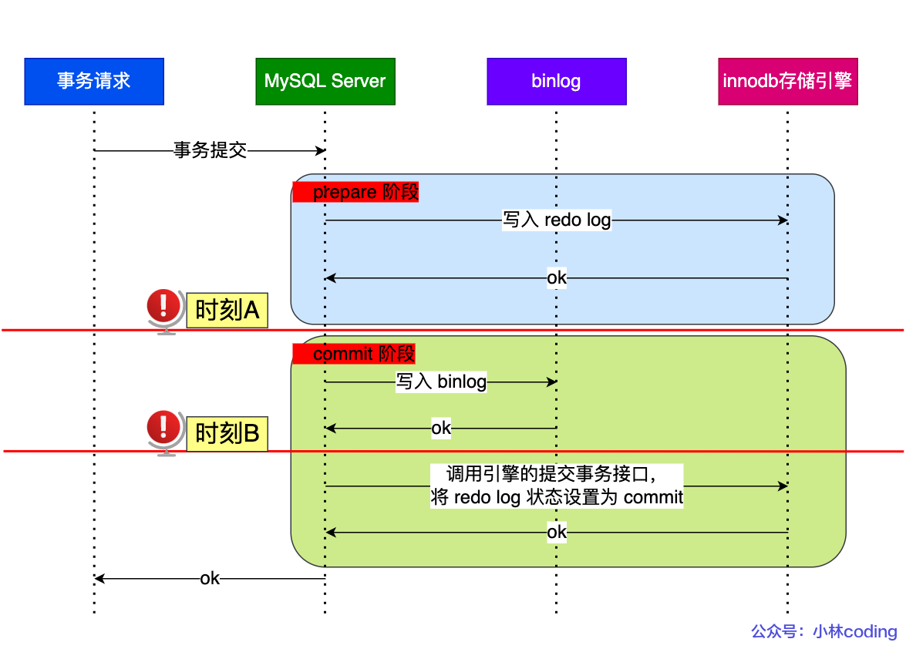

不管是时刻 A（redo log 已经写入磁盘， binlog 还没写入磁盘），还是时刻 B （redo log 和 binlog 都已经写入磁盘，还没写入 commit 标识）崩溃，此时的 redo log 都处于 prepare 状态。

在 MySQL 重启后会按顺序扫描 redo log 文件，碰到处于 prepare 状态的 redo log，就拿着 redo log 中的 XID 去 binlog 查看是否存在此 XID：

*   如果 binlog 中没有当前内部 XA 事务的 XID，说明 redolog 完成刷盘，但是 binlog 还没有刷盘，则回滚事务。对应时刻 A 崩溃恢复的情况。

*   如果 binlog 中有当前内部 XA 事务的 XID，说明 redolog 和 binlog 都已经完成了刷盘，则提交事务。对应时刻 B 崩溃恢复的情况。

### 两阶段提交的缺点：

1.  IO开销大（每次事务两次IO）。解决方法：binlog组提交，多个binlog的刷盘合为一个

# Elasticsearch

## 分片

索引默认5个分片,每个分片有一个备份,放在不同节点上

## **添加自定义的词添加到扩展字典中**

  `elasticsearch目录/plugins/ik/config/IKAnalyzer.cfg.xml`

  打开 `IKAnalyzer.cfg.xml` 文件，扩展字典

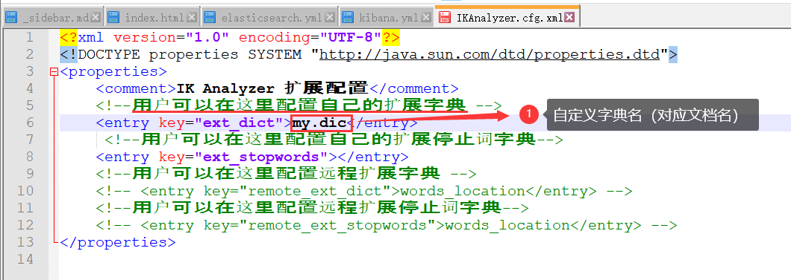

  创建字典文件，添加字典内容

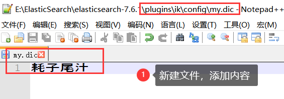

  重启ElasticSearch，再次使用kibana测试

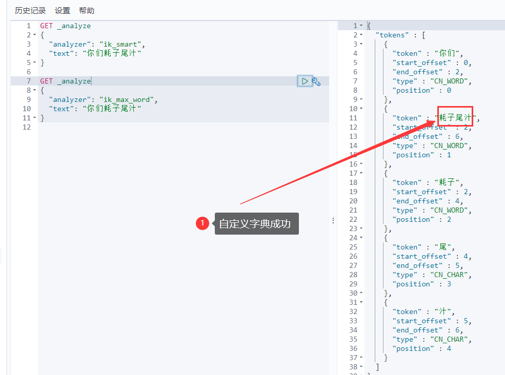

##   type

  7.0之后，type只能有一个，为\_doc

  8.0之后，没有type

  弃用原因：

  在ES中，同一个Index 下不同的 Type 如果有同名的字段，他们会被 Luecence 当作同一个字段 ，并且他们的定义必须相同。type字段没有多少意义。

## 整合springboot

1.  引入依赖

```XML
<!--Elasticsearch相关依赖-->
<dependency>
    <groupId>org.springframework.boot</groupId>
    <artifactId>spring-boot-starter-data-elasticsearch</artifactId>
</dependency>
```

1.  修改application.yml配置文件，在spring节点下添加Elasticsearch相关配置

```YAML
spring:
  data:
    elasticsearch:
      repositories:
        enabled: true # 开启ES仓库配置，自动为仓库接口生成实现类
  elasticsearch:
    uris: http://localhost:9200 # ES的连接地址及端口号
```

1.  相关注解

主要有两个：

*   @Id 标志文档的Id

*   @Field 文档中的字段，有一些参数：

    *   type：字段的类型

    ```Java
    public enum FieldType {
            Auto("auto"), //自动判断字段类型
            Text("text"), //会进行分词并建了索引的字符类型，
            Keyword("keyword"), //不会进行分词建立索引的类型
            Long("long"), //
            Integer("integer"), //
            Short("short"), //
            Byte("byte"), //
            Double("double"), //
            Float("float"), //
            Date("date"), //
            Boolean("boolean"), //
            Object("object"), //
            Nested("nested"), //嵌套对象类型
            Ip("ip"), //
    }
    ```

    ```Java
    @Field(analyzer = "ik_max_word",type = FieldType.Text)
    private String keywords;
    ```

    ```Java
    @Field(type = FieldType.Keyword)
    private String productSn;
    ```

    *   index：是否建立倒排索引

    *   store：是否进行存储

    *   analyzer：分词器的名称

1.  定义接口，由springboot来实现

```Java
/**
 * @auther macrozheng
 * @description 商品ES操作类
 * @date 2018/6/19
 * @github https://github.com/macrozheng
 */
public interface EsProductRepository extends ElasticsearchRepository<EsProduct, Long> {
    /**
     * 搜索查询
     *
     * @param name              商品名称
     * @param subTitle          商品标题
     * @param keywords          商品关键字
     * @param page              分页信息
     * @return
     */
    Page<EsProduct> findByNameOrSubTitleOrKeywords(String name, String subTitle, String keywords, Pageable page);

}
```

1.  把所有商品数据导入es

2.  商品搜索

# 十大排序

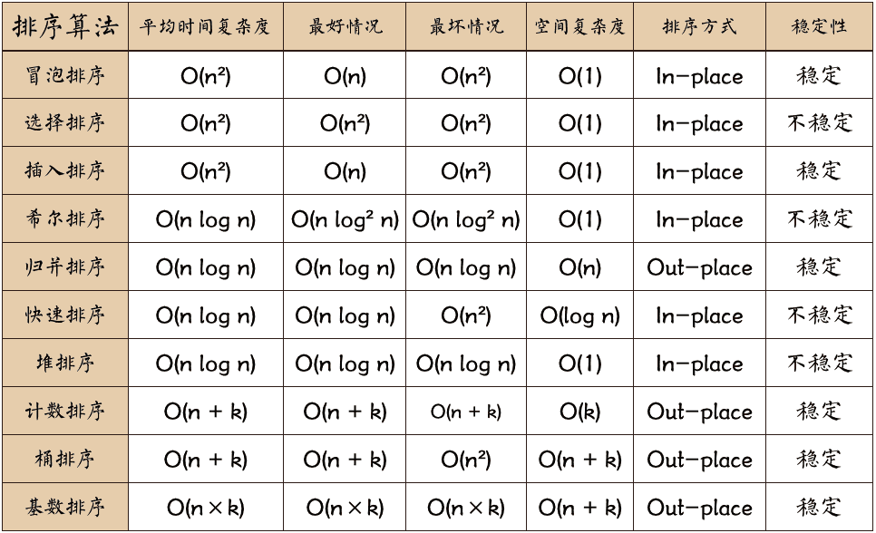

# 幂等性

## http的幂等性

*   GET : yes (天然幂等)

*   HEAD: yes (天然幂等)

*   PUT: yes （创建记录应只创建一条）

*   DELETE: yes

*   POST: no （修改会根据参数不同而结果不同）

## 幂等的实现方法

*   使用token：将token存到redis里，用户携带token来发请求。redis里有token说明是第一次，完了把token删除。

*   针对插入操作，创建唯一键。

# 锁升级

无锁

偏向锁。初次访问资源时是偏向锁。不会自动释放，从而性能高。在全局安全点（某个时间点上没有字节码正在执行）判断是否被锁，不被锁则释放这个锁

轻量级锁（自旋锁）。偏向锁被多个线程访问了

重量级锁。自旋次数超过10次

# http响应码

*   1xx：请求已被接受，需要继续处理。这类响应是临时响应，只包含状态行和某些可选的响应头信息，并以空行结束

    *   100 ：部分请求已经被服务器接收，请继续发送

    *   101：根据客户端的请求切换协议，主要用于websocket或http2升级
*   2xx：请求已成功被服务器接收、理解、并接受

    *   200：请求已成功

    *   206：成功处理了部分请求。一般用来做断点续传，或者是视频文件等大文件的加载
*   3xx：要完成请求，需要进一步操作。

    *   301：永久重定向（可缓存网页内容）

    *   302：临时重定向（不会缓存网页内容）
*   4xx：客户端看起来可能发生了错误，妨碍了服务器的处理

    *   400（错误请求）： 服务器不理解请求的语法

    *   401：未授权

    *   404：找不到
*   5xx：服务端错误

    *   500：未知错误

    *   502：错误网关

    *   504：网关超时

# Spring、SpringMVC、SpringBoot

1.  Spring：一系列模块的集合。包括Spring JDBC、SpringMVC等

2.  SpringMVC：SpringWeb项目的一种MVC模式的实现

3.  SpringBoot：通过一系列的starter和自动装配来简化Spring的开发

# Volatile底层原理

内存屏障，放置指令重排序，同时保证可见性（基于MESI协议：对共享变量修改时，会使得其他CPU中对该变量的缓存失效）

# Spring事务

声明式事务：使用方法：`@Transactional(propagation = Propagation.NESTED)`

## 常用的三种事务传播类型

1.  **REQUIRED**：默认

    1.  当前方法存在事务，则子方法加入该事务（父子共用一个事务，二者之一发生异常均会回滚）

    2.  当前方法不存在事务，子方法新建事务
2.  **REQUIRES\_NEW**

    1.  无论父方法是否有事务，子方法都会新建事务，二者独立（父方法异常不会导致子方法回滚。但是子方法异常，而父方法没有catch的话，会导致父方法也异常，从而造成父方法也回滚）
3.  **NESTED**

    1.  当前方法有事务则创建一个嵌套事务，否则等同于REQUIRED（新建一个事务）

            嵌套事务：父方法异常，则子方法也回滚。子方法异常，父方法是否回滚取决于是否catch

# 为什么不推荐外键约束

1.  数据库做额外的校验,影响性能

2.  对分库分表不友好：分库分表下外键是无法生效的

3.  高并发下容易造成死锁

# 数据库三大范式

1.  列不可拆分

2.  每一列都和主键相关，而不是只和主键的一部分相关

3.  **每列都和主键列直接相关,而不是间接相关**

# 复合主键

1.创建表的同时创建联合主键

格式:

create table 表名(

列名1 数据类型,

列名2 数据类型,

constraint 主键约束的名字 primary key(列名1,列名2)

);

格式三：

create table 表名(

列名1 数据类型,

列名2 数据类型,

primary key(列名1,列名2)

);

2.针对已经存在表，添加联合主键

格式：alter table 表名 add primary key(列名1,列名2);

格式：alter table 表名 add constraint 主键约束的名字 primary key(列名1,列名2);

3.删除主键约束格式：alter table 表名 drop primary key;

# utf8mb3和utf8mb4

前者最多3个字节

后者最多4个字节，可以表示生僻汉字、emoji等

`having` vs `where`：

`where`：过滤过滤指定的行，后面不能加聚合函数（分组函数）。`where` 在`group by` 前。

`having`：过滤分组，一般都是和 `group by` 连用，不能单独使用。`having` 在 `group by` 之后

# 协程

用户模式下的轻量级线程，是应用级别的实现，内核是看不到协程的

# interface和abstract class的区别

1.  可以实现多个interface，但只能继承一个类（包括abstract class）

2.  接口的方法是public abstrat，变量是public static final。而abstract class可以用其他修饰符

# Java8 新特性

1.  接口可以有默认方法和静态方法。（为了解决接口改变而子类也得跟着改变的问题，比如，jdk8以前没有foreach，jdk8为了让集合类有foreach，只需在Collection接口添加一个默认实现，而不需要对每一个集合类写foreach）

    1.  `default`修饰的方法，是普通实例方法，可以用`this`调用，可以被子类继承、重写。

    2.  `static`修饰的方法，使用上和一般类静态方法一样。但它不能被子类继承，只能用`Interface`调用。

2.  函数式接口：有且只有一个抽象方法，但可以有多个非抽象方法的接口。

3.  lambda表达式

4.  stream流

5.  optinal类

6.  Date-Time API

# 异常类

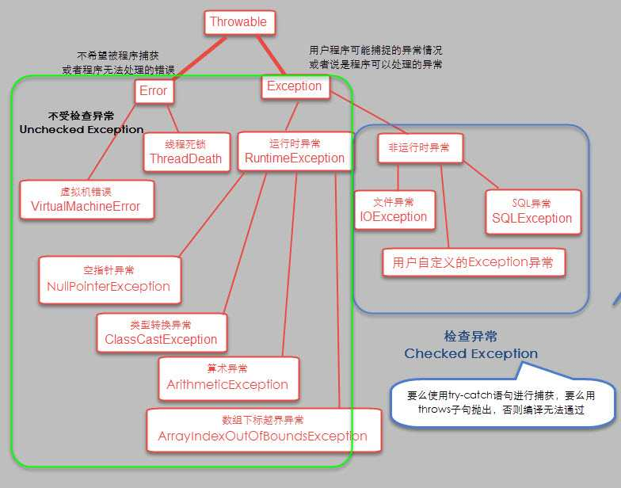

# 工厂和抽象工厂

*   工厂：一个产品系列，由子类实现具体的产品的生产

*   抽象工厂：不同的子类是不同系列产品的工厂，每个子类工厂生产自己专属系列的产品

# IOC 和 DI

*   IOC：对象的管理权交给Spring，对象自己不需要new对象，实现了代码解耦

*   DI：用来实现IOC的重要手段。通过setter、构造器方法来把所需的对象注入进去

# XSS (**跨站脚本)**

通过利用网页开发时留下的漏洞，通过巧妙的方法注入恶意指令代码到网页，使用户加载并执行攻击者恶意制造的网页程序。

# linux

## 文件名(目录也是一种文件)长度最大255字节, 包含完整路径名称的完整档名被限制在4096个字符内。

## \$\$、\$!等

*
    $$
      
    $$

*   \$! shell最后运行的后台pid (e.g. `myprog &`)

*   \$? 最后运行的命令的返回值（0代表成功）

*   $* 、$@ ：

      在 Bash 中没有双引号时, 它们两个被扩展后, 结果是一样的, 都是表示外部输入的参数列表.当有双引号时, 如 “$*”, “$@”, 这个时候, 前者表示的是用 IFS (Internal Field Separator) 分隔符连接起来的统一字符, 后者则表示的是输入的每个参数.

*   \$# 参数个数

*   \$0 对应 *./test.sh* 这个值。如果执行的是 `./work/test.sh`， 则对应 *./work/test.sh* 这个值，而不是只返回文件名本身的部分。

*   $ 1 ~  $n 具体的参数

## 命令

### top

性能分析工具，

显示当前系统正在执行的进程的相关信息，包括进程ID、内存占用率、CPU占用率等

***

### 帮助

*   **`help`** 查看bash内部命令的帮助信息（仅限bash）

*   **`whatis`** **简短的帮助信息**

*   **`man`** **整个系统所有程序的帮助信息**

*   **`info`** **linux下info格式的帮助命令**

*   **`which`** **在环境变量\$PATH 设置的目录里查找符合条件的文件。**

*   `whereis` 不只可以查找命令，其他文件类型都可以

### 文件目录

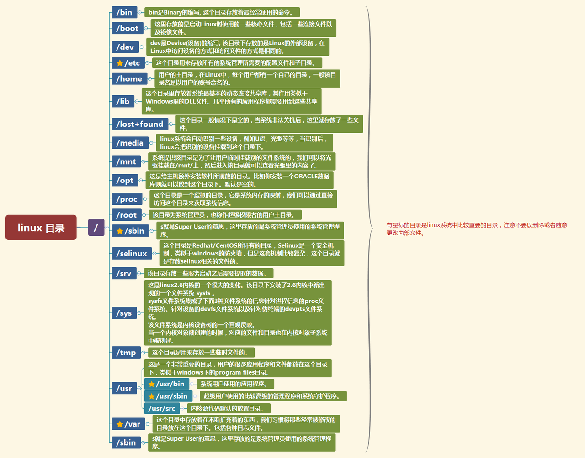

*   ls -la 列出所有文件（包括隐藏）的详细信息

*   ls -lh 列出详细信息并以可读大小显示文件大小

*   ls -lt 按时间列出文件和文件夹详细信息

*   ls -ltr 按修改时间列出文件和文件夹详细信息

*   mkdir dir1/subdir 错误，应为 mkdir -p dir1/subdir

*   rmdir -p zp/test -p删除非空目录（不加-p只能删除空目录）

*   touch 两个功能：一是用于把已存在文件的时间标签更新为系统当前的时间（默认方式），它们的数据将原封不动地保留下来；二是用来创建空文件。

*   rename 批量重命名

    *   样例1：目录test下存在两个文件：a\_01、a\_02，若需要将文件名中的a替换为b，其他部分保持不变，则

        *   若当前位于test目录下，则执行

            ```Bash
            rename a b *
            ```

        *   若当前位于test的父目录，则执行

            ```Bash
            rename a b test/*
            ```

                  Perl语言版本格式：

            ```Bash
            rename 's/原字符串/新字符串/' 文件名
            ```
    *   样例2：题目如样例1，则

        *   若当前位于test目录下，则执行

        ```Bash
        rename 's/a/b/' *
        ```

        *   若当前位于test的父目录，则执行

        ```Bash
        rename 's/a/b' test/*
        ```

*   chmod

```Bash
chmod u+x,g+w f01　　# 为文件f01设置自己可以执行，组员可以写入的权限chmod u=rwx,g=rw,o=r f01
chmod 764 f01
chmod a+x f01　　    # 对文件f01的u,g,o都设置可执行属性

# 将/home/wwwroot/里的所有文件和文件夹设置为755权限
chmod -R  755 /home/wwwroot/*
```

*   chown

```Bash
# 将目录/usr/meng及其下面的所有文件、子目录的文件主改成 liu
chown -R liu /usr/meng
```

*   locate 命令其实是 find -name 的另一种写法，但是要比后者快得多，原因在于它不搜索具体目录，而是搜索一个数据库/var/lib/locatedb

      可以在使用 locate 之前，先使用 updatedb 命令，手动更新数据库

    ```Bash
    locate pwd      #查找和 pwd 相关的所有文件
    locate /etc/sh  #搜索 etc 目录下所有以 sh 开头的文件
    ```

*   find

```Bash
# 当前目录搜索所有文件，文件内容 包含 “140.206.111.111” 的内容
find . -type f -name "*" | xargs grep "140.206.111.111"
# 列出当前目录及子目录下所有文件和文件夹
find .
# 在 /home 目录下查找以 .txt 结尾的文件名
find /home -name "*.txt"
# 同上，但忽略大小写
find /home -iname "*.txt"
# 当前目录及子目录下查找所有以 .txt 和 .pdf 结尾的文件
find . -name "*.txt" -o -name "*.pdf"
# 匹配文件路径或者文件
find /usr/ -path "*local*"
# 基于正则表达式匹配文件路径
find . -regex ".*\(\.txt\|\.pdf\)$"
# 同上，但忽略大小写
find . -iregex ".*\(\.txt\|\.pdf\)$"
# 找出 /home 下不是以 .txt 结尾的文件
find /home ! -name "*.txt"
```

*   scp

1.  本地到远程

```Bash
scp local_file remote_username@remote_ip:remote_folder 
# 例
scp /home/space/music/1.mp3 root@www.runoob.com:/home/root/others/music 
# 目录
scp -r local_folder remote_username@remote_ip:remote_folder 
```

1.  远程到本地

后两个参数调换顺序即可

```Bash
scp root@www.runoob.com:/home/root/others/music /home/space/music/1.mp3 
scp -r root@www.runoob.com:/home/root/others/ /home/space/music/
```

### 文件内容查看

*   cat

```Bash
cat m1              # 在屏幕上显示文件 ml 的内容
cat m1 m2           # 同时显示文件 ml 和 m2 的内容
cat m1 m2 > file    # 将文件 ml 和 m2 合并后放入文件 file 中
```

*   head

显示 notes.log 文件的开头 5 行，请输入以下命令：

`head -n` `5` `runoob_notes.log`

显示文件前 20 个字节:

`head -c` `20` `runoob_notes.log`

*   tail

```Bash
tail file           # 显示文件file的最后10行
tail -n +20 file    # 显示文件file的内容，从第20行至文件末尾
tail -n 20 file     # 末尾10行
tail -c 10 file     # 显示文件file的最后10个字符
```

*   more

*   less

less 命令的作用与 more 十分相似，都可以用来浏览文字档案的内容，不同的是 less 命令允许用户向前或向后浏览文件，而 more 命令只能向前浏览。用 less 命令显示文件时，用 PageUp 键向上翻页，用 PageDown 键向下翻页。要退出 less 程序，应按 Q 键。

*   sed

使用后, 文件内容并没有改变，除非你使用重定向存储输出。

或者使用 -i

```Bash
# 替换文本中的字符串
sed 's/book/books/' file

# -n 选项 和 p 命令 一起使用表示只打印那些发生替换的行
sed -n 's/test/TEST/p' file

# 直接编辑文件选项 -i ，会匹配 file 文件中每一行的第一个 book 替换为 books
sed -i 's/book/books/g' file

# 使用后缀 /g 标记会替换每一行中的所有匹配
sed 's/book/books/g' file

# 删除空白行
sed '/^$/d' file

# 删除文件的第2行
sed '2d' file

# 删除文件的第2行到末尾所有行
sed '2,$d' file

# 删除文件最后一行
sed '$d' file

# 删除文件中所有开头是test的行
sed '/^test/'d file
```

*   grep

```Bash
# 在多级目录中对文本递归搜索(程序员搜代码的最爱）:
$ grep "class" . -R -n

# 忽略匹配样式中的字符大小写
$ echo "hello world" | grep -i "HELLO"# 匹配多个模式:
$ grep -e "class" -e "vitural" file# 只在目录中所有的.php和.html文件中递归搜索字符"main()"
$ grep "main()" . -r --include *.{php,html}# 在搜索结果中排除所有README文件
$ grep "main()" . -r --exclude "README"# 在搜索结果中排除filelist文件列表里的文件
$ grep "main()" . -r --exclude-from filelist
```

# SQL

## 创建索引

1.  在表上创建一个简单索引

```SQL
CREATE INDEX index_name ON table_name (column_name)
```

1.  在表上创建一个唯一的索引。唯一的索引意味着两个行不能拥有相同的索引值。

```SQL
CREATE UNIQUE INDEX index_name ON table_name (column_name)
```

1.  创建联合索引

```SQL
CREATE INDEX index_name ON table_name (column1, column2)
```

## is NULL

而NULL = NULL和NULL <> NULL其实返回的都是 FALSE，任何值和NULL做运算的结果都是false。

使用 is NULL 和 is not NULL判断字段为空

## 清空表中的数据

```SQL
TRUNCATE TABLE user;
```

## UNION

### **SQL UNION 语法**

```SQL
SELECT column_name(s) FROM table1
UNION
SELECT column_name(s) FROM table2;
```

\*\*注释：\*\*默认地，UNION 操作符选取不同的值。如果允许重复的值，请使用 UNION ALL。

### **SQL UNION ALL 语法**

```SQL
SELECT column_name(s) FROM table1
UNION ALL
SELECT column_name(s) FROM table2;
```

\*\*注释：\*\*UNION 结果集中的列名总是等于 UNION 中第一个 SELECT 语句中的列名。

## DLL语句

#### [创建数据库](https://javaguide.cn/database/sql/sql-syntax-summary.html#%E5%88%9B%E5%BB%BA%E6%95%B0%E6%8D%AE%E5%BA%93)

```SQL
CREATE DATABASE test;
```

#### [删除数据库](https://javaguide.cn/database/sql/sql-syntax-summary.html#%E5%88%A0%E9%99%A4%E6%95%B0%E6%8D%AE%E5%BA%93)

```SQL
DROP DATABASE test;
```

#### [选择数据库](https://javaguide.cn/database/sql/sql-syntax-summary.html#%E9%80%89%E6%8B%A9%E6%95%B0%E6%8D%AE%E5%BA%93)

```SQL
USE test;
```

#### [删除数据表](https://javaguide.cn/database/sql/sql-syntax-summary.html#%E5%88%A0%E9%99%A4%E6%95%B0%E6%8D%AE%E8%A1%A8)

```SQL
DROP TABLE user;
```

添加列

```SQL
ALTER TABLE user ADD age int(3);
```

删除列

```SQL
ALTER TABLE user DROP COLUMN age;
```

修改列

```SQL
ALTER TABLE `user` MODIFY COLUMN age tinyint;
```

添加主键

```SQL
ALTER TABLE user ADD PRIMARY KEY (id);
```

删除主键

```SQL
ALTER TABLE user DROP PRIMARY KEY;
```

知识点：

*   日期格式：`YYYY-MM-DD`

*   时间格式：`HH:MM:SS`

日期和时间处理相关的常用函数：

|                |                 |
| -------------- | --------------- |
| 函 数            | 说 明             |
| ADDDATE()      | 增加一个日期（天、周等）    |
| ADDTIME()      | 增加一个时间（时、分等）    |
| CURDATE()      | 返回当前日期          |
| CURTIME()      | 返回当前时间          |
| DATE()         | 返回日期时间的日期部分     |
| DATEDIFF       | 计算两个日期之差        |
| DATE\_FORMAT() | 返回一个格式化的日期或时间串  |
| DAY()          | 返回一个日期的天数部分     |
| DAYOFWEEK()    | 对于一个日期，返回对应的星期几 |
| HOUR()         | 返回一个时间的小时部分     |
| MINUTE()       | 返回一个时间的分钟部分     |
| MONTH()        | 返回一个日期的月份部分     |
| NOW()          | 返回当前日期和时间       |
| SECOND()       | 返回一个时间的秒部分      |
| TIME()         | 返回一个日期时间的时间部分   |
| YEAR()         | 返回一个日期的年份部分     |

## [汇总数据](https://javaguide.cn/database/sql/sql-questions-01.html#%E6%B1%87%E6%80%BB%E6%95%B0%E6%8D%AE)

汇总数据相关的函数：

|         |          |
| ------- | -------- |
| 函 数     | 说 明      |
| AVG()   | 返回某列的平均值 |
| COUNT() | 返回某列的行数  |
| MAX()   | 返回某列的最大值 |
| MIN()   | 返回某列的最小值 |
| SUM()   | 返回某列值之和  |

## count(\*) 和 count(列名)

前者会统计值为NULL的行,后者不会。

# TCP粘包问题

## 为什么UDP没有粘包

UDP有消息保护边界：每次只能传输一个包

UDP没有对数据包进行重组的机制；

## TCP的粘包问题是怎么来的？

TCP是面向字节流的协议，不包含数据包的概念。需要应用层自己设计消息的边界。

TCP可能会将多个请求的结果合并为一个进行发送（比如默认的Nagle算法），这就形成了粘包问题。

## 解决办法

1.  采用固定包长度

2.  包的末尾使用固定的分隔符

3.  将消息分为头部和消息体，头部保存消息的长度

# 饿汉式如何保证线程安全

饿汉式单例模式在类加载时就实例化了一个对象，因此在多线程环境下不会有线程安全问题，实例的创建过程是在类加载时完成的，这个过程是由JVM来完成的，JVM保证了在多线程的情况下，类的加载过程是线程安全的。

在Java语言规范中，类的初始化阶段即类加载的时候，涉及到静态变量的赋值和静态块的执行。因为这个初始化阶段只会执行一次，并且是由JVM控制的，它保证了线程安全性。所以，在上述饿汉式单例模式的代码中，只要`instance`是静态变量并在类加载时初始化，那么`getInstance()`方法返回的总是同一个对象，且不会有线程安全问题。

然而，如果单例类的实例创建过程中涉及到了其他的复杂操作，比如读取外部资源或者进行一些需要时间的计算，那么在这些操作过程中还是有可能发生线程安全问题。但对于上述代码，单例的实例是在类加载时就创建好的，没有这类复杂操作，所以它是线程安全的。

## epoll

<https://cloud.tencent.com/developer/article/1488129>

epoll\_create创建一个红黑树、等待队列、就绪队列。红黑树用于存储epoll\_ctl需要监听的事件，等待队列存储epoll\_wait时被阻塞的进程，就绪队列存储已经就绪的文件描述符

**`int epoll_ctl(int epfd， int op， int fd， struct epoll_event *event)`**

epoll\_ctl在把需要监听的文件描述符事件存到红黑树后，还会注册回调函数，当网卡接收到数据后系统调用中断函数，触发注册的回调函数，把对应的socket封装成就绪队列的节点

**`int epoll_wait(int epfd， struct epoll_event *events， int maxevents， int timeout)`**

调用epoll\_wait时，会查看就绪队列是否为空，如果不为空，就把就绪的事件写入events数组中，函数返回值为就绪事件的数目。相比于select和poll，epoll只返回就绪的事件，不需要遍历就可以知道就绪的事件，而select和poll将之前传入的fd数组或链表拷贝传出用户态并返回就绪的文件描述符总数。用户态并不知道是哪些文件描述符处于就绪态，需要遍历来判断。

### 水平触发和边缘触发

**select/poll 只有水平触发模式，epoll 默认的触发模式是水平触发，但是可以根据应用场景设置为边缘触发模式。**

#### 水平触发

当被监控的文件描述符上有可读写事件发生时，epoll\_wait()会通知处理程序去读写。

如果这次没有把数据一次性全部读写完(如读写缓冲区太小)，那么下次调用 epoll\_wait()时，它还会通知你在上没读写完的文件描述符上继续读写。

如果系统中有大量你不需要读写的就绪文件描述符，而它们每次都会返回，这样会大大降低处理程序检索自己关心的就绪文件描述符的效率。

#### 边缘触发

当被监控的文件描述符上有可读写事件发生时，epoll\_wait()会通知处理程序去读写。如果这次没有把数据全部读写完(如读写缓冲区太小)，那么下次调用epoll\_wait()时，它不会通知你，也就是它只会通知你一次，直到该文件描述符上出现第二次可读写事件才会通知你。这种模式比水平触发效率高，系统不会充斥大量你不关心的就绪文件描述符。

## cookie位于哪里

*   在客户端浏览器中，Cookie 被存储在特定的文件或内存空间里。每个浏览器都有自己的方式来管理 Cookie，例如 Chrome、Firefox、Safari 等都有自己的存储机制。

*   在http请求报文中，位于`Cookie`请求头中

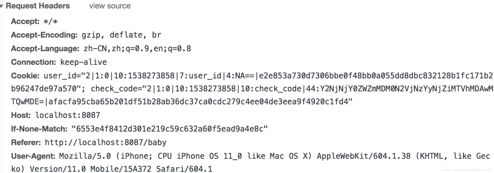

*   在http响应报文中，位于`Set-Cookie`响应头中

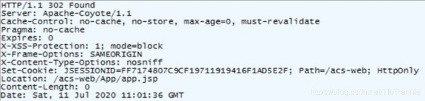

# 空字符串使用equals(null)会返回什么

答案：false

原因：会对传入对象使用instanceof，而instanceof对null的计算结果为false

源码：

```Java
    public boolean equals(Object anObject) {
        if (this == anObject) {
            return true;
        }
        if (anObject instanceof String) { // null instanceof some-class 返回 false
            String anotherString = (String)anObject;
            int n = value.length;
            if (n == anotherString.value.length) { 
                char v1[] = value;
                char v2[] = anotherString.value;
                int i = 0;
                while (n-- != 0) {
                    if (v1[i] != v2[i])
                        return false;
                    i++;
                }
                return true;
            }
        }
        return false;
    }
```

# Tomcat管理session的原理

tomcat第一次收到请求时，会创建一个session，并生成一个session-id，并通过响应头`Set-Cookie: "JSESSINONID=XXXXX"`返回给浏览器

浏览器之后在请求时，会带上JSESSIONID=XXXXXXX的cookie信息

tomcat根据这个id找到ssession，交给我们的服务器程序

# `@Resource` 和 `@Autowired`

*   @Resource是JDK原生的注解，@Autowired是Spring2.5 引入的注解

`@Autowired` 按照byType注入

`@Resource` ：

*   如果同时指定name和type，则从上下文中找唯一匹配的bean，找不到就抛异常

*   如果指定了name，则从上下文中查找名称（id）匹配的bean，找不到则抛异常

*   如果指定type，则从上下文中找到类似匹配的唯一bean进行装配，找不到或是找到多个，都会抛出异常。

*   如果既没有指定name，又没有指定type，则自动按照byName方式进行装配；如果没有匹配，则byType进行匹配，如果匹配则自动装配。

# redis限制访问的ip

`protected-mode`：指定是否启用保护模式，默认值为`yes`。在保护模式下，Redis只允许本地连接，拒绝外部连接。

在redis.conf文件, 通过bind参数

默认配置为

```Bash
bind 127.0.0.1
```

如果没有指定`bind`配置指令，则 Redis 监听来自服务器上所有可用网络接口的连接。可以使用`bind`配置指令来监听一个或多个选定的接口，在`bind`后拼接一个或多个 IP 地址即可。例如：

```Bash
bind 192.168.1.100 10.0.0.1
bind 127.0.0.1 ::1
```

警告：如果运行 Redis 的计算机直接暴露在互联网上，绑定到所有的接口是很危险的，并会将实例暴露给互联网上的每个人。因此，默认情况下，我们取消注释以下绑定指令，这将强制 Redis 只监听 IPv4 回环接口地址（这意味着 Redis 只接受来自运行它的计算机上的客户端的连接）。

如果你确定希望你的实例能够监听所有的接口，只需要注释下面的这一行即可。

```Bash
bind 127.0.0.1
```

## 网络接口

注释说明 bind 的是 network interfaces，即网络接口（网卡）。服务器可以有一个或者多个网络接口。可以使用 ifconfig 查看当前 Linux 服务器上的网络接口。

```Bash
$ ifconfig
docker0   Link encap:Ethernet  HWaddr 3A:F3:20:12:AE:6A
          inet addr:192.168.42.1  Bcast:0.0.0.0  Mask:255.255.255.0
          UP BROADCAST RUNNING MULTICAST  MTU:1500  Metric:1
          RX packets:362879 errors:0 dropped:0 overruns:0 frame:0
          TX packets:894703 errors:0 dropped:0 overruns:0 carrier:0
          collisions:0 txqueuelen:0
          RX bytes:28218097 (26.9 MiB)  TX bytes:1326305089 (1.2 GiB)
eth0      Link encap:Ethernet  HWaddr 00:16:3E:08:18:35
          inet addr:10.25.102.37  Bcast:10.25.103.255  Mask:255.255.252.0
          UP BROADCAST RUNNING MULTICAST  MTU:1500  Metric:1
          RX packets:4958304 errors:0 dropped:0 overruns:0 frame:0
          TX packets:2766733 errors:0 dropped:0 overruns:0 carrier:0
          collisions:0 txqueuelen:1000
          RX bytes:534516269 (509.7 MiB)  TX bytes:13382719049 (12.4 GiB)
eth1      Link encap:Ethernet  HWaddr 00:16:3E:08:13:6B
          inet addr:120.76.207.187  Bcast:120.76.207.255  Mask:255.255.252.0
          UP BROADCAST RUNNING MULTICAST  MTU:1500  Metric:1
          RX packets:13183600 errors:0 dropped:0 overruns:0 frame:0
          TX packets:14070363 errors:0 dropped:0 overruns:0 carrier:0
          collisions:0 txqueuelen:1000
          RX bytes:6460933699 (6.0 GiB)  TX bytes:8462002985 (7.8 GiB)
lo        Link encap:Local Loopback
          inet addr:127.0.0.1  Mask:255.0.0.0
          UP LOOPBACK RUNNING  MTU:65536  Metric:1
          RX packets:156288093 errors:0 dropped:0 overruns:0 frame:0
          TX packets:156288093 errors:0 dropped:0 overruns:0 carrier:0
          collisions:0 txqueuelen:0
          RX bytes:19039024606 (17.7 GiB)  TX bytes:19039024606 (17.7 GiB)
veth802443e Link encap:Ethernet  HWaddr 56:E8:12:D0:88:96
          UP BROADCAST RUNNING MULTICAST  MTU:1500  Metric:1
          RX packets:120 errors:0 dropped:0 overruns:0 frame:0
          TX packets:162 errors:0 dropped:0 overruns:0 carrier:0
          collisions:0 txqueuelen:0
          RX bytes:44625 (43.5 KiB)  TX bytes:18533 (18.0 KiB)
```

我的服务器是阿里云的ECS，当前有5个网络接口。

|             |                               |
| ----------- | ----------------------------- |
| 网络接口        | 说明                            |
| docker0     | 安装 docker 时自动创建的网桥            |
| eth0        | 阿里云内网接口                       |
| eth1        | 阿里云公网接口                       |
| lo          | 本地回环接口                        |
| veth88f3e3c | 运行 docker 容器创建的 veth pair 的一端 |

所以，如果要让公网可以连接该服务器上的 redis 服务，除了直接注释掉 bind 这一行来绑定到所有的网络接口之外，更正确的做法应该是不注释，再绑定多 eth1 这个公网接口，地址是 120.76.207.187。

```Bash
bind 127.0.0.1 120.76.207.187
```

然后重启下 redis 服务即可，这样配置，Redis 就只监听 IPv4 的本地回环接口和公网接口。

## 如何使用Redis缓存分页查询

链接：<https://www.cnblogs.com/makemylife/p/17425593.html>

如果使用list，且每一页使用一个list，那么当数据发生改变时，需要对缓存发生较大的修改。如果直接删除缓存，又会删除过多的缓存数据。

解决方案是缓存每个对象，以id为key

查询分页列表的操作：

1.  从数据库查询分页id列表

2.  批量从缓存中获取商品对象

3.  找出没有命中的商品id

4.  从数据库查询没有命中的商品，加入到缓存

5.  返回结果

# 接口和抽象类

## 区别：

*   可以实现多个接口，但只能实现一个抽象类

*   接口不能有构造方法，抽象类可以有

*   接口的变量都是public static final，接口的方法都是public abstract（除了默认方法和static方法），而抽象类的方法可以是其他类型

## 应用场景：

接口用于对行为进行定义，要求应该具有哪种行为，但是不对行为的具体实现进行限制

抽象类用于代码复用，用于把不同的类中的某些公共行为提取出来

### 例子（StringBuilder和StringBuffer）：

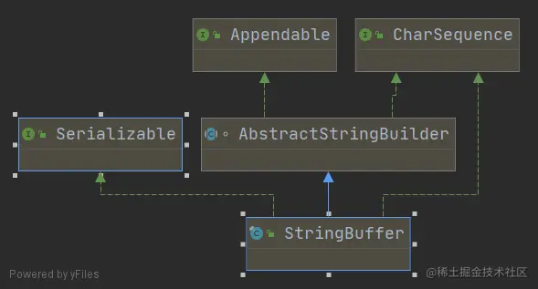
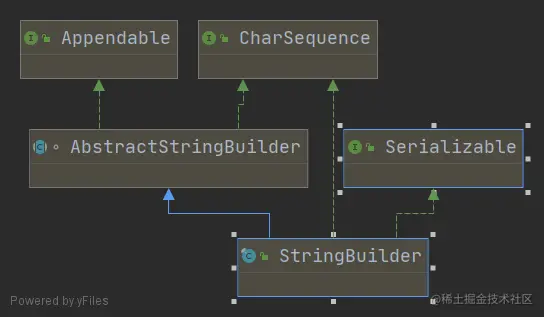

*   CharSequence的重要抽象方法：

    *   charAt、toString、length
*   Appendable：append方法

StringBuffer和StringBuilder都继承了AbstractStringBuilder类，复用了其中的append、charAt、length等方法。而AbstractStringBuilder又实现了Appendable接口中的append方法。

# boolean长度？

boolean数组中一个boolean占1个字节，而单独的boolean变量中，boolean占4个字节

原因是Java虚拟机中没有任何供 boolean值专用的字节码指令，所以boolean数组、boolean类型分别用byte、int来代替

# 天然的原子性操作

java中除了long和double以外的其他基本类型（int byte boolean short char float）的读写操作都是原子的以及所有引用 reference 的读/写操作是原子的

但是这些操作不能保证可见性。

# wait操作会使monitor直接归零

这意味着对同一个对象进行多重synchronized，然后使用wait，会使得monitor直接归零而让其他线程可以获取synchronized锁

# TODO

*   sql explain

*   SQL题

*   消息队列（解耦、异步、削峰）

*   linux

*   mongodb

*   Redisson 分布式锁

*   binlog组提交

*   java类加载、对象初始化、对象生命周期

*   mysql有哪些锁

*   websocket编程

*   nio bio 等

# 全局ID特性

*   唯一性

*   高可用

*   高性能

*   递增性

*   安全性

# Spring中开启、使用redis事务

1.  setEnableTransactionSupport(true) 加 @Transactional注解

```Java
StringRedisTemplate template = new StringRedisTemplate(factory);
/**
 * description 开启redis事务（仅支持单机，不支持cluster）
 **/
template.setEnableTransactionSupport(true);
```

然后在需要开启事务的方法上加上@Transactional注解就好

1.  multi、exec

使用multi、exec方式，需要使用SessinCallback回调（所有这一切的前提是，共有同一个连接。（使用SessionCallBack的方式就能保证，总是共用同一个连接）

示例

```Java
1         RedisStandaloneConfiguration configuration = new RedisStandaloneConfiguration("192.168.19.90");
 2         JedisConnectionFactory factory = new JedisConnectionFactory(configuration);
 3         factory.afterPropertiesSet();
 4 
 5         RedisTemplate<String, Object> template = new RedisTemplate<>();
 6         template.setConnectionFactory(factory);
 7         template.setDefaultSerializer(new GenericFastJsonRedisSerializer());
 8         StringRedisSerializer serializer = new StringRedisSerializer();
 9         template.setKeySerializer(serializer);
10         template.setHashKeySerializer(serializer);
11 
12         template.afterPropertiesSet();
14 
15         try {
16             List<Object> txResults = template.execute(new SessionCallback<List<Object>>() {
17                 @Override
18                 public List<Object> execute(RedisOperations operations) throws DataAccessException {
19 
20                     operations.multi();
21 
22                     operations.opsForValue().set("test_long", 1);
23                     int i = 1/0;
24                     operations.opsForValue().increment("test_long", 1);
25 
26                     // This will contain the results of all ops in the transaction
27                     return operations.exec();
28                 }
29             });
30 
31         } catch (Exception e) {
32             System.out.println("error");
33             e.printStackTrace();
34         }
```

# RedisTemplate自增操作返回null

源码中写到在pipeline、transaction中会返回null


spring中使用@Transactional注解，redis是不会开启事务的

想要在redis中开启事务

```Java
StringRedisTemplate template = new StringRedisTemplate(factory);
/**
 * description 开启redis事务（仅支持单机，不支持cluster）
 **/
template.setEnableTransactionSupport(true);
```

然后在需要开启事务的方法上加上@Transactional注解就好

# String 的长度限制

*   编译期的限制：字符串的UTF8编码值的字节数不能超过65535，字符串的长度不能超过65534；

*   运行时限制：字符串的长度不能超过2^31-1，占用的内存数不能超过虚拟机能够提供的最大值。

# java内存泄露

内存泄漏是指申请内存之后无法释放已申请的内存空间。直接原因是这些对象可达，但是以后不会用到。

# 查看java进程的命令：jps

<https://blog.csdn.net/wo541075754/article/details/55095443>

    -q：仅输出VM标识符，不包括classname,jar name,arguments in main method；
    -m：输出main method的参数；
    -l：输出完全的包名，应用主类名，jar的完全路径名； 
    -v：输出jvm参数 ； 
    -V：输出通过flag文件传递到JVM中的参数(.hotspotrc文件或-XX:Flags=所指定的文件 ；

# full GC如何快速定位

1.
    ## 使用jmap查看堆内存信息：jmap -heap pid

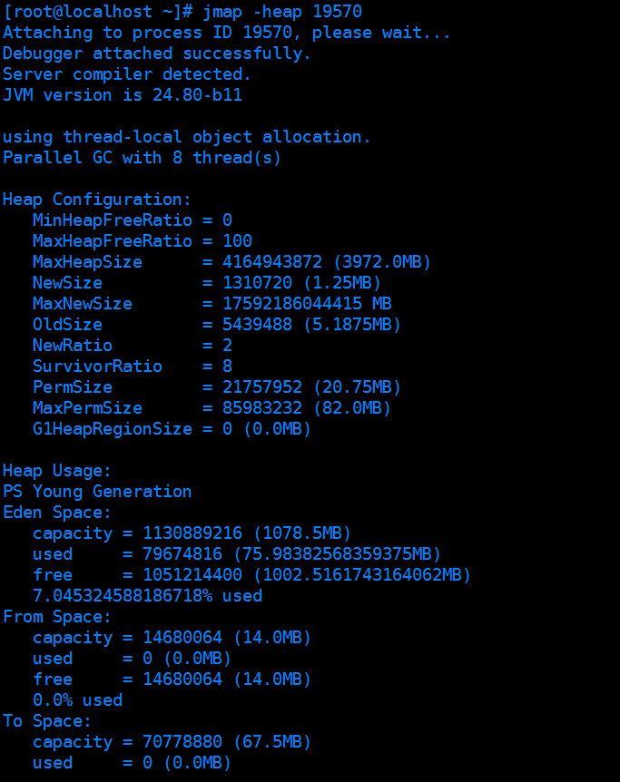

1.
    ## 使用 jmap -histo:live pid

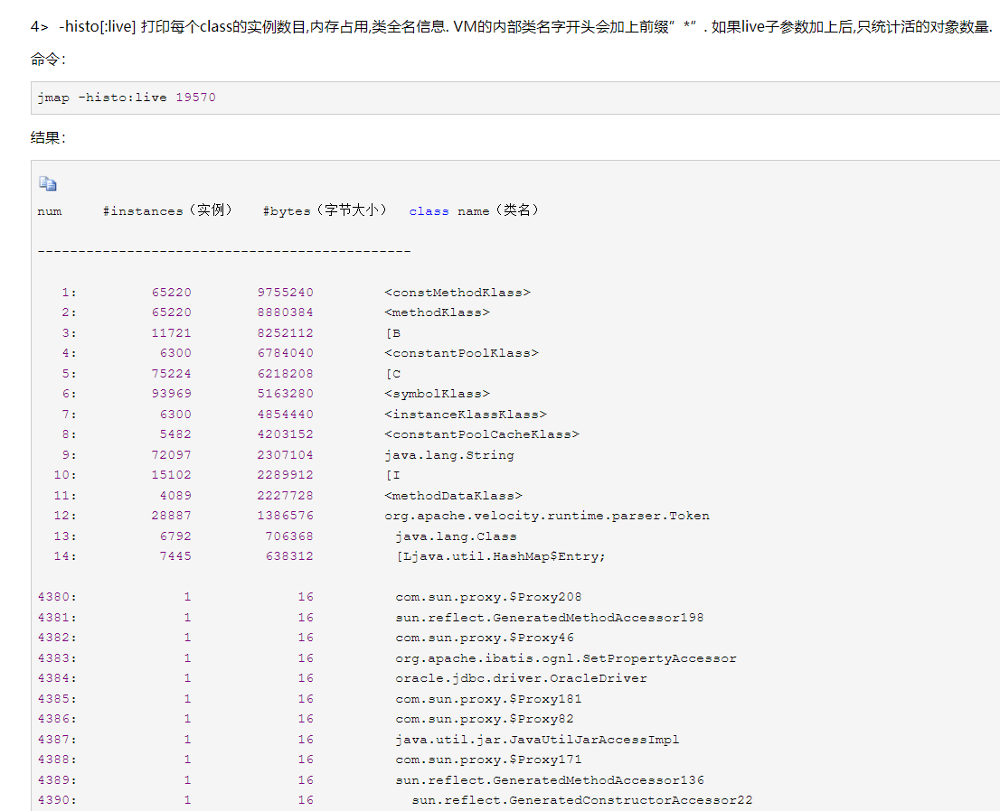

1.
    ## 生成堆快照

`./jmap -dump:live,format=b,file=heap.hprof <pid>`

# jstat命令：查看GC情况

<https://www.cnblogs.com/yjd_hycf_space/p/7755633.html>

# jmap：性能调优工具，可以生成 java 程序的 dump 文件， 也可以查看堆内对象示例的统计信息、查看 ClassLoader 的信息以及 finalizer 队列。

<https://www.jianshu.com/p/a4ad53179df3>

# GMT 和 UTC

GMT：格林威治时间，基于天文观测。

UTC：世界协调时间，基于原子钟

UTC没有时区的概念，取而代之的是时间偏移量，精确到分钟。UTC+8表示中国标准时间。

GMT和UTC误差不超过0.9秒

UNIX时间戳是UTC时间从1970年1月1日起到现在的秒数

# 雪花算法

组成：0 + 41位时间戳（毫秒） + 10位机器ID + 12位自增ID

<https://cloud.tencent.com/developer/article/1766264>

# Interrupt

当对一个线程，调用 interrupt() 时，

　　① 如果线程处于被阻塞状态（例如处于sleep, wait, join 等状态），那么线程将立即退出被阻塞状态，并抛出一个InterruptedException异常。中断标志仍为false（即调用Thread.interrupted()或者Thread.currentThread().isInterrupted()，返回false

　　② 如果线程处于正常活动状态，那么会将该线程的中断标志设置为 true，仅此而已。被设置中断标志的线程将继续正常运行，不受影响。

interrupt() 并不能真正的中断线程，需要被调用的线程自己进行配合才行。

# https通信过程

1.  客户端发起请求，获取到服务端的数字证书（CA证书）

2.  客户端验证CA证书是否可信（**通过证书链）**

3.  CA证书的重要部分有服务端的公钥以及通过CA证书的私钥对这个公钥进行的签名。

      客户端通过CA证书的公钥对签名进行验证，注意签名的原内容是服务端的公钥的摘要而不是服务端的公钥本身。

4.  验证签名无误后，客户端把自己生成的对称密钥通过服务端的公钥加密，发送给服务端

5.  服务端使用私钥解密，得到对称密钥，后续通过这个对称密钥进行通信

## 为什么签名的原内容是服务端的公钥的摘要而不是服务端的公钥本身？

防止攻击者进行已知明文攻击。攻击者可能会伪造大量消息让CA机构进行签名，然后通过签名和消息的规律来反推私钥。而消息的摘要则不具有明显的规律性，可以防止这种攻击。

## 使用CA证书链验证证书的可信性

1.  通过“Issuer”或者“Authority Key Identifier”属性查找签署证书的 CA 证书

2.  浏览器找到了签署证书的 CA 证书后，就用这个 CA 证书的公钥来验证证书的签名

3.  循环以上步骤直到最后用来验证的 CA 证书是根证书，根证书是自签名证书，使用自己的公钥来验证自己的签名。

4.  根证书已经内置在浏览器或者操作系统中，是绝对可信的。

# 常见加密算法

## 非对称：

*   RSA算法（[zh.wikipedia.org](https://zh.wikipedia.org/wiki/RSA%E5%8A%A0%E5%AF%86%E6%BC%94%E7%AE%97%E6%B3%95)）

## 对称

*   **AES**

*   **DES （不安全，采用64位密钥长度，远远不足以抵御现代计算机的暴力破解攻击。通过穷举法，只需要2^56次运算就能找到密钥，因此DES算法的密钥长度过短，安全性较低。）**

*   HS256 （HMAC using SHA-256 ）

*   HS512 （ HMAC using SHA-512 ）

## 哈希

*   MD5

*   SHA1

*   SHA256

是SHA-2下细分出的一种算法。SHA-2，名称来自于安全散列算法2（英语：Secure [Hash](https://so.csdn.net/so/search?q=Hash\&spm=1001.2101.3001.7020) Algorithm 2）的缩写，一种密码散列函数算法标准，由美国国家安全局研发，属于SHA算法之一，是SHA-1的后继者。

*   HMAC

`HMAC` 是密钥相关的 **哈希运算消息认证码**（Hash-based Message Authentication Code），`HMAC` 运算利用 **哈希算法** (`MD5`、`SHA1` 等)，以 **一个密钥** 和 **一个消息** 为输入，生成一个 **消息摘要** 作为 **输出**。

`HMAC` **发送方** 和 **接收方** 都有的 `key` 进行计算，而没有这把 `key` 的第三方，则是 **无法计算** 出正确的 **散列值**的，这样就可以 **防止数据被篡改**。

# 为什么要显式指定serialVersionUID？

如果不显式指定，java会自己计算出一个serialVersionUID。而这个serialVersionUID依赖于类的结构细节以及编译器的实现。因此容易导致serialVersionUID不一致而抛出 `[InvalidClassException](https://docs.oracle.com/en/java/javase/11/docs/api/java.base/java/io/InvalidClassException.html)`异常。

自己显式指定serialVersionUID的另一个好处是可以手动控制类在反序列化时是否向前兼容。

**序列化为json时不需要serialVersionUID，因为这属于第三方实现，和java内部的序列化机制无关。**

# lambda表达式不能修改局部变量

lambda表达式实质是匿名内部类，是位于堆上的。而局部变量是位于栈上的，栈上的局部变量是不能共享的。lambda表达式为了访问局部变量，对它做了拷贝，所以实际上访问的是拷贝，所以不能修改它。

但是lambda表达式可以修改位于堆上的变量。比如AtomicInteger

With **Java 10+**, use this construct as it's very easy to setup:

```Java
var wrapper = new Object(){ int ordinal = 0; };
list.forEach(s -> {
  s.setOrdinal(wrapper.ordinal++);
});
```

With **Java 8+**, use either an `[AtomicInteger](https://docs.oracle.com/javase/8/docs/api/java/util/concurrent/atomic/AtomicInteger.html)`:

```Java
AtomicInteger ordinal = new AtomicInteger(0);
list.forEach(s -> {
  s.setOrdinal(ordinal.getAndIncrement());
});
```

... or an array:

```Java
intordinal = { 0 };
list.forEach(s -> {
  s.setOrdinal(ordinal[0]++);
});
```

# ThreadLocal原理

每个thread对象都有一个ThreadLocalMap类型的对象（名叫threadlocals），这个对象以ThreadLocal为key，且为弱引用

源码：

```Java
    public T get() {
        return get(Thread.currentThread());
    }
```

```Java
    private T get(Thread t) {
        ThreadLocalMap map = getMap(t); // t.threadLocals，一个ThreadLocalMap类型的对象
        if (map != null) {
            if (map == ThreadLocalMap.NOT_SUPPORTED) {
                return initialValue();
            } else {
                ThreadLocalMap.Entry e = map.getEntry(this);
                if (e != null) {
                    @SuppressWarnings("unchecked")
                    T result = (T) e.value;
                    return result;
                }
            }
        }
        return setInitialValue(t); // 以this为key，null为value
    }
```

# ThreadLocalMap的key为什么是弱引用

当我们使用完threadlocal后（即这个threadlocal已经没有强引用了），如果threadlocalmap里的key是强引用，会导致这个threadlocal无法被回收。所以使用弱引用让它能够及时被回收。

但是threadlocalmap的entry的value是强引用。原因是我们在方法之间通过threadlocal传递变量的时候，value可能会只有threadlocamap对它有唯一的引用，这时就必须使用强引用。而这会导致问题：当线程在线程池里被复用的时候，可能会导致拿到上一个任务的value。所以每次使用完后要主动remove掉value

# tomcat线程池

**原生线程池在达到核心线程数时，是优先添加队列，这样比较适合CPU密集型任务**（认为新建线程不如让任务排队）

因为Tomcat的任务属于IO密集型，大概率不会长时间占用CPU资源。即期望任务堆积时，**优先创建线程来处理，而不是入队**

但是又不想任务被丢弃或交给调用者处理（想始终交给线程池处理）

tomcat线程池对java原生线程池做了修改。主要修改的是：

*   对于“优先创建线程而不是放入阻塞队列”，自己实现了一个阻塞队列，继承自LinkedBlockingQueue。关键内容是重写了offer方法。当已创建线程数没有达到最大线程数时，直接返回false，使得创建一个新线程来执行任务。

*   对于“想始终交给线程池处理”，重写了execute方法，会在方法内部去catch 异常，然后尝试把任务（runnable）重新放入队列里

# MySQL中的锁

mysql中锁分为全局锁、表锁、行锁

1.  全局锁

```SQL
FLUSH TABLES WITH READ LOCK;
```

这时，整个数据库都是只读的。用于对数据库进行逻辑备份

释放全局锁：

```SQL
UNLOCK TABLES;
```

1.  表锁

```SQL
// 表级共享锁, 也就是读锁
lock tables table_name read;
// 表级独占锁, 也就是写锁
lock tables table_name write;

// 锁定多张表
lock tables table1 read, table2 write;

// 给当前会话的所有表解锁(而不是整个数据库的表)
unlock tables;
```

表锁除了会限制别的线程的读写外，也会限制本线程接下来的读写操作。

1.  意向锁

意向锁属于表级锁, 它是加行级锁之前自动加上的

意向锁的作用是限制表级锁。加了意向锁，加表级锁时就不逐行判断是否存在冲突行级锁了

1.  加了意向读锁，则不能加表级写锁

2.  加了意向写锁，则不能加表级读锁和表级写锁

3.  元数据锁(MDL)

我们对数据库表进行操作时, 会自动给这个表加上MDL:

1.  对一张表进行CRUD操作时, 会自动加上MDL读锁

2.  对一张表的表结构进行修改时, 会自动加上MDL写锁

> MDL 不需要显示调用，那它是在什么时候释放的?

    MDL 是在事务提交后才会释放，这意味着事务执行期间，MDL 是一直持有的。

    那如果数据库有一个长事务（所谓的长事务，就是开启了事务，但是一直还没提交），那在对表结构做变更操作的时候，可能会发生意想不到的事情，比如下面这个顺序的场景：

    4. 首先，线程 A 先启用了事务（但是一直不提交），然后执行一条 select 语句，此时就先对该表加上 MDL 读锁；
        
    5. 然后，线程 B 也执行了同样的 select 语句，此时并不会阻塞，因为「读读」并不冲突；
        
    6. 接着，线程 C 修改了表字段，此时由于线程 A 的事务并没有提交，也就是 MDL 读锁还在占用着，这时线程 C 就无法申请到 MDL 写锁，就会被阻塞，
        

    那么在线程 C 阻塞后，后续有对该表的 select 语句，就都会被阻塞，如果此时有大量该表的 select 语句的请求到来，就会有大量的线程被阻塞住，这时数据库的线程很快就会爆满了。

    为什么线程 C 因为申请不到 MDL 写锁，而导致后续的申请读锁的查询操作也会被阻塞？

    这是因为申请 MDL 锁的操作会形成一个队列，队列中写锁获取优先级高于读锁，一旦出现 MDL 写锁等待，会阻塞后续该表的所有 CRUD 操作。

    所以为了能安全的对表结构进行变更，在对表结构变更前，先要看看数据库中的长事务，是否有事务已经对表加上了 MDL 读锁，如果可以考虑 kill 掉这个长事务，然后再做表结构的变更。

5\. 行锁

*   首先，普通的select语句不加锁，属于快照读，通过MVCC保证事务的隔离性

*   但是也可以为select语句加锁，而且必须在事务里加，当事务提交之后，锁会释放

```Java
// 共享锁
select ... lock in share mode;
// 独占锁
select ... for update;
```

*   无论是读锁还是写锁, 行级锁分为三类: 记录锁、间隙锁、Next-Key 锁

    *   记录锁

    ```SQL
    // 开启事务 
    begin;
    // 记录写锁
    select * from t_test where id = 1 for update;
    ```

    *   间隙锁

      只存在于可重复读级别, 解决可重复读下的幻读现象

    ```SQL
    SELECT * FROM employees WHERE employee_id BETWEEN 1 AND 10 FOR UPDATE;
    ```

    *   next-key锁next-key锁是前开后闭的。

    *   唯一索引等值查询

        1.  当查询的记录存在时，退化成记录锁

        2.  当查询的记录不存在时，退化成间隙锁

    *   唯一索引范围查询

        1.  满足条件的值加上next-key锁，如果是大于等于且查询到的记录正好满足等值查询，这个记录加记录锁

    *   非唯一索引等值查询

        1.  当查询的记录存在时，查到的记录加next-key锁，第一条不满足条件的记录加间隙锁

        2.  当查询的记录不存在时，第一条不满足条件的记录加间隙锁

    *   非唯一索引范围查询

        1.  对满足条件的索引都是加next-key锁

1.  插入意向锁

插入意向锁是一种特殊的间隙锁，但不同于间隙锁的是，该锁只用于并发插入操作。

如果说间隙锁锁住的是一个区间，那么「插入意向锁」锁住的就是一个点。因而从这个角度来说，插入意向锁确实是一种特殊的间隙锁。

插入意向锁与间隙锁的另一个非常重要的差别是：尽管「插入意向锁」也属于间隙锁，但两个事务却不能在同一时间内，一个拥有间隙锁，另一个拥有该间隙区间内的插入意向锁（当然，插入意向锁如果不在间隙锁区间内则是可以的）。所以，插入意向锁和间隙锁之间是冲突的。

# rocketmq

### 如何保证顺序消费

1.  在发送端实现

broker里的每个queue都是fifo的，单个queue可以保证顺序消费。所以可以通过自定义MessageQueue selector，让它返回指定的queue的索引

1.  在消费端实现

# 类的初始化

## 类的初始化过程：加载、验证、准备、解析、初始化

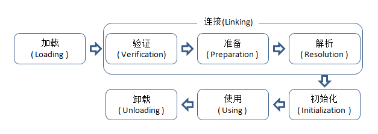

加载、验证、准备、初始化和卸载这5个阶段的顺序是确定的，类的加载过程必须按照这种顺序按部就班地开始，而解析阶段则不一定：它在某些情况下可以在初始化阶段之后再开始，这是为了支持Java语言的运行时绑定（也称为动态绑定或晚期绑定）。

1.

    ### 加载

    1.
        ####   通过类的全限定名获取定义此类的二进制字节流（从class文件、网络、数据库等），采用双亲委派机制

    2.
        ###   把这个二进制流代表的静态的存储结构转化为方法区的运行时数据结构

    3.
        ####   在方法区生成class对象

2.
    ### 验证

验证是连接阶段的第一步，这一阶段的目的是为了确保Class文件的字节流中包含的信息符合当前虚拟机的要求，并且不会危害虚拟机自身的安全。 验证阶段大致会完成4个阶段的检验动作：

*   文件格式验证：验证字节流是否符合Class文件格式的规范(例如，是否以魔术0xCAFEBABE开头、主次版本号是否在当前虚拟机的处理范围之内、常量池中的常量是否有不被支持的类型)

*   元数据验证：对字节码描述的信息进行语义分析，以保证其描述的信息符合Java语言规范的要求(例如：这个类是否有父类，除了java.lang.Object之外)；

*   字节码验证：通过数据流和控制流分析，确定程序语义是合法的、符合逻辑的;

*   符号引用验证：确保解析动作能正确执行。

\*\*验证阶段是非常重要的，但不是必须的，它对程序运行期没有影响。\*\*如果所引用的类经过反复验证，那么可以考虑采用-Xverifynone参数来关闭大部分的类验证措施，以缩短虚拟机类加载的时间。

1.
    ### 准备

为类的变量（即static变量）分配内存，并为非final的static变量设置为零值，而final static的变量设置为初始指定的值

```Java
// 准备阶段设置为0
public static int value = 123;
```

　　那么，变量value在准备阶段过后的值为0而不是123。因为这时候尚未开始执行任何java方法，而把value赋值为123的putstatic指令是程序被编译后，存放于类构造器方法`<clinit>()`之中，所以把value赋值为123的动作将在初始化阶段才会执行。至于“特殊情况”是指：当类字段的字段属性是ConstantValue时，会在准备阶段初始化为指定的值，所以标注为final之后，value的值在准备阶段初始化为123而非0。

```Java
// 准备阶段设置为123　
public static final int value = 123;
```

1.
    ### 解析

将常量池内的符号引用替换为直接引用

1.
    ### 初始化

**初始化阶段是执行类构造器`<clinit>()`方法的过程。**

`<clinit>()`方法是由编译器自动收集类中的所有类变量的赋值动作和静态语句块static{}中的语句合并产生的。

编译器收集的顺序是由语句在源文件中出现的顺序所决定的，静态语句块只能访问到定义在静态语句块之前的变量，定义在它之后的变量，在前面的静态语句块可以赋值，但是不能访问。

```Java
public class Test{
static
{
        i=0;
        System.out.println(i);//Error：Cannot reference a field before it is defined（非法向前应用）
    }
    static int i=1;
}
```

　　那么注释报错的那行代码，改成下面情形，程序就可以编译通过并可以正常运行了。

```Java
public class Test{static{
        i=0;//System.out.println(i);
    }
static int i=1;
public static void main(String args[]){
        System.out.println(i);
    }
}/* Output: 
    1
 *///:~
```

# 类的实例化：对象的创建和初始化

类的实例化之前一定要先进行类的初始化，然后进行类的实例化：

**父类的类构造器`<clinit>()` -> 子类的类构造器`<clinit>()` -> 父类的成员变量和实例代码块 -> 父类的构造函数 -> 子类的成员变量和实例代码块 -> 子类的构造函数。**

1.  对该类的父类进行实例化

2.  对实例变量分配内存，并赋默认值

3.  实例变量赋初始值

4.  执行实例代码块

5.  调用构造函数

编译器会将实例变量初始化和实例代码块初始化相关代码放到类的构造函数中去，并且这些代码会被放在对超类构造函数的调用语句之后，构造函数本身的代码之前。

# 慢接口排查

首先排查是不是网络的问题，然后排查是不是后端的问题

## 网络排查

*   使用ping、traceroute或nslookup检查网络连通性、延迟

*   查看服务器cpu、内存、磁盘使用情况

## 查看应用日志

查看日志，是否有异常的信息

## 检查数据库，是否有慢SQL

开启慢sql日志：

slow\_query\_log=1

查询慢sql：

检查缓存，看是否有大量缓存失效

# java内存区域

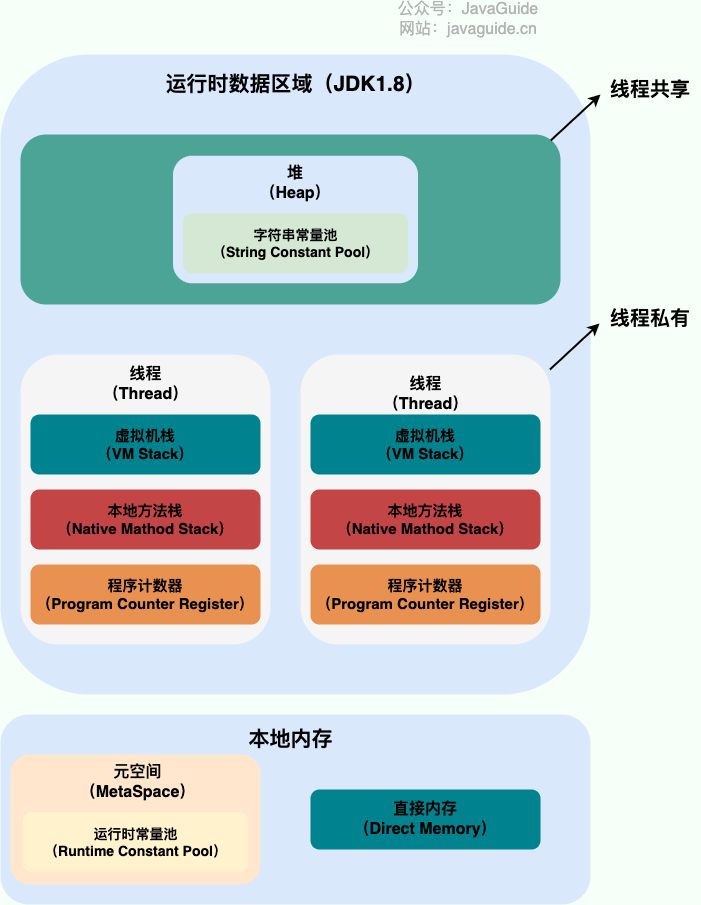

# 僵尸进程

## 产生原因

子进程已经结束，父进程没有调用wait或waitpid，导致子进程的信息仍然存在（进程号、运行时间等），于是这个进程号就被占用，当产生大量僵尸进程，会导致进程号不够用

## 解决僵尸进程造成的问题

（1）方案一：父进程通过 wait 和 waitpid 等函数等待子进程结束，但这会导致父进程挂起，所以这并不是一个好办法，父进程如果不能和子进程并发执行的话，那我们创建子进程的意义就没有。同时一个 wait 只能解决一个子进程，如果有多个子进程就要用到多个 wait

（2）方案二：通过信号机制：

子进程退出时，向父进程发送 SIGCHILD 信号，父进程处理 SIGCHILD 信号，在信号处理函数中调用 wait 进行处理僵尸进程。

（3）方案三：fork两次：

原理是将进程成为孤儿进程，从而其的父进程变为 init 进程，通过 init 进程处理僵尸进程。具体操作为：父进程一次 fork() 后产生一个子进程随后立即执行 wait(NULL) 来等待子进程结束，然后子进程 fork() 后产生孙子进程随后立即exit(0)。这样子进程顺利终止（父进程仅仅给子进程收尸，并不需要子进程的返回值），然后父进程继续执行。这时的孙子进程由于失去了它的父进程（即是父进程的子进程），将被转交给Init进程托管。于是父进程与孙子进程无继承关系了，它们的父进程均为Init，Init进程在其子进程结束时会自动收尸，这样也就不会产生僵死进程了

（4）方案四：kill 父进程：

严格地来说，僵死进程并不是问题的根源，罪魁祸首是产生出大量僵死进程的那个父进程。因此，当我们寻求如何消灭系统中大量的僵死进程时，答案就是把产生大量僵死进程的那个元凶枪毙掉（也就是通过 kill 发送 SIGTERM 或者 SIGKILL 信号啦）。枪毙了元凶进程之后，它产生的僵死进程就变成了孤儿进 程，这些孤儿进程会被 init 进程接管，init 进程会 wait() 这些孤儿进程，释放它们占用的系统进程表中的资源，这样，这些已经僵死的孤儿进程就能瞑目而去了。

# 死锁排查

1.

    ## jstack

    1.  首先，通过jps -l获得程序进程

    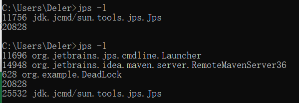

    1.  通过jstak查看死锁 (jstack -l \[pid]) ( jstack 用于生成 Java 虚拟机当前时刻的线程快照，查看线程调用堆栈、运行状态、锁的状态等）

    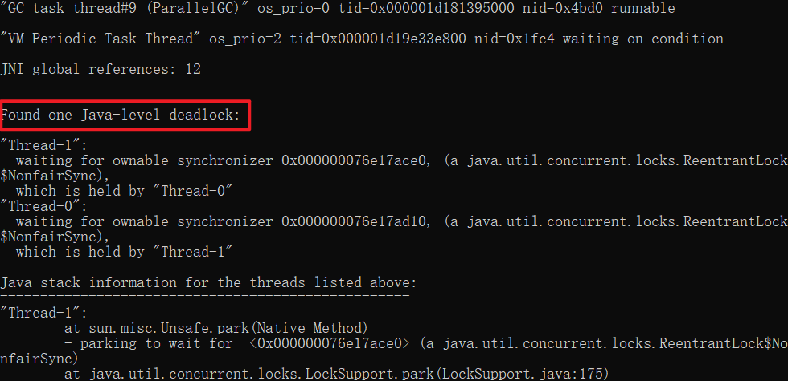

2.
    ## jconsole

打开jconsole


连接要监测的进程

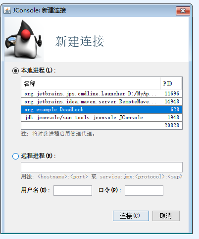

检测死锁

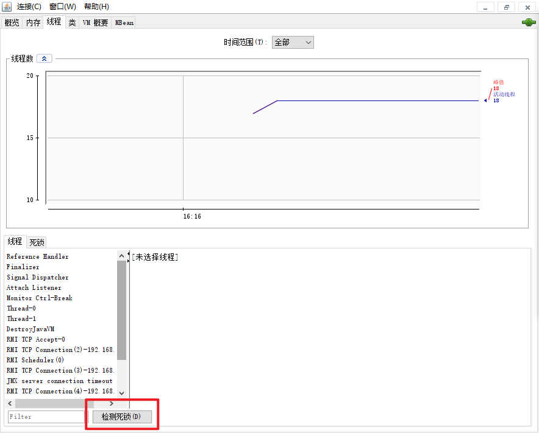

1.
    ## jvisualvm

jvisualvm 也在 JDK 的 bin 目录中，同样是双击打开：

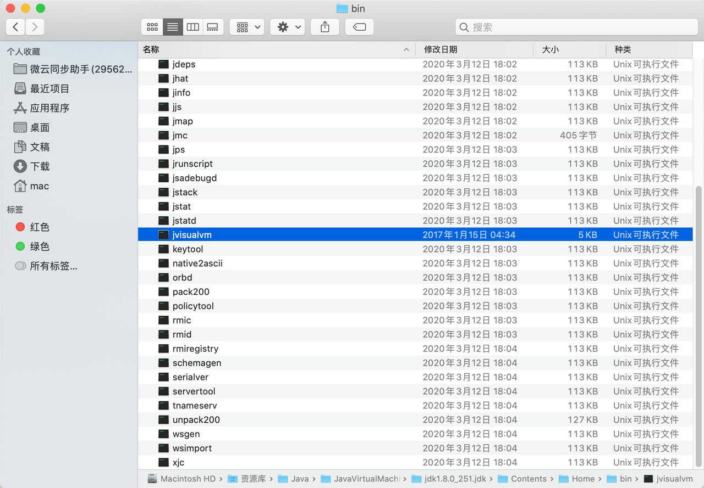

稍等几秒之后，jvisualvm 中就会出现本地的所有 Java 程序，如下图所示：

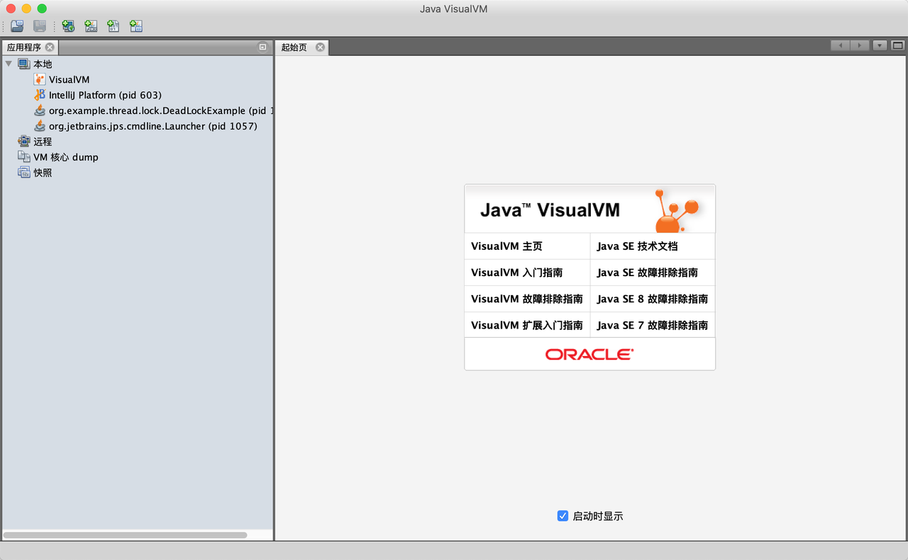

双击选择要调试的程序：

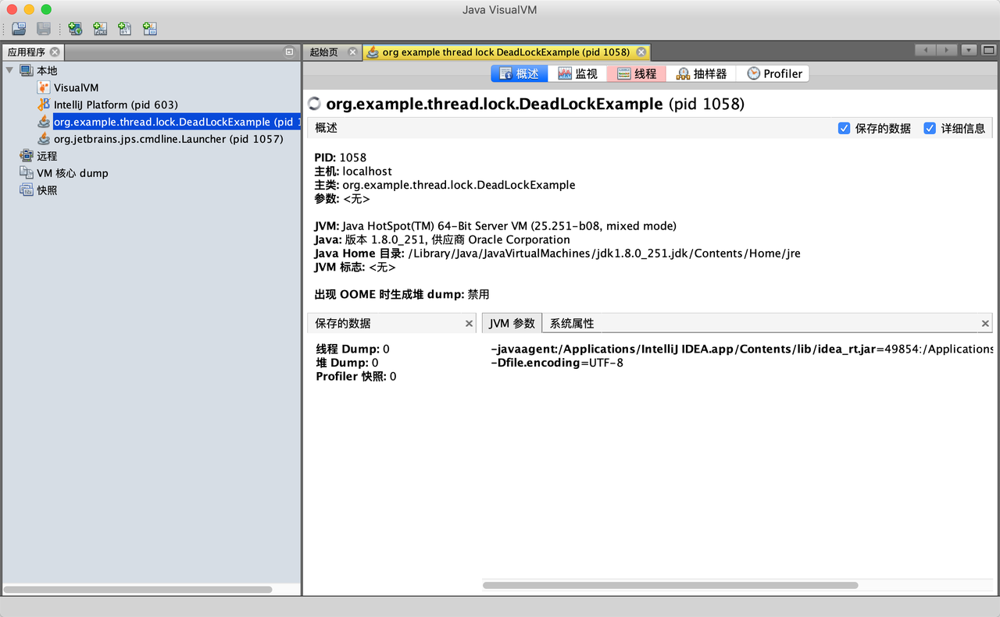

单击鼠标进入“线程”模块，如下图所示：

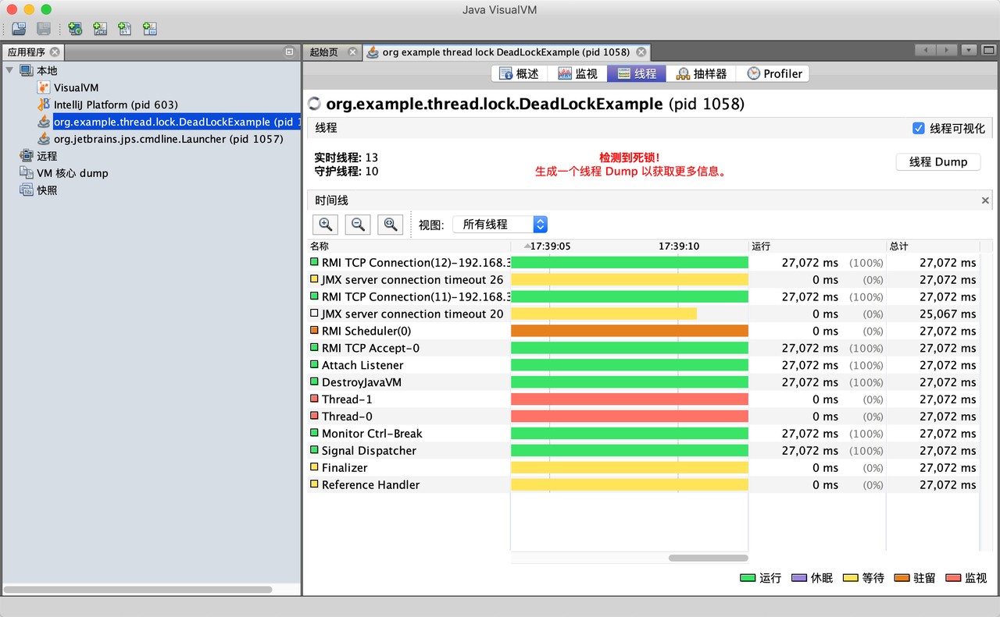

从上图可以看出，当我们切换到线程一栏之后就会直接显示出死锁信息，之后点击“线程 Dump”生成死锁的详情信息，如下图所示：

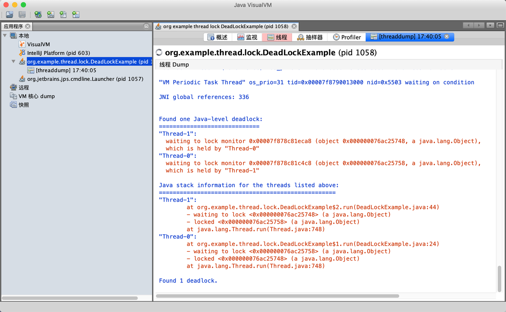

1.
    ## jmc

jmc 是 Oracle Java Mission Control 的缩写，是一个对 Java 程序进行管理、监控、概要分析和故障排查的工具套件。它也是在 JDK 的 bin 目录中，同样是双击启动，如下图所示：

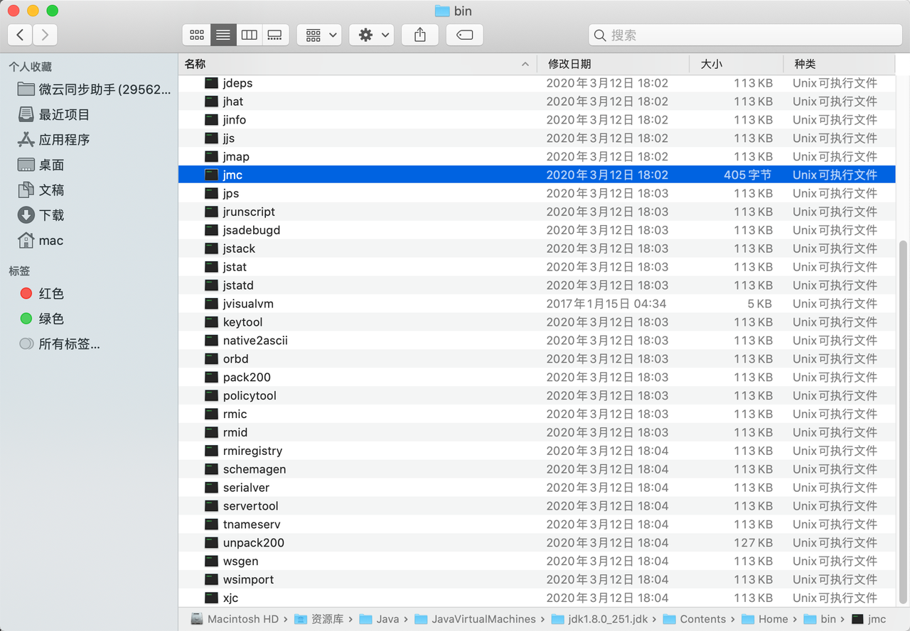

jmc 主页信息如下：

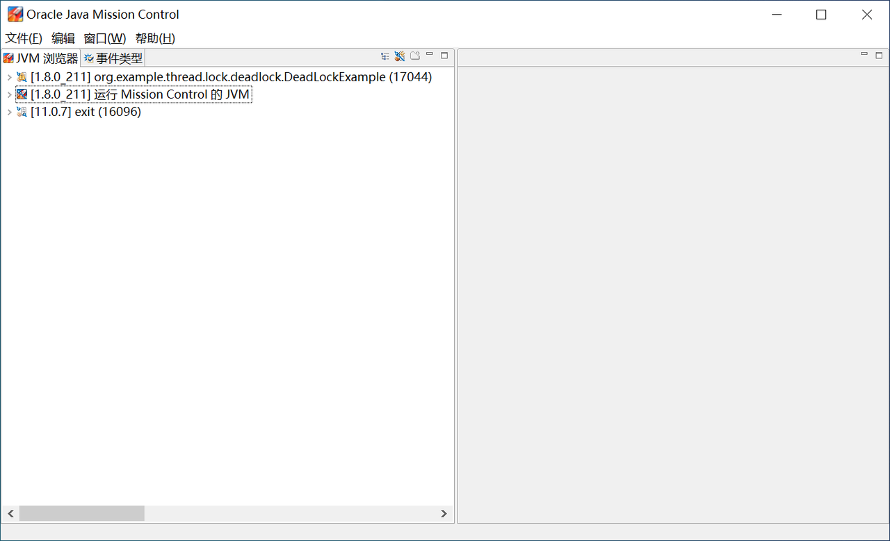

之后选中要排查的程序，右键“启动 JMX 控制台”查看此程序的详细内容，如下图所示：

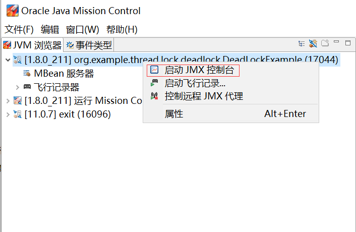

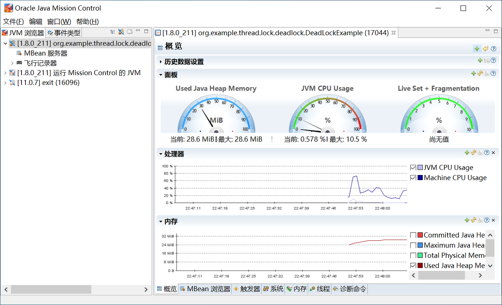

然后点击“线程”，勾中“死锁检测”就可以发现死锁和死锁的详情信息，如下图所示：

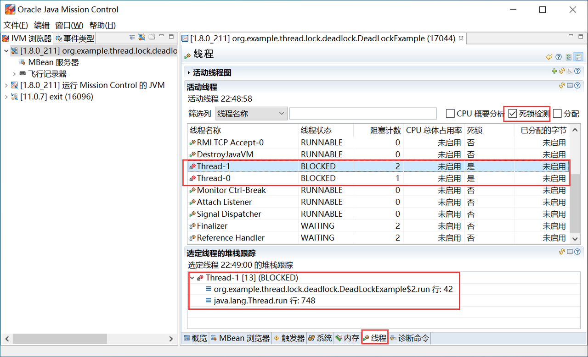

# MYSQL DELIMITER

<https://www.cnblogs.com/chihirotan/p/7457204.html>

# MYSQL or 和 in

对于数据

## or

对于：SELECT \* FROM table WHERE conditionA OR conditionB

*   没有索引时，or会全表扫描，逐行扫描表，并对每一行应用条件A和条件B，以确定是否满足其中之一。

*   如果表上有适当的索引，并且这些索引能够加速条件A和条件B的评估，查询的时间复杂度可能会更低。例如，如果有一个针对条件A的索引和一个针对条件B的索引，数据库可以使用这些索引来快速定位满足条件的记录，而不需要遍历整个表。

## in

in会先对in列表里的元素排序，然后遍历表中的每一行，对于每一行通过二分查找来查询条件列表，速度比较快。

*   没有索引时，or的时间复杂度是 O(n \* k)，in的时间复杂度是O(n \* log(k))

*   如果有索引，仅针对or和in的对比，结果是索引用不上，仍然是in更快。因为or的查询效率提升的前提是condition使用了不同的索引，而和in进行对比，就说明condition是 col = a or col = b or col = c 这种情形。

# 既然多线程这么好，为什么python使用多进程而不是多线程

python是有多线程的，但是由于历史遗留问题，python的解释器的实现使用了GIL(Global Interpreter Lock)，即全局解释器锁，导致每一时刻只能有一个线程在执行解释器。

但是python的多线程还是有用的，在IO密集的任务中，可以通过异步IO同时运行多个任务

# InnoDB索引的存储结构

InnoDB 采用了 B+ 树作为索引。磁盘的 I/O 操作次数对索引的使用效率至关重要，因此在构造索引的时候，我们更倾向于采用“矮胖”的 B+ 树数据结构，这样所需要进行的磁盘 I/O 次数更少，而且 B+ 树 更适合进行关键字的范围查询。

InnoDB 里的 B+ 树中的每个节点都是一个数据页，数据页组成：

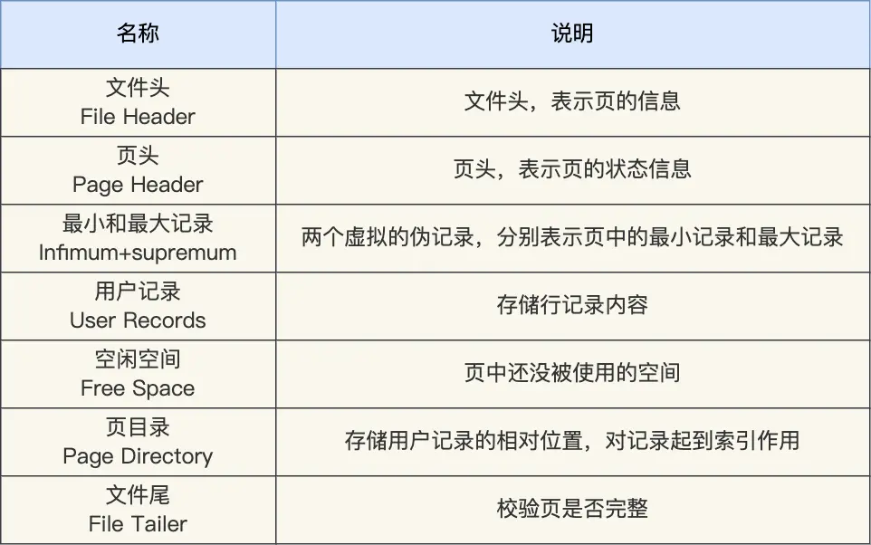

页目录和用户记录：

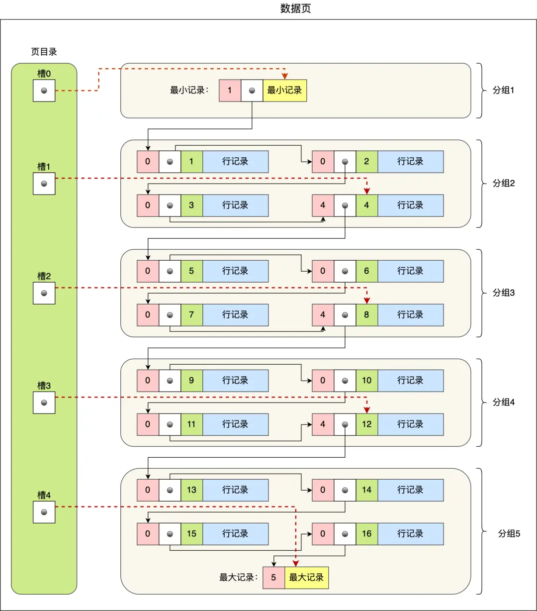

# linux查看cpu占用：top

# CPU的缓存一致性

MESI协议

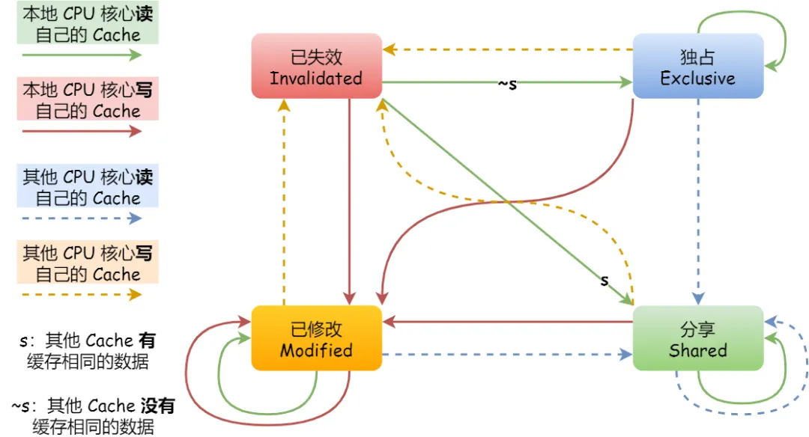

# Java 中的锁

主要分为两大类: synchronized和Lock

# Redis主从复制

redis主从复制分为全量复制、增量复制和命令传播。

### 全量复制

从节点第一次与主节点进行同步（replicaof）时进行全量复制

1.  建立连接，协商同步

    1.  从节点发送psync命令，参数：runID（主服务器的唯一标识）为“？”，offset为-1

    2.  主服务器发送FULLRESYNC作为响应命令，参数：主服务器的runID和目前的复制进度offset
2.  数据同步

主节点执行bgsave命令，生成RDB文件，并把这个过程中产生的写操作写入replication buffer 缓冲区里。

生成RBD文件之后，把RDB文件发给从节点。

从节点收到RDB文件后，丢弃所有的旧数据，将RDB数据载入内存，最后回复一个确认消息

1.  主节点发送新的写操作命令

      主服务器将 replication buffer 缓冲区里所记录的写操作命令发送给从服务器，从服务器执行来自主服务器 replication buffer 缓冲区里发来的命令

### 命令传播

主从服务器在完成第一次同步后，双方之间就会维护一个 TCP 连接。

后续主服务器可以通过这个连接继续将写操作命令传播给从服务器，然后从服务器执行该命令，使得与主服务器的数据库状态相同。

### 增量复制

增量复制发生在网络断开又恢复之后。

1.  从服务器在恢复网络后，会发送 psync 命令给主服务器，此时的 psync 命令里的 offset 参数不是 -1；

2.  主服务器收到该命令后，然后用 CONTINUE 响应命令告诉从服务器接下来采用增量复制的方式同步数据；

3.  然后主服务将主从服务器断线期间，所执行的写命令发送给从服务器，然后从服务器执行这些命令

# Redis哨兵机制

*   主观下线和客观下线。客观下线只适用于主节点

1.  判断主节点下线

    1.  哨兵每秒向所有主从节点发送PING，如果有某个节点超时未回应，则该哨兵把这个节点标记为主观下线。

    2.  这个哨兵向其他哨兵发起命令，其他哨兵根据自身和主节点的网络状况，做出赞成或反对的投票

    3.  如果总的赞成票达到quorum值，这时主节点被标记为客观下线
2.  选出哨兵Leader

      该哨兵发起投票，告诉其他哨兵，它想成为leader。想成为 leader 的哨兵节点，要满足两个条件：

    1.  拿到半数以上的赞成票

    2.  拿到的票数大于等于quorum值
3.  由哨兵leader进行主从故障转移

    1.  在已下线的主节点的所有从节点中，选出一个作为新的主节点，向它发送replicaof no one

            选择的规则：

        1.  过滤掉所有已经离线的从节点

        2.  过滤掉历史连接状态不好的从节点

        3.  将剩下的从节点进行三轮考察：优先级、复制进度、ID号。在每一轮考察中，如果找到了一个胜出的节点，就将其作为新的主节点

    2.  让其他从节点指向新的主节点（replicaof)

    3.  将新主节点的 IP 地址和信息，通过「发布者/订阅者机制」通知给客户端

    4.  继续监视旧主节点，当这个旧主节点重新上线时，将它设置为新主节点的从节点；

# MYSQL 主从复制

建立主从关系：

1.  在master数据库创建数据同步用户，授予用户 slave REPLICATION SLAVE权限和REPLICATION CLIENT权限，用于在主从库之间同步数据。

`CREATE USER 'slave'@'%' IDENTIFIED BY '@#$Rfg345634523rft4fa';`

`GRANT REPLICATION SLAVE, REPLICATION CLIENT ON` *`.`* `TO 'slave'@'%';`

1.  在从库执行：change master to master\_host='172.17.0.2', master\_user='slave'

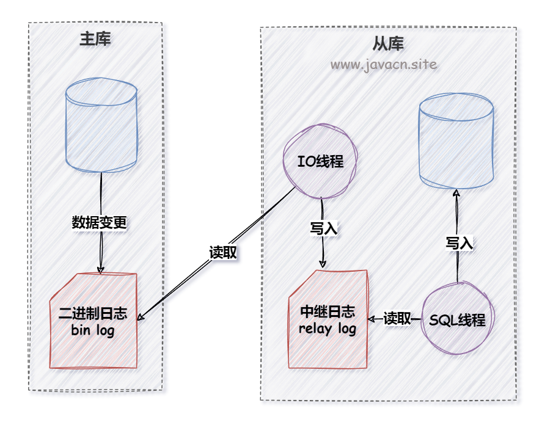

# Java中，对象一定在堆中分配吗？

  如果JVM通过逃逸分析发现一个对象只在一个方法中使用，并且不会逃逸出这个方法，那么它可能会选择在栈上分配这个对象

# 用户态和内核态

用户态和内核态的概念是为了限制应用程序对计算机资源的访问。当程序跑在用户态时，是无法直接访问IO资源、内存分配等的，需要切换到内核态来运行。

### 用户态的应用程序访问内核态的资源的方式：

1.  系统调用（软中断）

2.  外中断（外围设备，比如硬盘）

3.  异常（比如缺页异常）

# 什么时候触发Minor GC

*   新分配的对象大小大于Eden区的可用空间

*   在Minor GC过程中，Eden区和from区存活的对象会被移动到to区，如果to区的空间不够，会频繁触发Minor GC

# 对象什么时候进入老年代

*   大对象直接进入老年代：通过`-` `XX:PretenureSizeThreshold``=`<字节大小>\`参数来设置

*   从新生代晋升到老年代，通过`-``XX:MaxTenuringThreshold`**（默认15）和**`-XX:TargetSurvivorRatio`\*\*\*\*（默认50%）共同决定

      Hotspot 遍历所有对象时，按照年龄从小到大对其所占用的大小进行累积，当累积的某个年龄大小超过了 survivor 区的 50% 时（默认值是 50%，可以通过 `-XX:TargetSurvivorRatio=percent` 来设置），取这个年龄和 MaxTenuringThreshold 中更小的一个值，作为新的晋升年龄阈值”。

# Mysql explain

*   id：序号越大越先执行，序号一样谁在前谁先执行。id为 null 时表示一个结果集，不需要使用它查询，常出现在包含[union](https://so.csdn.net/so/search?q=union\&spm=1001.2101.3001.7020)等查询语句中。

*   select\_type：

    *   SIMPLE：简单查询，即查询不包含子查询或UNION

    *   PRIMARY：查询中包含任何复杂的子部份，最外层的查询被标记为primary

        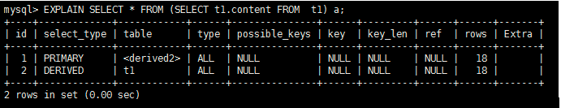

    *   SUBQUERY：在SELECT或者WHERE中的子查询

        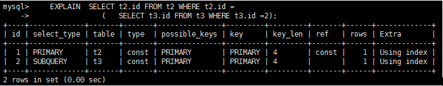

    *   DERIVED：在FROM中的子查询

    *   UNION 出现在union后的查询语句中

    *   UNION RESULT 从UNION中获取结果集

    *   DEPENDENT SUBQUERY：当子查询的条件依赖于外部查询的数据时，为DEPENDENT SUBQUERY。这种情况下，外层查询的每一组变量的不同值，子查询都会执行一次

        *   例：

        ```SQL
        // 数据
        CREATE TABLE customers (
            customer_id INT PRIMARY KEY,
            name VARCHAR(100)
        );

        CREATE TABLE orders (
            order_id INT PRIMARY KEY,
            customer_id INT,
            order_amount DECIMAL(10, 2),
            FOREIGN KEY (customer_id) REFERENCES customers(customer_id)
        );

        INSERT INTO customers (customer_id, name) VALUES (1, 'Alice'), (2, 'Bob');
        INSERT INTO orders (order_id, customer_id, order_amount) VALUES (1, 1, 100.00), (2, 1, 200.00), (3, 2, 150.00);

        // 查询
        SELECT customer_id,
               (SELECT MAX(order_amount)
                FROM orders
                WHERE orders.customer_id = customers.customer_id) AS max_order_amount
        FROM customers;

        ```

        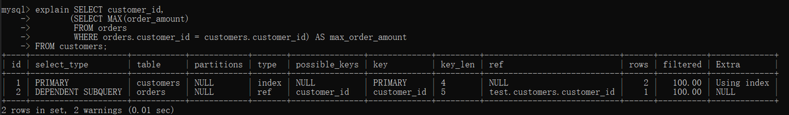

*   type：

    *   system：表中只有一行数据，等同于系统表

    *   const：主键或唯一索引等值查询

    *   eq\_ref：在join查询中，使用主键或非空唯一索引进行等值查询（对于join前表的每一行，后表最多只有一行与之对应）

        *   `联表`(join)查询

        *   命中`主键`(primary key)或者`非空唯一索引`(unique not null)

        *   `等值`连接

        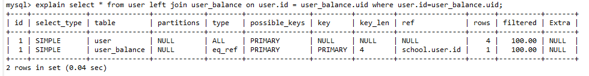

    *   ref：同eq\_ref模拟数据区别：表中的`主键索引`改为`普通索引`（对于join前表的每一行，后表有多行与之对应）

    *   range：使用了索引的范围查询。如 between、in、`>、>=、 <、 <=`

    *   index：全索引扫描，仅比全表扫描快一点

    *   ALL：全表扫描（如果有主键，且使用了主键，是不会ALL的）

        

*   table：查了哪张表，只有一张

*   partitions：表分区

*   possible\_keys：可能用到的索引，可能是多个

*   key：实际使用的索引，可以是多个，如果为NULL，则没有使用索引

    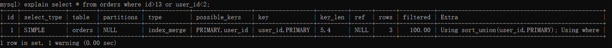

*   key\_len：表示索引使用的字节数

*   ref：ref列显示哪些列或常量与key列中指定的索引进行比较。（CONST或者某些列的列名）

*   rows：为了得到结果，预估需要扫描的行数

*   filtered：实际结果相对于总的扫描的行数的占比（0 - 100的两位小数，表示百分比）

*   extra：

    *   Using Where：使用了where条件过滤数据

    *   Using index：覆盖索引

    *   Using where;Using index：覆盖索引，且where是对索引的范围查询

    *   Using temporary：表示需要使用临时表来存储结果集，常见于order by和group查询

    *   Using filesort：查询要求的顺序与读取的行的顺序不一致，于是MySQL需要进行额外的排序操作。常见于where条件和order by的列不一样

        *   这种排序可能在内存中进行，也可能在磁盘中进行。

        *   如果所需内存量超过了sort\_buffer\_size，则在磁盘中进行

        *   否则在内存中进行

    *   Using index condition：索引下推（ICP）

# hashmap

*   什么时候扩容？

    *   当总元素个数超过threshold（Node\[]数组长度 \* Load factor, Node\[]数组默认初始16, Load factor默认0.75)时,会进行扩容

    *   当链表长度大于8, 且Node\[]数组长度小于64时, 会进行扩容

*   为什么jdk 1.8之前在扩容时会产生循环链表

    *   <https://www.bilibili.com/video/BV1n541177Ea/?spm_id_from=333.337.search-card.all.click&vd_source=53c8a677cde7e1f0918c7ca7690f2e64>

*   计算哈希桶数组索引

    ```Java
    方法一：
    static final int hash(Object key) {   //jdk1.8 & jdk1.7
         int h;
         // h = key.hashCode() 为第一步 取hashCode值
         // h ^ (h >>> 16)  为第二步 高位参与运算
         return (key == null) ? 0 : (h = key.hashCode()) ^ (h >>> 16);
    }
    方法二：
    static int indexFor(int h, int length) {  //jdk1.7的源码，jdk1.8没有这个方法，但是实现原理一样的
         return h & (length-1);  //第三步 取模运算
    }
    ```

*   为什么jdk 1.8之后采用尾插法

    *   解决多线程下扩容产生循环链表的问题

    *   解决扩容之后出现链表倒置的问题

# MySQL设置配置

在 MySQL 中，`SET GLOBAL`, `SET SESSION`, `SET PERSIST`, 和 `SET PERSIST_ONLY` 是用于设置系统变量的不同命令，它们在作用范围和持久性上有所不同。下面是它们的区别：

1.  **SET GLOBAL**:

    1.  **作用范围**: 全局范围，影响所有会话。

    2.  **持久性**: 仅在服务器运行期间有效，重启后失效。

    3.  **用法**: `SET GLOBAL variable_name = value;`

    4.  **示例**: `SET GLOBAL max_connections = 200;`

2.  **SET SESSION**:

    1.  **作用范围**: 当前会话，影响当前连接的会话。

    2.  **持久性**: 仅在当前会话期间有效，会话结束后失效。

    3.  **用法**: `SET SESSION variable_name = value;`

    4.  **示例**: `SET SESSION sql_mode = 'TRADITIONAL';`

3.  **SET PERSIST**:

    1.  **作用范围**: 全局范围，影响所有会话。

    2.  **持久性**: 持久有效，即使服务器重启后依然有效。变量值被写入 `mysqld-auto.cnf` 文件。

    3.  **用法**: `SET PERSIST variable_name = value;`

    4.  **示例**: `SET PERSIST max_connections = 250;`

4.  **SET PERSIST\_ONLY**:

    1.  **作用范围**: 全局范围，影响所有会话。

    2.  **持久性**: 持久有效，即使服务器重启后依然有效。变量值被写入 `mysqld-auto.cnf` 文件。

    3.  **用法**: `SET PERSIST_ONLY variable_name = value;`

    4.  **示例**: `SET PERSIST_ONLY max_connections = 300;`

    5.  **特殊说明**: 与 `SET PERSIST` 不同的是，`SET PERSIST_ONLY` 不会影响当前运行的服务器，只会影响重启后的设置。

简要总结如下：

*   `SET GLOBAL`: 影响所有会话，服务器重启后失效。

*   `SET SESSION`: 仅影响当前会话，会话结束后失效。

*   `SET PERSIST`: 影响所有会话，持久有效，服务器重启后依然有效。

*   `SET PERSIST_ONLY`: 影响所有会话，持久有效，服务器重启后生效。

通过理解这些命令的作用范围和持久性，可以更好地管理和配置 MySQL 的系统变量。

# `mysqld-auto.cnf` 和 `my.cnf`

在 MySQL 中，`mysqld-auto.cnf` 和 `my.cnf` 文件是用于配置系统变量的文件，但它们在使用和优先级上有所不同。

### my.cnf

*   **功能**: `my.cnf` 是 MySQL 的主要配置文件，包含各种服务器配置选项。

*   **位置**: 通常位于 MySQL 安装目录下，可能在 `/etc/my.cnf`, `/etc/mysql/my.cnf` 或用户自定义的位置。

*   **优先级**: 在服务器启动时读取，并应用其中的配置选项。

*   **手动编辑**: 需要手动编辑此文件来更改配置。

### mysqld-auto.cnf

*   **功能**: `mysqld-auto.cnf` 是 MySQL 5.7.8 及更高版本引入的文件，主要用于存储通过 `SET PERSIST` 和 `SET PERSIST_ONLY` 命令持久化的变量。

*   **位置**: 通常位于数据目录中。

*   **优先级**: 在服务器启动时读取，优先级高于 `my.cnf`，也就是说，如果在 `mysqld-auto.cnf` 中有相同的变量设置，这些设置将覆盖 `my.cnf` 中的相应设置。

*   **自动生成**: 通过 `SET PERSIST` 和 `SET PERSIST_ONLY` 命令自动生成和更新，无需手动编辑。

### 冲突处理

*   **优先级顺序**: MySQL 在启动时会按照优先级顺序读取配置文件。`mysqld-auto.cnf` 的优先级高于 `my.cnf`，因此如果两个文件中有冲突的配置，`mysqld-auto.cnf` 中的设置将生效。

*   **应用场景**:

    *   **持久性更改**: 使用 `SET PERSIST` 和 `SET PERSIST_ONLY` 命令持久化的变量将写入 `mysqld-auto.cnf`，确保即使服务器重启后，设置仍然有效。

    *   **静态配置**: `my.cnf` 文件适合存放不经常更改的静态配置。

    *   **动态调整**: `mysqld-auto.cnf` 适合动态调整的配置，这些调整可以在运行时通过 SQL 命令进行。

### 示例

假设你有如下两个文件：

`my.cnf`:

```TOML
[mysqld]
max_connections = 100
```

`mysqld-auto.cnf`:

```JSON
{
  "max_connections": 200
}
```

在这种情况下，MySQL 启动后 `max_connections` 将被设置为 200，因为 `mysqld-auto.cnf` 中的设置覆盖了 `my.cnf` 中的设置。

### 结论

*   **优先级**: `mysqld-auto.cnf` 的优先级高于 `my.cnf`。

*   **用途**: `my.cnf` 用于静态配置，`mysqld-auto.cnf` 用于持久化动态调整的配置。

*   **不会冲突**: 两个文件不会直接冲突，但 `mysqld-auto.cnf` 会覆盖 `my.cnf` 中的相应设置。

# 慢查询排查

1.
    ## 日志

2.
    ## 网络

3.
    ## explain

# 慢查询优化

1.

    ## 索引

    *   首先，通过explain查看type字段，如果是ALL，说明没用上索引

    *   注意索引失效的情况： [back-end](https://diangroup.feishu.cn/docx/BCCvdNRvpoK2Zrxh3d8ct3l0nRd#part-WKI0dHydgoTGdBxWoUOcJk50nPc)

    *   查看key和possible\_keys，看是否使用了正确的索引。然后通过force indx(idx\_name)强制使用索引

        ```SQL
        select * from ws_shop a force index(create_time)
        where date(create_time-interval 6 hour) > '2016-10-01 06:00:00'
        ```

2.
    ## limit深度分页

深度分页优化

1.  改为子查询(只适用于ID 是正序的)

```SQL
SELECT `score`, `name` FROM `cus_order` LIMIT 100000, 10

# 改为

SELECT `score`, `name` FROM `cus_order`
WHERE id >= (SELECT id FROM `cus_order` LIMIT 100000, 1)
LIMIT 10;
```

1.  延迟关联

```SQL
SELECT `score`,`name` FROM `cus_order` a, (SELECT id from `cus_order` LIMIT 1000000, 10) b
WHERE a.id = b.id;

# 或者

SELECT `score`,`name` FROM `cus_order` a
INNER JOIN(SELECT id from `cus_order` LIMIT 1000000, 10) b 
ON a.id = b.id
LIMIT 10;
```

1.
    ## 避免单表数据量太大

当单表数据量太大的时候，索引的层数会变得很高，IO时间变长

可以通过分库分表的方式解决

1.

    ## join

    1.
        ###   尽量不要多表join

    2.
        ###   用小结果集驱动大结果集，并尽量使用Index Nested-Loop Join

      **在Mysql的实现中，Nested-Loop Join有3种实现的算法：**

    *   Simple Nested-Loop Join：SNLJ，简单嵌套循环连接

    *   Index Nested-Loop Join：INLJ，索引嵌套循环连接

    *   Block Nested-Loop Join：BNLJ，缓存块嵌套循环连接

      **在选择Join算法时，会有优先级** **Index Nested-LoopJoin > Block Nested-Loop Join > Simple Nested-Loop Join**

    1.  Index Nested-Loop Join在外层表的每次循环中，使用内层表的索引来进行比较，时间复杂度为m \* log n（外层表行数 \* 内层表索引层数）

    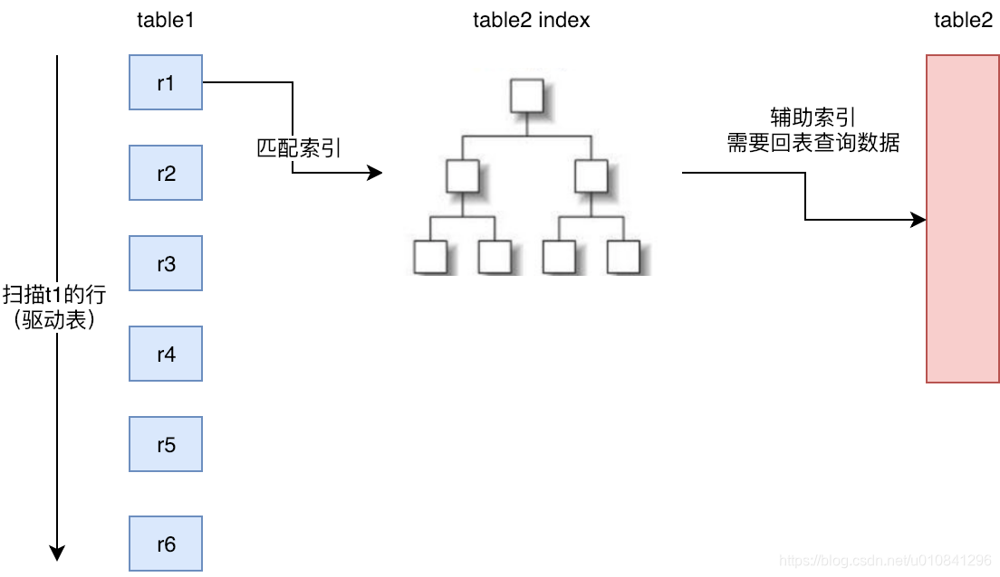

    1.  **Block Nested-Loop Join：使用Join Buffer，通过一次性缓存多条数据，把参与查询的列缓存到Join Buffer 里，然后拿join buffer里的数据批量与内层表的数据进行匹配，从而减少了内层循环的次数（遍历一次内层表就可以批量匹配一次Join Buffer里面的外层表数据）**

    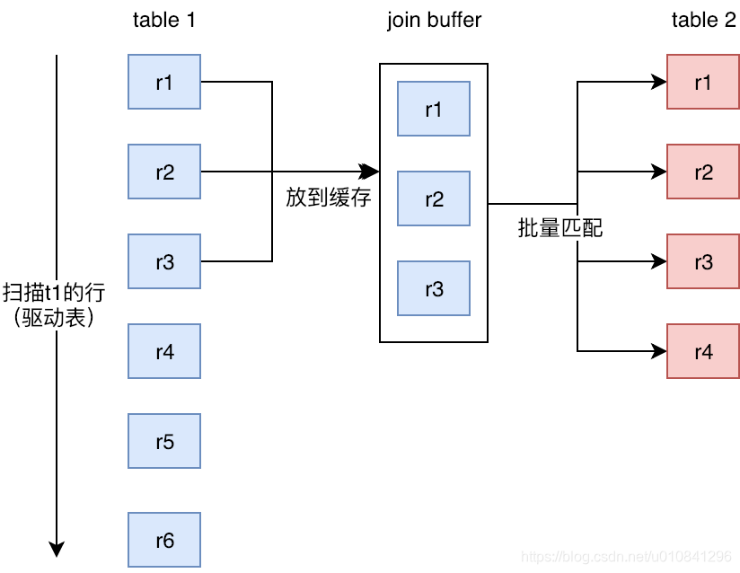

### 如果无法使用Index Nexsted-Loop Join，要通过增大join buffer size的大小，从而使用Block Nested-Loop Join

# synchronized锁升级

*   对象头：java对象的一部分（对象头、对象体、对齐字节）

    *   由 Mark Word、Class Pointer、数组长度三个字段组成

    *   **Mark Word**：主要用来表示当前 Java 对象的线程锁状态以及 GC 的标志】

    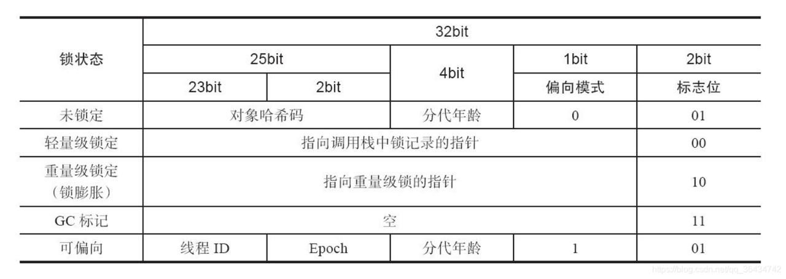

    *   **Class Pointer**：是指针，指向方法区中的 class，JVM 通过此字段来判断当前对象是哪个类的实例

    *   **数组长度**：当且仅当对象是数组时才会有该字段
*   锁升级过程

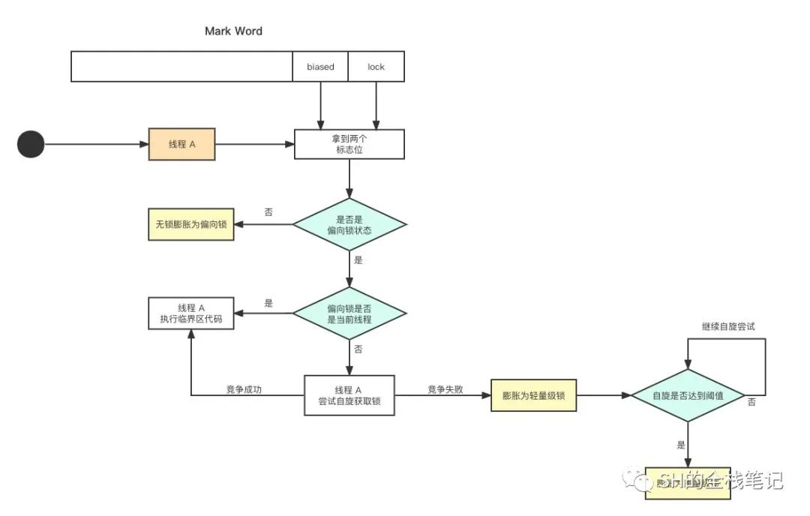

# AIO、NIO、BIO

# 零拷贝

# Redisson原理

*   使用lua脚本进行加锁解锁，通过hash存储锁，key是资源名，field是uuid + threadId（uuid是客户端启动时生成的）, value是锁的重入次数。并给锁设置过期时间

*   通过watch dog进行锁的续期。默认情况下，锁的过期时间是 30s，锁获取成功之后每隔 10s 进行一次锁续期，重置过期时间成 30s

*   如果锁获取失败，会通过redis的发布订阅功能来等待锁的释放信息，并阻塞当前的线程 "future.await(timeout)"

    *   阻塞有超时时长，默认7.5秒。原因是防止持有锁的线程意外挂掉而没有正常释放锁，从而没有往channle发布消息。

# 解决哈希冲突的常用方法

1.

    ## 开放地址法

    1.
        ###   线性探查法

    2.
        ###   平方探查法

      平方探测不是简单地跳过一个固定的步数，而是跳过“探测次数的平方”的步数，即 1,4,9,… 步。

2.
    ## 链地址法（拉链法）

3.

    ## 再哈希法

      准备多个哈希函数，如果冲突，就使用下一个哈希函数进行计算#

# http 1.0/1.1/2

## http1.1

*   模式使用长连接（1.0默认短连接）：

    *   Connection设置为Keep-alive（默认打开）

    *   如果客户端想关闭HTTP连接，可以在请求头中携带`Connection:false`来告知服务器关闭请求

*   加入Host字段，表示请求的域名（如果直接通过ip地址进行请求，则Host字段的内容是ip地址）

*   加入range头，表示请求数据的一部分，从而能够断点续传

    ```HTTP
      GET /z4d4kWk.jpg HTTP/1.1
      Host:   i.imgur.com
      Range: bytes=0-1023
    ```

    ```HTTP
    HTTP/1.1 206 Partial Content
    Content-Range: bytes 0-1023/146515
    Content-Length: 1024
    …
    （二进制内容）
    ```

## http2

*   采用二进制格式传输数据

*   头部压缩：通过HPACK算法，在客户端和服务端同时维护一张信息头表，每次只要传输字段的索引就可以了

*   并发传输：通过在一条TCP连接里发送多个Stream，实现多个响应的并发传输

# RocketMq推和拉

## 推模式：

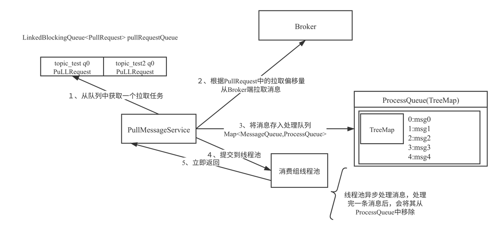

# 常见的Lock实现类

*   ReentrantLock

*   ReentrantReadWriteLock

      **API介绍**

      构造方法：

    *   `public ReentrantReadWriteLock()`：默认构造方法，非公平锁

    *   `public ReentrantReadWriteLock(boolean fair)`：true 为公平锁

      常用API：

    *   `public ReentrantReadWriteLock.ReadLock readLock()`：返回读锁

    *   `public ReentrantReadWriteLock.WriteLock writeLock()`：返回写锁

    *   `public void lock()`：加锁

    *   `public void unlock()`：解锁

    *   `public boolean tryLock()`：尝试获取锁

# 为什么有了synchronized还要有Lock

*   通过tryLock实现非阻塞式的获取锁，获取成功返回true，否则返回false

*   通过tryLock(long time, TimeUnit unit)实现阻塞的最大时间

*   Lock可以实现等待可中断：

```C
 void lockInterruptibly() throws InterruptedException;
```

通过lockInterruptibly，可以让线程在阻塞获取锁的时候被interrupt方法打断

*   ReentrentLock提供了公平锁

*   ReentrantReadWriteLock实现了读写锁

# java停止线程

*   thread.interrupt();

    *   然后通过Thread.currentThread().isInterrupted()来判断

    *   或者通过Thread.interrupted()来判断

    *   二者的区别：Thread.currentThread().isInterrupted()不会清除线程中断状态，而Thread.interrupted()会清除线程中断状态

# java停止多个线程

*   使用共享变量

*   使用`ExecutorService` 的shutdown方法

    ```Java
    import java.util.concurrent.ExecutorService;
    import java.util.concurrent.Executors;
    import java.util.concurrent.TimeUnit;

    public class ExecutorServiceExample {
        public static void main(String[] args) throws InterruptedException {
            ExecutorService executorService = Executors.newFixedThreadPool(3);
            
            for (int i = 0; i < 3; i++) {
                executorService.submit(() -> {
                    while (!Thread.currentThread().isInterrupted()) {
                        // 执行线程的任务
                    }
                });
            }

            // 等待一段时间，然后关闭线程池
            Thread.sleep(1000);
            executorService.shutdownNow();
            executorService.awaitTermination(1, TimeUnit.SECONDS);
        }
    }
    ```

# spring-boot-starter-parent

# SpringBoot相比于Spring的提升

1.  通过自动装配，只需要引入相关的依赖，不需要手写XML或配置类就可以使用第三方组件

2.  内嵌了Tomcat、Jetty等服务器，可以直接运行

3.  通过继承spring-boot-starter-parent或引入[spring-boot-dependencies](https://github.com/spring-projects/spring-boot/blob/master/spring-boot-project/spring-boot-dependencies/pom.xml)实现自动依赖管理

# 计算机网络中的5元组

源端口、目的端口、源IP、目的IP、协议类型（TCP、UDP）

用来唯一标识一个网络通信连接

# 实现多态的方式中，实现接口和继承父类的区别

*   实现接口是一种”能做什么“的关系，表示具有某种功能，并且除了default方法和static方法，接口实现类必须实现接口的抽象方法

*   继承是一种”is-a“的关系，子类可以重写父类的部分方法，不必重写父类的所有方法。

# java 中属性和方法的多态

结论：java中只有非静态方法有多态（多态：持有父类引用时，调用的方法实现是子类的实现），

静态方法和属性（静态与非静态）没有多态，而是有”隐藏“的特性。即：持有父类的引用则看到的是父类的属性，持有子类的引用则看到的是子类的属性。静态方法也是如此。当子类没有这个属性或静态方法时，看到的是父类的。

# Buffer和Cache的区别

buffer是进行磁盘写操作的临时缓冲区，用于将多个磁盘写操作合并为一次（update系统守护进程每30秒调用一次sync系统调用）。buffer属于内存的一部分，由操作系统实现。

cache是CPU和内存之间的缓冲区，用于提高CPU访问内存的性能。cache是内存之外的单独的存储区域，读写性能比内存高

# linux定时任务

使用crontab命令，来编辑crontab文件，实现定时任务

查看当前用户的 crontab 文件：

crontab -l

编辑当前用户的 crontab 文件：

crontab -e

删除当前用户的 crontab 文件：

crontab -r

列出某个用户的 crontab 文件（需要有相应的权限）：

crontab -u username -l

编辑某个用户的 crontab 文件（需要有相应的权限）：

crontab -u username -e

## 格式

时间格式如下：

f1 f2 f3 f4 f5 program

*   其中 f1 是表示分钟，f2 表示小时，f3 表示一个月份中的第几日，f4 表示月份，f5 表示一个星期中的第几天。program 表示要执行的程序。

*   当 f1 为 \* 时表示每分钟都要执行 program，f2 为 \* 时表示每小时都要执行程序，其馀类推

*   当 f1 为 a-b 时表示从第 a 分钟到第 b 分钟这段时间内要执行，f2 为 a-b 时表示从第 a 到第 b 小时都要执行，其馀类推

*   当 f1 为 \*/n 时表示每 n 分钟个时间间隔执行一次，f2 为 \*/n 表示每 n 小时个时间间隔执行一次，其馀类推

*   当 f1 为 a, b, c,... 时表示第 a, b, c,... 分钟要执行，f2 为 a, b, c,... 时表示第 a, b, c...个小时要执行，其馀类推

<!---->

*
    *
        *
            *
                *
                    *
                        *
                            *
                                *
                                    *   \| | | | | | | | | +----- 星期中星期几 (0 - 6) (星期天 为0) | | | +---------- 月份 (1 - 12) | | +--------------- 一个月中的第几天 (1 - 31) | +-------------------- 小时 (0 - 23) +------------------------- 分钟 (0 - 59)

## 实例

每一分钟执行一次 /bin/ls：

*
    *
        *
            *
                *   /bin/ls

在 12 月内, 每天的早上 6 点到 12 点，每隔 3 个小时 0 分钟执行一次 /usr/bin/backup：

0 6-12/3 \* 12 \* /usr/bin/backup

周一到周五每天下午 5:00 寄一封信给 <alex@domain.name>：

0 17 \* \* 1-5 mail -s "hi" <alex@domain.name> < /tmp/maildata

每月每天的午夜 0 点 20 分, 2 点 20 分, 4 点 20 分....执行 echo "haha"：

20 0-23/2 \* \* \* echo "haha"

# 进程和线程

## 进程和线程的区别：

*   进程是操作系统中资源分配的基本单位，每个进程都有自己独立的虚拟地址空间和页表，以及寄存器上下文、堆和栈等

*   线程是cpu调度的基本单位，进程在运行时，实际运行的是进程里的线程。同一个进程的线程共享进行的堆、地址空间等资源，但是每个线程都有自己的程序计数器、栈等资源

## 为什么使用多线程

*   线程比进程更加轻量，线程的切换只是涉及寄存器上下文和栈指针，不需要切换地址空间、进程的系统资源等，所以线程的切换成本更低

*   线程之间可以通过共享的堆内存进行通信，不需要调用内核

*   多线程可以实现CPU的高效利用，比如在一个线程IO阻塞时，可以由另一个线程使用CPU

## 线程间的同步方式

*   锁

    *   互斥锁：Synchronized、Lock实现类

    *   读写锁：比如ReadWriteLock的实现类：ReentrantReadWriteLock

    ```Java
    public interface ReadWriteLock {
        /**
         * Returns the lock used for reading.
         *
         * @return the lock used for reading
         */
        Lock readLock();

        /**
         * Returns the lock used for writing.
         *
         * @return the lock used for writing
         */
        Lock writeLock();
    }
    ```

*   计数器：CountDownLatch

*   信号量

    *   Semaphore

*   屏障

    *   `CyclicBarrier`

*   事件

    *   java对象的wait/notify

    *   condition的await/signal

# 协程

协程是一种用户级线程，本质上还是单线程，在操作系统角度是看不到协程的。协程的特点是主动让出控制权来实现多任务，而不是抢占式的操作系统调度。

# Semaphore

# 系统调用的过程

1.  通过int 0x80陷入内核态，将系统调用号放入eax寄存器

2.  在内核栈中压入用户态寄存器的值，将当前栈切换为内核栈

3.  从eax寄存器获取系统调用号，根据中断向量表找到中断程序的入口

4.  执行中断处理程序

5.  从中断处理程序返回

# Future和Runnable的区别

*   Runnable接口的run方法无返回值，Callable的call方法有返回值

*   Runnable 接口 run 方法只能抛出运行时异常，且无法捕获处理；Callable 接口 call 方法允许抛出异常，可以获取异常信息（使用线程池的submit方法传入callable，返回一个Future，调用Future的get方法时可以try捕获到异常）

    ```Java
    @FunctionalInterface
    public interface Callable<V> {
        /**
         * Computes a result, or throws an exception if unable to do so.
         *
         * @return computed result
         * @throws Exception if unable to compute a result
         */
        V call() throws Exception;
    }
    ```

    ```Java
    @FunctionalInterface
    public interface Runnable {
        /**
         * When an object implementing interface <code>Runnable</code> is used
         * to create a thread, starting the thread causes the object's
         * <code>run</code> method to be called in that separately executing
         * thread.
         * <p>
         * The general contract of the method <code>run</code> is that it may
         * take any action whatsoever.
         *
         * @see     java.lang.Thread#run()
         */
        public abstract void run();
    }
    ```

# submit和execute的区别

`execute`的入参是Runnable， 没有返回值。任务通过`execute`提交后就基本和主线程脱离关系了。

而`submit`的入参可以是Callable(也可以是Runnable)，并且有返回值，返回的是一个`Future`对象，然后通过对象的`get`方法获取任务执行的结果。

submit的本质还是执行execute方法，不过会把Runnable、Callable分别包装成`RunnableFuture<Void>、RunnableFuture<T>`之后再丢给execute，然后返回这个RunnableFuture

```Java
public Future<?> submit(Runnable task) {
    if (task == null) throw new NullPointerException();
    RunnableFuture<Void> ftask = newTaskFor(task, null);
    execute(ftask);
    return ftask;
}
```

```Java
public <T> Future<T> submit(Callable<T> task) {
    if (task == null) throw new NullPointerException();
    RunnableFuture<T> ftask = newTaskFor(task);
    execute(ftask);
    return ftask;
}
```

# 进程调度方法

*   先到先服务

*   短作业优先

*   时间片轮转调度

*   多级反馈队列调度算法：UNIX系统采用这种方法

      设有N个队列（Q1,Q2....QN），其中各个队列对于[处理机](https://baike.baidu.com/item/%E5%A4%84%E7%90%86%E6%9C%BA/0?fromModule=lemma_inlink)的[优先级](https://baike.baidu.com/item/%E4%BC%98%E5%85%88%E7%BA%A7/5643121?fromModule=lemma_inlink)是不一样的，也就是说位于各个队列中的作业(进程)的优先级也是不一样的。一般来说，优先级Priority(Q1) > Priority(Q2) > ... > Priority(QN)。

      对于每一个队列，队列内部的进程采用先到先服务调度算法，而优先级最低的那个队列采用时间片轮转调度算法。

      只有当上一个优先级的队列的所有进程都调度过了，下一个优先级的队列的进程才能开始调度

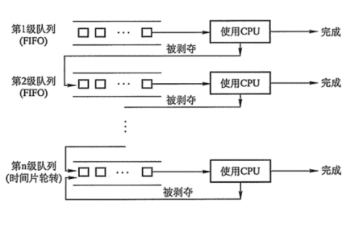

*   优先级调度算法，具有相同优先级则使用先到先服务

# 虚拟内存

## 分段机制

*   段号：标识着该虚拟地址属于整个虚拟地址空间中的哪一个段。

*   段内偏移量：相对于该段起始地址的偏移量。

## 分页机制

*   页号：通过虚拟页号可以从页表中取出对应的物理页号；

*   页内偏移量：物理页起始地址+页内偏移量=物理内存地址。

### TLB

用虚拟地址中的虚拟页号作为 key 去 TLB 中查询；

如果能查到对应的物理页的话，就不用再查询页表了，这种情况称为 TLB 命中（TLB hit)。

如果不能查到对应的物理页的话，还是需要去查询主存中的页表，同时将页表中的该映射表项添加到 TLB 中，这种情况称为 TLB 未命中（TLB miss)。

当 TLB 填满后，又要登记新页时，就按照一定的淘汰策略淘汰掉快表中的一个页。

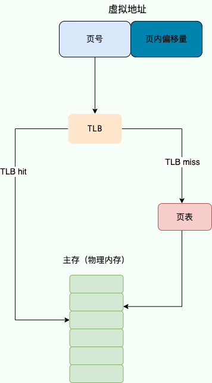

### [什么是页缺失？](https://javaguide.cn/cs-basics/operating-system/operating-system-basic-questions-02.html#%E4%BB%80%E4%B9%88%E6%98%AF%E9%A1%B5%E7%BC%BA%E5%A4%B1)

页缺失（Page Fault，又名硬错误、硬中断、分页错误、寻页缺失、缺页中断、页故障等）指的是当软件试图访问已映射在虚拟地址空间中，但是目前并未被加载在物理内存中的一个分页时，由 MMU 所发出的中断。

常见的页缺失有下面这两种：

*   **硬性页缺失（Hard Page Fault）**：物理内存中没有对应的物理页。于是，Page Fault Handler 会指示 CPU 从已经打开的磁盘文件中读取相应的内容到物理内存，而后交由 MMU 建立相应的虚拟页和物理页的映射关系。

*   **软性页缺失（Soft Page Fault）**：物理内存中有对应的物理页，但虚拟页还未和物理页建立映射。于是，Page Fault Handler 会指示 MMU 建立相应的虚拟页和物理页的映射关系。

### [常见的页面置换算法有哪些?](https://javaguide.cn/cs-basics/operating-system/operating-system-basic-questions-02.html#%E5%B8%B8%E8%A7%81%E7%9A%84%E9%A1%B5%E9%9D%A2%E7%BD%AE%E6%8D%A2%E7%AE%97%E6%B3%95%E6%9C%89%E5%93%AA%E4%BA%9B)

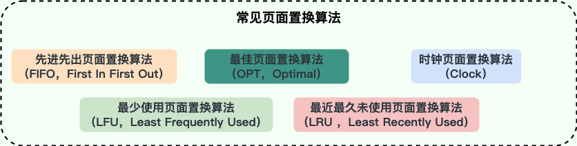

**最佳页面置换算法（OPT，Optimal）**：优先选择淘汰的页面是以后永不使用的，或者是在最长时间内不再被访问的页面，这样可以保证获得最低的缺页率。但由于人们目前无法预知进程在内存下的若干页面中哪个是未来最长时间内不再被访问的，因而该算法无法实现，只是理论最优的页面置换算法，可以作为衡量其他置换算法优劣的标准。

**先进先出页面置换算法（FIFO，First In First Out）** : 最简单的一种页面置换算法，总是淘汰最先进入内存的页面，即选择在内存中驻留时间最久的页面进行淘汰。该算法易于实现和理解，一般只需要通过一个 FIFO 队列即可需求。不过，它的性能并不是很好。

**最近最久未使用页面置换算法（LRU ，Least Recently Used）**：LRU 算法赋予每个页面一个访问字段，用来记录一个页面自上次被访问以来所经历的时间 T，当须淘汰一个页面时，选择现有页面中其 T 值最大的，即最近最久未使用的页面予以淘汰。LRU 算法是根据各页之前的访问情况来实现，因此是易于实现的。OPT 算法是根据各页未来的访问情况来实现，因此是不可实现的。

**最少使用页面置换算法（LFU，Least Frequently Used）** : 和 LRU 算法比较像，不过该置换算法选择的是之前一段时间内使用最少的页面作为淘汰页。

**时钟页面置换算法（Clock）**：可以认为是一种最近未使用算法，即逐出的页面都是最近没有使用的那个。

## 段页式


# 硬链接和软链接

*   硬链接不能跨文件系统

*   软连接可以跨文件系统

*   不能为目录创建硬链接，因为可能会导致文件系统的循环引用。但是可以为目录创建软链接，因为软链接是一个独立的新的文件，不会改变对方的目录结构

## 硬链接

硬链接的作用是允许一个文件拥有多个有效路径名，每个路径的目录项对应的inode节点号是相同的，它们互相为硬链接

```Bash
[oracle@Linux]$ ln f1 f2          #创建f1的一个硬连接文件f2
```

### [硬链接为什么不能跨文件系统？](https://javaguide.cn/cs-basics/operating-system/operating-system-basic-questions-02.html#%E7%A1%AC%E9%93%BE%E6%8E%A5%E4%B8%BA%E4%BB%80%E4%B9%88%E4%B8%8D%E8%83%BD%E8%B7%A8%E6%96%87%E4%BB%B6%E7%B3%BB%E7%BB%9F)

每个文件系统都有自己的独立 inode 表，且每个 inode 表只维护该文件系统内的 inode。如果在不同的文件系统之间创建硬链接，可能会导致 inode 节点号冲突的问题，即目标文件的 inode 节点号已经在该文件系统中被使用。

## 软链接

软链接又称为符号链接，在符号连接中，文件实际上是一个文本文件，其中包含的有另一文件的位置信息。比如：A 是 B 的软链接（A 和 B 都是文件名），A 的目录项中的 inode 节点号与 B 的目录项中的 inode 节点号不相同，A 和 B 指向的是两个不同的 inode，继而指向两块不同的数据块。但是 A 的数据块中存放的只是 B 的路径名（可以根据这个找到 B 的目录项）。A 和 B 之间是“主从”关系，如果 B 被删除了，A 仍然存在（因为两个是不同的文件），但指向的是一个无效的链接。

```Bash
[oracle@Linux]$ ln -s f1 f3       #创建f1的一个符号连接文件f3
```

# 为什么ConcurrentHashMap不允许null为key、value

1.
    ## 不允许value为null

如果允许value为null，则由于二义性，当get返回值为null时，无法确定值是否存在，于是需要先containsKey判断，而这两步操作是不具备原子性的，于是需要加锁，而加锁会锁住整个ConcurrentHashMap，并发性能降低

```Java
if (m.containsKey(k)) {
   return m.get(k);
} else {
   throw new KeyNotPresentException();
}
```

1.
    ## 不允许key为null

不清楚原因

# SpringMVC

# SkipList和平衡树的对比

## SkipList

### 优点：

1.  实现简单

2.  节省空间：在Redis里，每个节点的指针数平均为1.33，比二叉平衡树（2个指针）开销小（[SkipList(跳跃表)详解-CSDN博客](https://blog.csdn.net/helloworld_ptt/article/details/105801262)）

3.  范围查找时间复杂度更优：查找树范围查找需要进行中序遍历，遍历了许多无用的父节点

4.  插入和删除操作只需要更改相邻的节点，而平衡树需要旋转、染色等操作，时间开销更大

### 缺点：

1.  时间复杂度可能退化成$O(n)$：随机数生成器生成的随机数集中在每一个值的时候，所有节点都在同一个高度

## 平衡树

### 优点：

1.  增删查改的时间复杂度稳定在$O(log n)$

### 缺点（skiplist的优点的相反面）：

1.  空间开销大

2.  实现复杂（旋转、染色等）

3.  范围查找需要回溯父节点，时间复杂度更差

# Redis为什么选择SkipList而不是平衡树作为ZSet的底层实现

*   SkipList实现简单，代码易于理解和维护

*   SkipList空间开销更小，而Redis使用内存来存储数据，内存空间是很宝贵的

*   SkipList的时间复杂度和平衡树相同，都是log，性能不比平衡树差

*   SkipList需要范围操作如ZRANGEBYSCORE, ZREVRANGEBYSCORE，而SkipList范围查找性能更优

*   插入和删除操作只需要更改相邻的节点，而平衡树需要旋转、染色等操作，时间开销更大

# Gradle

<https://www.yuque.com/youyi-ai1ik/emphm9/kyhenl?#WArEu>

# ShardingSphere加密数据模糊搜索解决方案

1.
    ## 业界通用方案（淘宝、拼多多、JD）

将明文进行分词组合，分别加密，然后拼起来，存储到模糊查询列

查询时把查询条件进行分词组合，进行模糊查询，然后合并

**举个例子：**

ningyu1使用4个字符为一组的加密方式，第一组ning ，第二组ingy ，第三组ngyu ，第四组gyu1 … 依次类推，全部加密之后存

储到模糊查询列。

如果需要检索所有包含检索条件4个字符的数据比如：ingy ，加密字符后通过 key like “%partial%” 查库。

## 缺点：

1.  存储空间变大，空间占用高

2.  模糊查询条件的长度要大于4（加入4个一组进行分词加密）

3.
    ## ShardingSphere原创方案：基于单字符加密存储

原理：对明文的每个字符先进行mask与运算以增加碰撞，然后进行加密，然后拼起来，存储到模糊查询列。进行mask与运算的目的是增大碰撞几率（丢失了信息），可以增加反向破解的时间复杂度

# RocketMQ 5.0 任意时间段延时消息原理

基于时间轮实现。有一个60秒的时间轮，每秒转一个刻度。定时消息通过链表的形式绑定到相应的刻度上，并且有round字段。对于大于60秒的消息，round大于0。每次转到某个刻度时，会投递该刻度上链表中所有round为0的消息。对于round大于0的，会将其round减1

# Kafka 和 RocketMQ对比

*   Kafka更偏向于流式处理和大规模数据流, 功能比较单一但是性能很高, TPS可达百万, 而RocketMQ TPS为7万左右

*   而RocketMQ在满足高性能的同时，更加关注事务性和业务场景的灵活性。

## 具体功能对比

*   kafka不支持分布式事务,需要额外引入其他框架; rocketmq支持事务消息(两阶段提交)

*   kafaka不支持延时消息; rocketmq支持延时消息(5.0之后延时时长不再是18个level, 而是任意时间长度)

# 雪花算法时钟回拨和全局递增问题

## 时钟回拨问题

1.
    ### 百度uid-generator方案:CachedUidGenerator

维护一个环形队列ringbuffer, 存储提前计算好的未使用的uid。当buffer剩余uid数小于50%时, 获取一批uid并进行填充

每一批获取uid的时间戳都是相同的

解决时钟回拨的关键: **在满足填充新的唯一ID条件时，通过时间值递增得到新的时间值（lastSecond.incrementAndGet()），而不是System.currentTimeMillis()这种方式**，而lastSecond是AtomicLong类型，所以能保证线程安全问题。在实现上, UidGenerator通过**借用未来时间**来解决sequence天然存在的并发限制; 采用RingBuffer来缓存已生成的UID, 并行化UID的生产和消费,最终单机QPS可达600万。

因为是使用自己的时间因此很可能导致其中的时间含义并不准确(不是系统时间),但是这部分可以使用隔一段时间进行系统时间校验解决,中期也不会重复id,因为work id不同

1.
    ### 美团leaf

*   TODO

# 为什么lock方法在try外面

因为只有lock成功才需要unlock操作。如果在try里面lock并且lock失败了，在finally里进行unlock会出现IllegalMonitorStateException异常

# Raft

## 竞选发生条件：

1.  心跳超时

2.  leader的term比自己的小

3.  把时间划分成多个term，当前term结束后发起竞选

## 竞选

所有follower的过期时间是一个随机值（150ms到300ms之间），所以大概率只会出现只有一个follower过期，成为candidate

*   \*\*发出选举请求：\*\*follower成为candidate后，向其他follower发出选举请求（RequestVote RPC），请求中包含新的任期值NewTerm（即当前Term + 1）

*   \*\*选举中收到其他的 Leader RPC：\*\*如果一个candidate在选举过程中收到其他Leader的AppendEntries RPC，会检查该Leader的term，如果这个term比自己的大，就认为这个leader合法，并主动把自己的身份切换为follower，否则拒绝这个RPC

*   \*\*投票：\*\*follower收到选举请求后，向candidate投票。每个follower每个term只会投出一票。

    *   投票原则：先到先服务。会检查term和logIndex，如果符合要求就投票，否则拒绝。

    *   当一个follower接收到一个candidate的投票请求时，它首先会检查自己的当前任期号。如果candidate的任期号比follower的当前任期号小，那么该请求会被拒绝。

    *   如果candidate的任期号大于或等于follower的当前任期号，follower会检查自己是否已经在这个任期中投票给其他candidate。如果还没有投票，并且该candidate的日志比follower的日志更完整（log index更大），follower就会投票给这个candidate，否则拒绝

*   **失败，重试：**

    *   当candidate在timeout时间之内没有收到超过quorum票数（即没有成为leader）或者没有收到leader的心跳，则会选择一个新的随机timeout，然后开始下一轮的选举

*   \*\*成为leader：\*\*当candidate收到的投票数大于quorum（通常为半数），成为leader

*   **同步follower日志：**

      当leader刚上任时，它会初始化所有的nextIndex值为最后一条日志的下一个索引，如图3.6中的11。如果follower的日志和leader的不一致，下一次AppendEntries的一致性检查就会失败。在遭到拒绝后， leader就会降低该follower的nextIndex并进行重试。最终nextIndex会到达leader和follower一致的位置。这条AppendEntries RPC会执行成功，并覆盖follower在这之后原有的日志，之后follower的日志会保持和leader一致，直到这个term结束。

*   \*\*持续同步日志：\*\*leader向follower发出AppendEntries RPC，进行log同步

## log同步

Log Replication 的步骤如下：

1.  每个客户端的请求都会被重定向给 leader，每一条请求都包含一条需要被复制状态机（replicated state machine）执行的命令。

2.  leader 把这条命令加入到新的 log 条目中，同时向其他服务器发起 AppendEntries RPC ，要求其他 follower 同步这条 log。

3.  follower 同步成功后返回给 leader 一条消息，如果 leader 收到超过 quorum 的 follower 的同步成功消息，则这个log被认为是commited，leader 将会将这条 log apply到状态机中，然后响应 client 成功。后续所有节点都可以把这条log apply到状态机里。

4.  如果 follower 宕机或是网络中断，leader 会无限重发 AppendEntries RPC（甚至在它向 client响应之后），直到所有的 follower 最终同步了 log。leader 通过强制 followers 复制它的 log 来处理不一致问题，follower 上的不一致的 log 会被 leader 的 log 所覆盖。

其中，每个 log 条目包含：

*   log index：log 的索引，即图片最上方的数字，是严格递增的，用来表示在 log 中的位置。

*   term：log 任期号，即方块中的数字

*   command：log 对应的数据修改操作。

## 状态机

每个节点上的日志都是通过状态机（State Machine）进行管理的

**leader的volatile状态机的结构：**

*   nextIndex\[]：leader要发给该follower的下一个entry的index

*   matchIndex\[]：follower发给leader的确认index

**所有节点都有的voliatile状态机结构：**

*   commitIndex：下一个commit的log的index

*   lastApllied：上一个apply的log的index

**所有节点都有的persistent状态机的结构：**

*   currentTerm：当前的term

*   votedFor：当前节点给哪个candidate投票，选举时起作用

*   log\[]：log entries数组

## **网络分区问题**

当出现网络分区故障时，会出现多个 leader，如果网络通信恢复后，集群内的 leader 会按照较大的 term 来决定。

## 过半节点包括自己

## 心跳超时和竞选超时

*   心跳是leader向follower发送的，心跳时间是一个固定的间隔，follower只需要监测是否在选举超时时间之前收到leader的心跳

*   竞选超时时间比心跳间隔长，大约是心跳间隔的5-10倍。

*   心跳超时在配置后不会变。竞选超时会有刷新机制：

    *   跟随者状态：

        1.  当一个节点处于跟随者（follower）状态时，它会启动一个选举超时计时器（election timeout）。选举超时是一个随机值，通常在一个范围内（例如150到300毫秒）随机选择，以避免多个节点同时发起选举导致冲突。
    *   检测心跳：

        1.  在选举超时内，如果跟随者收到来自当前领导者的心跳（AppendEntries RPC），计时器会被重置，并重新开始等待下一个选举超时。

        2.  如果跟随者在选举超时内没有收到领导者的心跳，它会认为领导者失效。
    *   转换为候选人：

        1.  当选举超时到期且没有收到心跳时，跟随者会转换为候选人（candidate）状态。

        2.  候选人状态下，该节点会增加其当前任期号（term），并启动一个新的选举过程。
    *   发起选举：

        1.  候选人向集群中的所有其他节点发送RequestVote RPC请求，要求它们为自己投票。

        2.  候选人会等待投票结果，如果在新的选举超时（这也是一个随机的election timeout）内获得了多数票（超过半数），它将成为领导者（leader）。

        3.  如果在选举超时内没有获得足够的票数，并且没有收到其他节点的领导者心跳，它会再次增加任期号并发起新的选举。
    *   重新启动选举超时：

        1.  每次重新发起选举后，候选人会重新设置一个新的选举超时（仍然是随机值）。

        2.  如果在新的选举超时内没有成功变成领导者，也没有收到新的领导者的心跳，候选人将再次增加任期号并再次发起选举。

## Raft Safety（容错）

节点容错的目的是保证节点在crash之后，log仍然能够保证一致性

1.
    ## follower crash

follower crash之后会出现的问题是它重新上线后log如何和leader进行同步。

方法比较简单，使用正常的同步机制即可

1.
    ## leader crash

leader crash之后再上线，如果日志和leader不一致，采用的方法是：

1.  leader选举时，所有uncommited日志会回滚

2.  如果follower的日志和leader不一致，会被强制写成leader的日志

## raft算法如何保证leader的数据永远是最新的且不会丢数据

通过两个majority和一个约束来保证

**majority：**

*   commit majority：一条消息只有变成committed状态才被认为已经提交成功，而committed状态的前提是该消息已经同步到了majority的节点

*   vote majority：某个candidate当选leader的条件就是该candidate获得到了majori节点的选票

**约束：**

*   leader当选的条件是log是最新的

# @Transactional注解是用在接口上还是实现类上

*   答案是都可以。但是推荐用在实现类上，因为这样更灵活，是否开启事务要根据具体实现来看

# CAP

在分布式系统中无法同时保证C、A、P，而在实际实践中，P（分区容错性）是必须要保证的，否则就和单点系统没有太大的区别。

于是，在满足P的前提下，A和C只能选择一个：CP和AP。

C和A不能同时保证，直观上来看是因为：

在P出现时，如果有C，就需要关闭其他分区来保证一致性，但是这样就牺牲了可用性；

在P出现时，如果有A，就会出现不同分区的数据不一致，于是牺牲了一致性

# BASE

**BASE是CP和AP权衡的结果**

BA：基本可用性（某个模块出现问题，其他模块依旧可用）

S：软状态（允许短暂的数据不一致）

E：最终一致性（数据最终一致）

## 最终一致性的5种目标

*   因果一致性

      如果节点A在更新完某个数据后通知了节点B，那么节点B之后对该数据的访问和修改都是基于A更新后的值。与此同时，与A无因果关系的节点C的数据访问则没有这样的限制

# RAFT和CAP

raft实现的是CP

raft通过多数投票机制保证了只有一个分区能够提供服务，从而保证数据一致性和分区容忍性

# Gossip

gossip协议是一个去中心化的协议，所有节点都是对等的。

Gossip协议在计算机系统通常以随机的“对等选择”形式实现：以给定的频率，每台计算机随机选择另一台计算机，并共享任何消息。定义十分简单，所以实现方式非常多，可能有几百种Gossip协议变种。

一种实现如下：

*   **种子节点**周期性的散播消息 【假定把周期限定为 1 秒】。

*   被感染节点随机选择N个邻接节点散播消息【假定fan-out(扇出)设置为6，每次最多往6个节点散播】。

*   节点只接收消息不反馈结果。

*   每次散播消息都选择**尚未发送过的节点**进行散播。

*   收到消息的节点**不回传散播**：A -> B，那么B进行散播的时候，不再发给 A。

# 分布式事务

三个角色：RM（资源管理器）、TM（事务管理器）、AP（应用程序）

1.
    ## XA

原理：两阶段提交

prepare和commit

### 正常情况下XA的流程

1.  AP向TM发起请求，开启全局事务

2.  AP向RM依次发起请求，RM开始prepare资源，完成后向TM注册子事务

3.  TM依次向RM发起提交通知，RM进行提交

### prepare阶段有RM失败

则所有RM都需要回滚

### commit阶段有RM失败

则所有RM都需要回滚

### 缺点

*   比较依赖TM，如果TM挂了，就完了，如果TM耗时很长，就会拖累整体的时间

1.
    ## SAGA

思想是把长事务转化为一个个短事务

1.  每个RM向TM发送自己的正向操作和补偿操作

2.  TM一次调用每个RM的正向操作

3.  如果某个RM出现错误，TM会让这个RM进行补偿事务，完成之后进行上一个RM的补偿事务，如此依次进行

4.
    ## TCC

有三个阶段：try，confirm，cancel。实际上confirm和cancel只会出现一个

1.  AP调用RM的try接口，RM锁定相关的资源之后通知TM

2.  如果所有的RM的try阶段都顺利结束了，TM会开始confirm阶段，否则进行回滚

3.  在confirm阶段一般不会失败，因为资源都已经预留好了。如果确实有失败，会不断重试，指直到成功

4.
    ## AT

AT是Seata自研的事务模式。和XA类似，也是两阶段。有三个角色：RM、TC（相当于XA中的TM）、TM（相当于XA的AP）

1.  第一阶段，RM执行本地事务，把执行之前的数据（BoreforImage）和执行之后的数据（AfterImage）存储在undolog表里，并把主键（lockkey）注册到TC上

2.  如果第一阶段都没有错误，TC会把所有的lockKey删除，然后通知所有RM，表示事务成功，RM把undolog删除

3.  如果第一阶段有错误，TC会通知RM进行回滚。然后TC把lockKey删除

### 好处

相对于XA来说，AT的侵入性很弱，只需要加一个注解即可完成分布式事务。
