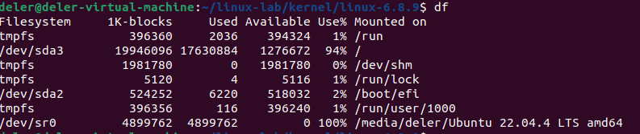
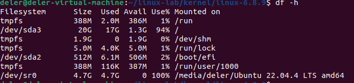
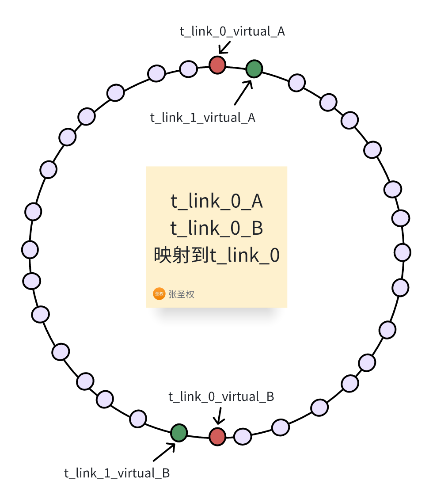
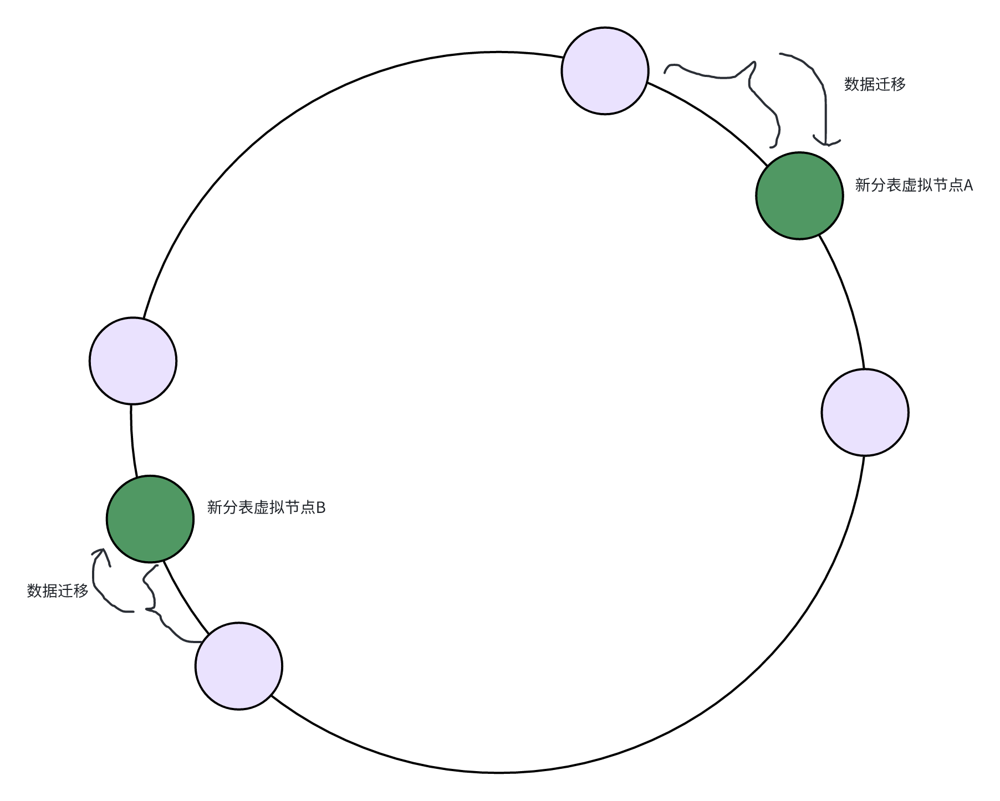

# 杂记
- mysql order by field 自定义排序
    

https://blog.csdn.net/whaxrl/article/details/50929861

# 求逆元

```C++
long long inv(long long a, long long p){     //求a关于素数p的逆元
    if(a==1) return 1;
    return (p-p/a)*inv(p%a)%p;
}
```

# 快速幂

```C++
long long binpow(long long a, long long b, long long m) {
  a %= m;
  long long res = 1;
  while (b > 0) {
    if (b & 1) res = res * a % m;
    a = a * a % m;
    b >>= 1;
  }
  return res;
}
```

# yum

- yum update ：升级所有已安装的包
    
- yum upgrade ：升级所有已安装的包，并且会删除已废弃的包。可能会导致问题
    
- yum makecache ：从配置的软件仓库下载元数据，并生成/更新本地缓存
    
- yum search -C : 从本地缓存而不是互联网查找软件包
    
- yum check-update : 在yum makecache的基础上,还会检查可以更新的软件并显示给用户
    

**注意:** **yum** **update 会自动更新****本地缓存****, 不需要事先执行相关命令**

# service和systemctl

- service 是SysV init的命令 (SysV是Unix的一个分支)
    
- systemctl是systemd的命令
    
- 在许多现代linux系统中,service命令被设置为指向systemctl的相应命令
    

# 查看端口

- lsof：
    
      lsof -i:端口名
    
- netstat
    
      netstat -tunlp | grep 端口号
    
    - -t (tcp) 仅显示tcp相关选项
        
    - -u (udp)仅显示udp相关选项
        
    - -n 拒绝显示别名，能显示数字的全部转化为数字
        
    - -l 仅列出在Listen(监听)的服务状态
        
    - -p 显示建立相关链接的程序名
        

# wc

计算文件的Byte数、字数、或是列数，若不指定文件名称、或是所给予的文件名为"-"，则wc指令会从标准输入设备读取数据

- wc testfile # testfile文件的统计信息
    

```Bash
wc testfile           # testfile文件的统计信息  
3 92 598 testfile       # testfile文件的行数为3、单词数92、字节数598 
```

- -c或--bytes或--chars 只显示Bytes数。
    
- -l或--lines 显示行数。
    
- -w或--words 只显示字数。
    

# 查看cpu

## 查看所有cpu详细信息

- **cat /proc/cpuinfo**
    

## 查看有几个核

- cat /proc/cpuinfo | grep processor | wc -l
    

## 查看每个核有多少个核心

- cat /proc/cpuinfo | grep cores
    

# 查看磁盘空间占用情况：df

- df -h ：不加h则以1kB块为单位，加h则以人类可读的方式显示（KB、MB、GB）
    






# 查看内存占用

```Plaintext
 cat /proc/meminfo
```

# mysql join 就是 inner join

# UUID和雪花算法

- 长度：UUID128位，雪花算法64位
    
- UUID不具有有序性，雪花算法是自增的
    
- UUID组成：不同的版本不一样，如版本一基于时间戳，版本四基于随机数
    
- 雪花算法组成：0 + 41位时间戳（毫秒，69年） + 10位机器id + 12位序列号（同一毫秒）
    

  

# 项目

# 使用了哪些设计模式

## TODO

- ~~动态路由~~
    
- **分布式事务**
    
    - seata的几种事务八股
        
- 幂等
    
- **Dubbo远程调用（结合网关）**
    
- 为什么用nacos
    
- 数据：TPS、QPS
    
- 12306业务梳理
    
- ~~spring security 动态权限，RBAC~~
    

## TO Learn

- redis和etcd
    
- redis能否作为注册中心？为什么？
    

---

- 多级缓存数据一致性
    
    - 本地缓存和redis、数据库的一致性：旁路缓存
        
        - 读：本地缓存没有，读redis，redis没有，读数据库，回写redis和本地缓存
            
        - 写：写数据库，删redis，删本地缓存
            
    - 多节点之间的数据一致性
        
        - 在删除本地缓存后，通过配置中心通知其他节点删除本地缓存
            

## 短链接

1. ### 原项目
    

- 布隆过滤器 + 双重判定锁
    
- 旁路缓存保证数据一致性
    
- 消息队列异步记录跳转日志
    
- Redis解决消息重复消费
    
- Redisson读写锁（为什么？Mysql本身不是有锁吗）
    
- Sentinel限流
    
- 增加中间表，实现分表后多条件查询
    

2. ### 改进
    

- **改进布隆过滤器，缓存误判值，解决误判问题**
    
- **改进网关，采用Dubbo进行网关和服务间远程调用，提高并发性能**
    
- ~~**通过网关实现短链接与服务实例IP的解耦，实现多实例部署和动态水平扩容**~~
    
    - ~~原项目的短链接表存储的短链接是域名 + 唯一短链字符串，于是同一个短链接只能请求到同一个服务实例上，并且不能走网关。~~
        
- **限制分组内短链接数量 + 一致性哈希 + 动态增加水平分表解决分表数据倾斜问题**
    
    - 描述：短链接分表会出现数据倾斜问题，即某个分表数据量过大。主要原因有两个：
        
        - 某个短链接分组的短链接数目过大。这种情况下即使把这张分表分成多张分表，在查询该分组所有短链接时还是要查询所有这些分表，性能提升不是很大。所以解决方案是：**限制每个分组的短连接数量最多为1000条**
            
        - 有大量分组被映射到了同一张分表上，所以
            
    - 初始分表个数为16个，前缀都是t_link_，后缀是一个数字，在0 ~ 2^32 - 1之间
        
    - 初始分表分布均匀
        
    - 每个节点有两个虚拟节点，使得数据分布更加均匀
        
    - 所有短链接分表的名称记录在数据库的一张表里：t_link_partition_names，只有两个字段：id和name，name具有唯一索引
        
    - 所有短链接分表的虚拟节点记录在数据库的另一张表里：t_link_partition_virtual，有4个字段：id，name，partition_name(映射到哪张分表），index（在哈希环上的索引值，0 ~ 2^32 - 1）
        
    - 这两张表只在扩容检测定时任务中和扩容时被使用到
        
    

    
    - **使用**
        
            首先对短链接的gid哈希，然后转换成无符号long类型，作为index
        
        ```Java
        long index = hashValue & 0xffffffffL;
        ```
        
            然后查找虚拟节点表，找到对应的虚拟节点（index在取模意义上大于该数据index的最小的虚拟节点），以及对应的分表名称
        
            然后在这个分表里进行相关操作
        
            **这里需要用到sharding sphere的自定义sharding方法：**
        
        - **TODO**
            
    - **扩容**
        
        - 当某个分表的数据总量超过2千万时，会进行扩容。
            
            - 首先需要判断分表的数据总量
                
            - 如果通过查询information_schema.TABLES的table_rows来查询数据总量，结果是不准确的。Mysql官方表示，在InnoDB中，这个数据和count(*)的结果会相差40% ~ 50%
                
            - 于是，通过count(*)获取某张表的数据总量需要全表扫描，耗时很长
                
            - 于是，采用Spring Task每小时查询一次所有短链接分表。由于短链接服务是多实例部署的，多个实例的任务会重复执行，所以执行任务前会先获取分布式锁（redisson，key为固定常量SCAN_SHORT_LINK_TABLES_LOCK)，10秒后抢锁失败直接返回。
                
            - Spring Task使用：
                
            
                  Spring Boot 默认在无任何第三方依赖的情况下使用 `spring-context` 模块下提供的定时任务工具 **Spring Task**。我们只需要使用 `@EnableScheduling` 注解就可以开启相关的定时任务功能。
            
            ```Java
            @SpringBootApplication
            @EnableScheduling
            public class SpringbootScheduleApplication {
                public static void main(String[] args) {
                    SpringApplication.run(SpringbootScheduleApplication.class, args);
                }
            }
            ```
            
        
            然后定义一个shorkLinkPaititionTaskManager的component，在定时任务方法上面加上`Scheduled`注解，使用cron来配置每小时执行一次
        
        ```Java
        
        @Component
        public class TaskService {
            @Autowired
            private RedissonClient redissonClient;
        
            @Scheduled(cron = "0 0 * * * ?") // 每小时执行一次
            public void task() {
                RLock lock = redissonClient.getLock("myTaskLock");
                if (lock.tryLock(0, 10, TimeUnit.SECONDS)) {
                    // 获取锁成功，执行任务
                    try {
                        // 查询数据库并处理数据
                    } finally {
                        lock.unlock();
                    }
                } else {
                    // 获取锁失败，说明另一个实例已经在执行任务
                    System.out.println("Task already being executed by another instance");
                }
            }
        }
        ```
        
        - 在扩容时，会涉及到两个虚拟节点对应的分表的数据迁移
            
        - 数据迁移采用delete和insert
            
        - 这两个分表会锁表，直到数据迁移完成（锁表会影响性能，怎么办？）
            
    
        
    

## 12306

1. ### 原项目
    

- 使⽤责任链模式重构请求数据准确性检验，⽐如：查询购票、购买⻋票下单以及⽀付结果回调等业务。
    
- 使⽤装饰器模式对缓存组件进⾏增强，解决缓存穿透问题。
    
- 使⽤RocketMQ 延时消息实现⽤⼾购票 10 分钟后未⽀付情况下取消订单功能。
    
- 使⽤Redis Lua脚本进⾏购票减库存操作，通过RocketMQ实现异步⽣成订单，满⾜⾼并发场景下的购票需求。
    
- 通过订单号和⽤⼾信息复合分⽚算法完成订单数据分表，实现⽔平分表后使⽤订单号和⽤⼾证件号多条件查功能。
    
- 通过增加中间表实现⾮12306⽤⼾查询本⼈⻋票功能。
    

2. ### 改进
    

- **分布式事务**
    
- **采用多级缓存 + 热key探测解决热key问题**
    
    - 二级缓存：本地缓存 + redis集群缓存
        
        - 本地缓存：caffeine
            
            - 使用京东开源HotKey进行封装
                
        - 热key探测：京东开源HotKey
            
            - 架构：
                
                - etcd：作为一个高性能的配置中心，可以以极小的资源占用，提供高效的监听订阅服务。主要用于存放规则配置，各worker的ip地址，以及探测出的热key、手工添加的热key等。
                    
                - client端：在我们的服务中添加的引用jar，引入后，就可以以便捷的方式去判断某key是否热key。同时，该jar完成了key上报、监听etcd里的rule变化、worker信息变化、热key变化，对热key进行本地caffeine缓存等。
                    
                - worker端是一个独立部署的Java程序，启动后会连接etcd，并定期上报自己的ip信息，供client端获取地址并进行长连接。之后，主要就是对各个client发来的待测key进行累加计算，当达到etcd里设定的rule阈值后，将热key推送到各个client。
                    
                - dashboard控制台：一个带可视化界面的Java程序，也是连接到etcd，之后在控制台设置各个APP的key规则，譬如2秒出现20次算热key。然后当worker探测出来热key后，会将key发往etcd，dashboard也会监听热key信息，进行入库保存记录。同时，dashboard也可以手工添加、删除热key，供各个client端监听。
                    
            - 工作流程：
                
                - client从etcd获取worker的ip地址，通过netty与worker建立长连接
                    
                - client端启动定时任务，每500毫秒向worker端批量发送一次待测的key到对应的worker，发送规则是发送的key进行hash然后对worker数量进行取余
                    
                - 当热key探测出来后，可以选择进行本地存储，该框架采用caffein来存储
                    
            - 注意：
                
                - HotKey只会探测一个key是不是热key，但是不会关心value，我们需要自己主动维护value。当一个key是热key时，要主动设置这个key的value。
                    
                - 为什么不给热key设置过期时间？
                    
                    - 一般来说，设置过期时间的作用有两个：保证数据最终一致性、节省内存
                        
                                    如果不设置过期时间，可以有这样一个例子：A线程读数据，发现缓存不存在，读数据库，然后B线程写数据库，然后改缓存，然后A线程回写缓存，导致数据不一致。
                        
                    - 但是在热key的场景下，最重要的是热key对于本地内存的命中率即高并发性能，而不是数据的一致性。实际上真实的12306的数据一致性就不是很高，经多次实测发现买票之后5分钟票数才更新
                        
                    - 而节省内存方面，caffeine已经实现了自动内存淘汰，不会出现内存撑爆的情况
                        
                        - caffeine内存淘汰策略：
                            
        - 数据同步：
            
            - 写数据：旁路缓存模式，写完数据库后把redis和本地缓存删除
                
            
                  这里的remove会通过etcd通知整个client集群进行删除，保证了数据同步
            
            ```Java
            /**
            * 删除某key，会通知整个集群删除
            */
            public static void remove(String key) {
              getCache(key).delete(key);
              HotKeyPusher.remove(key);
            }
            ```
            
            - 读数据：
                
            
            

            
            ```Java
            if (JdHotKeyStore.isHotKey(key)) {
                //注意是get，不是getValue。getValue会获取并上报，get是纯粹的本地获取              
                Object obj = JdHotKeyStore.get(key);              
                if(obj == null) {          
                    // 从redis里获取，旁路缓存策略
                    obj = getFromRedisCacheAside();        
                    JdHotKeyStore.smartSet(key, obj);              
                } else {                  
                    //使用缓存好的value即可              
                }         
            } else {
                JdHotKeyStore.remove(key);
                // 走redis
            }
            ```
            
