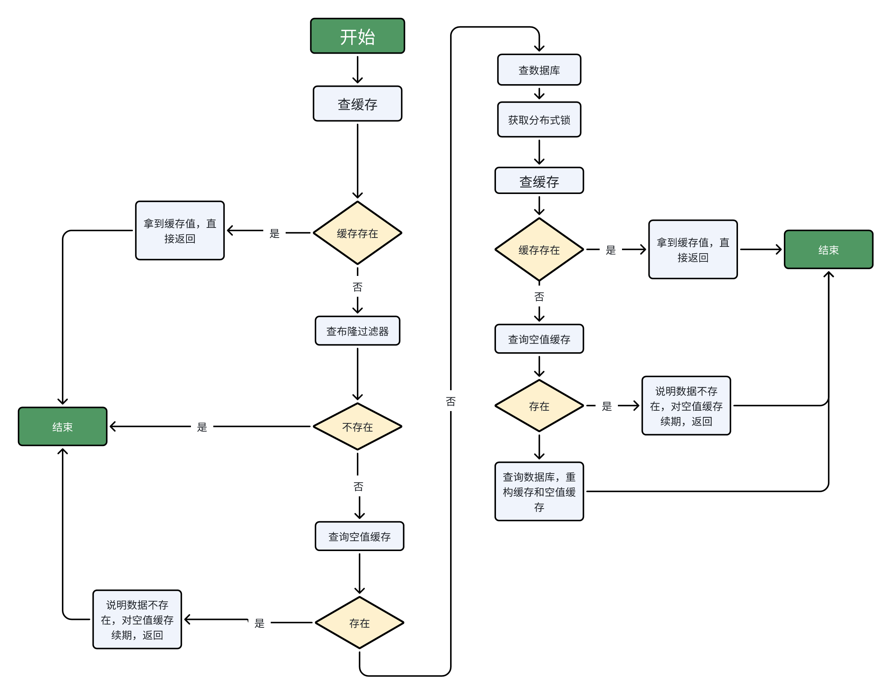

# 短链接
# TODO

- sentinel 限流
- lombok accessors
- 布隆过滤器：用户注销后让这个用户名变得可用
    - 布隆过滤器本来就会误判，在注销的用户比较少时应该不需要这样
    - 当注销用户比较多时，考虑重构布隆过滤器？
        

# 一些测试结果

## 4C8G云服务器（宣称6M峰值带宽，实际测试2M左右，使用SFTP传文件时显示传输速率）

- 短链接跳转QPS：使用Dubbo之前66左右，使用Dubbo之后680左右
    

## 本地6核16G

- 短链接跳转QPS：使用Dubbo之前480左右，使用Dubbo之后1200左右
    

# 短链接创建时获取图标会很耗时，怎么办？

使用消息队列，异步处理。

前端先展示一个默认的图标，隔0.5秒再发一次请求，如果获取到了图标就展示出来。

# 用户信息更改后保证redis里token的用户信息的一致性？

更新数据库成功后，直接更新redis就好

# 登录与鉴权

## 登录

首先校验用户名和密码，校验成功后：

首先根据username去redis里查询是否有该用户的token，如果有，则直接返回这个token key

否则生成uuid作为token key，并把用户信息存到redis和userContext里，然后把token key返回给用户

## 鉴权

1. 用户请求的时候会携带token key。配置一个filter，从请求的header里中获取token key，并去查询redis里是否有这个username对应的key。如果有，就把token续期，并获取到value里的用户信息，封装到userContext里（threadLocal）
    
2. 配置一个intercepter，从userContext里拿用户信息，如果拿到了，就放行，否则抛出unauthorized异常，由全局异常处理器来处理
    

# token的存储结构

两个key-value结构。其中一个是username-tokenKey，另一个是tokenKey-userInfo

## 为什么不直接以username + token为key？

原因是用户登录时需要先根据用户名判断用户是否已经登录，这时需要使用username来判断是否有以这个为key的hash，所以key里不能有token

# 短链接日志表、每小时pv、uv、ip监控表、各种信息的监控表的分表

按照日期分表，每天一张表。

# 使用hyperloglog统计每小时的uv、ip的实现过程？

1. 获取到本次短链接跳转的user、ip之后，首先通过stringRedisTemplate.hasKey判断这个hyperloglog是否存在，如果不存在，就把它放到延迟队列里，2小时之后把它删除。
    
2. 然后把user、ip放到对应的hyperloglog里，注意不只有每小时的，还有短链接的总的uv、ip的hyperloglog：
    

```Java
stringRedisTemplate.opsForHyperLogLog().add(user_stat_key, user);
stringRedisTemplate.opsForHyperLogLog().add(user_stat_key, user);
```

3. 然后获取hyperloglog的值，并插入到每小时的uv、ip监控表里。注意不只有每小时的，还有短链接的总的uv、ip的hyperloglog：
    

stringRedisTemplate.opsForHyperLogLog().size(key);

# 为什么使用了hyperloglog，还要另外使用监控表来记录每小时的uv、id？

虽然一个hyperloglog的大小固定为12kB左右，但是如果不使用数据库进行持久化，就会导致每小时都要有一个hyperloglog，于是每个短链接每年会产生103MB的内存，这个内存开销是很大的。

# 用户表分表的分片键

有两个选择：用户名和用户id

二者都能满足以下需求：

1. 均匀（对于username，通过哈希来实现）
    
2. 不可变
    
3. 访问频率：经常访问的数据放在同一个分片上
    

选择用户名作为分片键。因为用户名用于登录场景，属于频繁使用的属性。如果使用id作为分片键，那么在登录时就不得不查询所有分片，性能不好

  

# 短链接表分表

短链接的分片键是短链接（shorturl），而为了实现高效查询短链接的原始链接，增加了短链接到分组的路由表

## 分析

短链接的主要查询需求：根据分组（gid）查询短链接、根据短链接查询原始链接

于是有两种方案：

1. 原项目方案：短链接表以gid为分片键，并新增短链接到分组的路由表，路由表的分片键为短链接
    
2. 改进后的方案：短链接表以短链接名称为分片键，并新增短链接到分组的路由表，路由表的分片键为gid
    

  

1. 对于前者：
    
      优点：
    
    2. 根据短链接名称查询短链接原始链接时，需要2次查询（一次路由表，一次分表）
        
    3. 根据短链接分组查询该分组的所有短链接时，只需要查找一张分表
        
    
      缺点：
    
    5. 如果一个分组下的短链接数据量过大，会导致该分组对应的分表的短链接数据量过大，即数据不均匀
        
2. 对于后者（改进后的方案）：
    
      好处：
    
    2. 根据短链接名称查询短链接的原始链接时，需要1次查询，比原方案更快
        
    3. （对于原方案的缺点的改进）短链接是原始链接哈希得来，区分度比gid更大，所以用短链接作为分表字段可以保证分表比较均匀，解决了分表不均匀的问题
        

缺点：

1. 根据短链接分组查询该分组的所有短链接时，需要查询多张表（一张路由表，许多张分表）。但是这个需求的并发量不是很大，主要的流量还是短链接的跳转，即根据短链接查询原始链接。
    

### 既然原方案有缺点，为什么原方案这么设计？或者说，新的方案相比于原方案有什么不足之处？

# 使用布隆过滤器创建短链接是否有问题？

在获取到短链接之后，成功把短链接插入到数据库之前的这段时间里，有可能会发生短链接重复获取，从而导致插入了相同的短链接？

答：不会。因为在数据库里创建了唯一索引

# <type>pom</type>

用在dependencies中时，将另一个pom文件的依赖导入当前文件。

  

如果想将另一个依赖的dependencyManagement导入当前的dependencyManagement,则需要

<type>pom</type> <scope>import</scope>

例:

```XML
<dependencyManagement>
    <dependencies>
        <dependency>
            <groupId>other.pom.group.id</groupId>
            <artifactId>other-pom-artifact-id</artifactId>
            <version>SNAPSHOT</version>
            <scope>import</scope>
            <type>pom</type>
        </dependency>   
    </dependencies>
</dependencyManagement>
```

  

# 压测

配置：本地机器 16G内存，带宽 300Mbps

## 创建短链接

吞吐量在 420 左右

## 短链接跳转

吞吐量480左右

# 加读写锁的目的

假设有一个线程正在读短链接，然后发现缓存里的短链接失效了，于是去读取数据库，在这个线程写回缓存之前，另一个线程进行写操作，完成之后执行删除缓存的操作。这之后之前的读操作的线程才完成写回缓存的操作。于是缓存里是旧数据。

# 消息重复消费问题

## 使用redis存储已经消费过的消息的id

解决方案：

消费者在获取到消息之后，会先尝试把消息id使用setIfAbsent来设置到缓存里，如果返回True，说明消息是第一次消费，否则直接返回

要注意消费失败需要删除缓存中的消息id，这个通过try catch实现。但是需要重新抛出异常，使得redis把消息重新放入队列里。

为了防止消息消费失败而没有删除缓存中的消息id的情况（比如代码执行到这一步后宕机了），对缓存设置了一个过期值

# 缓存穿透解决方案

## 原项目问题

原项目使用布隆过滤器，这样存在误判问题。当布隆过滤器恰好误判而黑客发出对这个存在误判的数据的请求时，大量线程都会走数据库来判断数据到底存不存在，导致服务器宕机

如果不使用布隆过滤器而是缓存空值，会导致恶意攻击而缓存大量的空值而宕机。于是需要对空值设置较短的过期时间，而这又会导致误判率提高。

## 解决方案：使用布隆过滤器，但是做了改进：布隆过滤器 + 缓存无效数据

**注意：这里的缓存无效数据和传统的缓存空值不一样，因为它的key的前缀和正常数据的key的前缀是区分开的。相当于单独对那些不存在的数据做了缓存**

## 思路：

1. 首先查缓存，如果缓存存在，直接返回
    
2. 如果缓存不存在，查询布隆过滤器：
    
    1. 如果布隆过滤器里不存在，说明一定不存在，把这个key放入无效数据缓存里（设置较短的过期时间），然后返回
        
    2. 如果布隆过滤器里存在，说明可能存在，于是查询无效数据缓存
        
        1. 如果无效数据缓存里有这个key，说明这个值一定不存在，对这个无效数据缓存进行续期，然后返回
            
        2. 如果无效数据缓存里没有这个key，说明这个key可能存在，于是去查询数据库
            
3. 查询数据库：
    

首先获取分布式锁

1. 获取到分布式锁之后，重新判定一下缓存是否存在，如果存在则使用缓存，直接返回。如果不存在还需要再次查询一次空值缓存，如果空值缓存存在则直接返回，否则进行下一步。
    
2. 否则查询数据库，并更新缓存和无效数据缓存
    


## 问题

1. 为什么不对无效数据缓存也使用布隆过滤器？这样不是可以节省内存空间吗？
    
      因为布隆过滤器不能删除元素。如果现在这个key不存在，以后又存在了，无法从布隆过滤器里删除
    
2. 为什么要对无效数据缓存设置过期时间？
    
      首先，无效数据缓存只在布隆过滤器误判的情况下才会插入数据，所以无效数据缓存的数据量不会很大。
    
      为了防止攻击者故意伪造会导致误判的且不存在的数据而导致服务器宕机，给它设置了过期时间
    
3. 为什么获取到分布式锁之后，再次检查缓存发现不存在，还需要查询无效数据缓存？为什么不用查询布隆过滤器了？
    

第一个拿到锁的线程查询数据库之后必定会更新缓存和无效数据缓存中的一个。后续线程只要判断这两个缓存就行了

在这里，布隆过滤器不会更新，不能提供有效信息

# 项目难点、遇到的困难及解决

## 使用hyperLogLog统计uv、ip导致redis宕机

对uv、ip的统计功能进行测试，模拟一个月内1000条短链接的uv监控，发现redis老是宕机。

然后发现redis内存占用高达几个G

通过计算发现问题：一个hyperloglog的大小为12KB左右，1000条短链接一个月的内存占用为：

$$1000 * 24 * 30 * 12 = 8640000KB = 8.24G$$

所以只使用redis来存储监控数据是不行的。

但是如果存储到数据库里，会导致数据量很大，查询速度远不及基于内存的redis。

于是给监控日志进行水平分表，每天一个表，这样才妥善的解决了问题。

## 短链接分片键的选择

使用gid进行哈希作为分片键，并构建路由表，能够保证两种需求下的高性能查询

1. 查询某一分组的所有短链接，只需查一张分表
    
2. 查询某短链接的原始链接，只需两次查询
    

## tps上不去

进行压测时，发现短链接创建功能的tps只有12左右，tps很低。但是调试发现数据库操作和缓存预热操作都很快。最后发现原因是创建短链接时需要获取短链接的原始链接的图标，这个操作需要网络io，比较费时。于是把这一步改成异步操作，tps立马上去了，稳定在420左右。

## 多端登录

当已经登录过平台之后，使用另一个电脑再登录就会失败。原因是如果发现redis里已经有token，就会抛出“已登录”的异常。为了实现多端登录，在发现redis里有token时会直接返回token，而不是抛出异常

# 对项目做了哪些改进

- 对缓存穿透使用布隆过滤器的方案做了改进。针对布隆过滤器可能误判的情况，通过缓存不存在的数据来解决
    
- 使用rocketmq：原项目使用了redis stream实现的消息队列，由于redis是单线程的，吞吐量不如rocketmq，并且rocketmq支持事务消息等复杂场景
    
- 使用hyperloglog进行uv、ip的统计，每小时创建一个hyperloglog，每次在维护hyperloglog的同时把数据持久化到每小时监控表中。每隔一段时间
    
- 对监控表中的访问日志表、
    

# 如何改变短链接分组

短链接分组涉及两张表（短链接表和路由表），由于短链接表被分片了，所以需要先删除再插入，然后改变路由表即可。注意需要加上事务

# 表设计

## 基本

- 用户表：username、password、real_name、phone、email
    
- 短链接分组表：gid（6位字符串，采用布隆过滤器和唯一索引保证唯一性）、name、username
    
- 短链接表，以gid为分片键：短链接url、短链接完整url（带上域名）、原始链接、description、favicon（varchar 256 base64，存储网站的图标）、gid、总uv、总pv、总ip
    
- 短链接路由表：full_short_url、gid
    

## 监控

- 短链接访问日志表，记录每次访问的时间、用户（uuid）、地理位置、ip、设备（PC、Mobile）、OS（Windows、Mac等）、浏览器（Chrome、Edge等）
    
- 短链接各种信息的监控总表
    
    - locale_stat：(full_short_url, date, province, cnt)
        
    - device_stat: (full_short_url, date, device, cnt)
        
    - os_stat: ...
        
    - browser_stat: ...
        
- 每小时uv、pv、ip访问监控表（其中uv、ip要配合hyperloglog来实现）
    
    - (full_short_url, date, hour, uv, pv, ip)
        

# 短链接监控功能

## 表设计

- 短链接访问日志表，记录每次访问的时间、用户（uuid）、地理位置、ip、设备（PC、Mobile）、OS（Windows、Mac等）、浏览器（Chrome、Edge等）
    
- 短链接各种信息的监控表，记录短链接地理位置、设备、ip、等的总监控数据
    
    - device_stats：(id, short_url, date, device, cnt)
        
    - ...
        
- 短链接每小时的uv、ip、pv监控表，其中uv、ip使用hyperloglog实现，并同步到数据库里。
    
      这个监控表以(date,hour)联合索引为唯一索引，通过 on duplicate key update 实现”首次插入，后续更新“的策略。
    

## 功能实现

1. 查询某段时间内（过去24小时、一周以内等）（精确到小时）的pv、uv、ip：查询每小时的uv、ip、pv监控表
    
2. 查询某段时间内（精确到天）地理信息、设备等总监控数据：使用监控总表。
    
3. 查询某段时间内的高频访问ip：查询访问日志表
    
4. 访客类型：通过查询访问日志来实现。访客类型分为新用户和老用户，老用户是指该用户访问次数大于1次（访问日志里有该用户的多条记录）
    

# RocketMQ

## 如何实现顺序消息

1. 发送方保证消息放到同一个队列里
    

messagequeue里的消息是fifo的，所以可以把消息发送到同一个messagequeue里。

在rocketmqtemplate里，可以通过syncsendorderly(topic, payload, hashKey)，让指定消息的hashKey都一样

1. 消费方保证同一时刻每个messagequeue只有一个消费者
    

可以在消费方指定消费模式为ConsumeMode.ORDERLY（默认是CONCURRENTLY)

```Java
// --run--
import org.apache.rocketmq.spring.annotation.RocketMQMessageListener;
import org.apache.rocketmq.spring.core.RocketMQListener;
import org.apache.rocketmq.spring.core.RocketMQTemplate;
import org.springframework.stereotype.Service;

@Service
@RocketMQMessageListener(topic = "yourTopic", consumerGroup = "yourConsumerGroup", consumeMode = RocketMQMessageListener.ConsumeMode.ORDERLY)
public class OrderConsumer implements RocketMQListener<String> {

    @Override
    public void onMessage(String message) {
        // 处理消息
        System.out.println("Received message: " + message);
    }
}
```